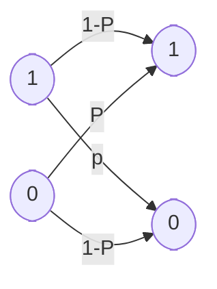

# 量子纠错

量子纠错主要讨论在存在噪声的情况下，如何可靠地进行量子信息处理。这涉及到三个主要的问题：量子纠错码的基本理论、容错量子计算和阈值定理。此综述的这一章将首先讨论量子纠错码的基本理论，它能抵抗噪声以保护量子信息。随后将阐述容错量子计算的理论， 这将允许我们去掉在基本理论部分的推导过程中的完美编码和解码假设。最后，本章的重点是量子计算的阈值定理：在单个量子门中的噪声低于一个确定阈值前提下，有可能有效地执行任意规模的量子计算。阈值定理表明噪声对大规模量子计算的性能看来并不会造成根本障碍。

# 噪声

噪声是信息处理系统的一大祸害。只要有可能，我们总要使我们构造的系统完 全避免噪声， 而对不可能的情形，我们会试图抵消噪声的影响。举例来说，现代计算机中的元部件都是非常可靠的，典型故障率低于每 $10^{17}$ 次运算出 1 次差错。对于绝大多数的实际用途，我们可以认为计算机元部件完全没有噪声。然而，许多广泛应用中的系统确实面临真正的噪声问题。调制解调器和光盘播放装置两者都采用纠错码保护信息免受噪声影响。实际中用于针对噪声的保护技术的细节有时还 是相当复杂的， 但其基本原理是容易理解的。关键的思想是，如果我们想要针对噪声的影响保护一个消息，那么我们应当通过对这个消息加入一些冗余信息来编码消息。采用这种方法，即使编码消息中的某些信息为噪声所污染，在编码消息中仍将有足够的冗余度使有可能恢复或解码消息，使得原来消息中的所有信息得以恢复。
举例来说，设我们想要通过带噪声经典信道从一个位置发送一个比特到另一个位置。信道中噪声的影响是以概率 $p>0$ 将正在被传输的比特翻转，而以概率 $1-p$ 使比特无差错地传输。这种信道称为二元对称信道 ( binary symmetric channel)，见下图。针对二元对称信道中噪声的影响来保护比特的一个简单手段是，把我们所想保护的比特替换为其自身的三份备份:
$$
\begin{aligned}
0 & \rightarrow 000 \\
1 & \rightarrow 111
\end{aligned}
$$
这个比特串 000 和 111 有时被叫做逻辑 0 和逻辑 1 ， 因为它们分别扮演了 0 和 1 的角色。我们现在通过信道发送所有这三个比特。在信道的接收方三个比 特均为输出，且接收方必须确定原来的比特的值是什么。设从信道的输出为 001。规定一个比特翻转的概率 $p$ 为不太高， 非常可能是第三比特被信道翻转，而 0 为所发送的比特。

这种类型的解码被称为多数判决 (majority voting)，因为信道的解码输出不论是 1 还是 0 ，在实际信道输出都占多数。如果通过信道发送的比特中两个或多个被翻转那么多数判决失败， 否则多数判决成功。所有比特中两个或多个被翻转的概率为 $3 p^{2}(1-p)+p^{3}$， 所以差错的概率为 $p_{\mathrm{e}}=$ $3 p^{2}-2 p^{3}$。要是没有编码，出现一个差错的概率为 $p$， 所以只要 $p_{\mathrm{e}}<p$ 这种编码会使传输更为可靠， 而 $p<1 / 2$ 时就是这种情况。

因为我们是通过将所发送的消息重复多次而来对其编码的，所以刚才描述的这类码称为重复码 (repetition code)。类似的技术作为日常谈话的一部分已被用了 上千年：如果我们听某个人所说的话语有困难，或许是因为他们有外国口音，我们会请他们重复一下他们刚才说的是什么。我们可能在任一时间里没有听清楚所有的词， 但是我们可把重复的话合起来以理解一个连续的消息。在经典纠错码的理论中， 发展了许多聪明的技术，但是，关键的思想始终是利用足够的冗余来编码消息，使得有噪声的编码消息仍可以恢复原来的消息，至于需要添加的冗余量则依赖于信道中噪声的严重程度。

## 三量子比特的比特翻转编码

为了抵消噪声的影响保护量子状态，我们将会基于类似的原理来引入量子纠错码。经典信息和量子信息之间存在着一些重要的区别，这就需要引人一种新的思想以使这样的量子纠错码成为可能。这种新的思想需要克服如下三个问题：

1. 不可克隆：有人可能试图通过将量子状态复制三次或多次，以量子力学方式来实现重复码。但据不可克隆 (no-cloning) 定理, 这种作法是不允许的，即使复制是可能的，也不可能来度量和比较来自信道的三个量子状态输出。

2. 差错是连续的：连续的不同差错可能出现在单量子比特上。为确定哪个差错出现以便来纠正它，看来需要无穷高的精度，因此要求无穷多的计算资源。

3. 测量会破坏量子信息：在经典纠错中, 我们会观测来自信道的输出，并决定采用什么样的解码步骤。量子力学中的观测一般会破坏所观测的量子状态并使恢复成为不可能。

幸运的是，这三个问题中没有一个是致命的。假设通过一个信道发送量子比特，信道以概率 $1-p$ 保持量子比特不改变，以概率 $p$ 使量子比特翻转. 也即以概率 $p$ 状态 $|\psi\rangle$ 被取为状态 $X|\psi\rangle$, 其中 $X$ 为通常的 Pauli sigma $x$ 算子或比特翻转算子。这种信道被称为比特翻转信道(bit flip channel)，我们现在来解释比特翻转码 (bit flip code)，这种编码可被用来处理来自这种信道的噪声的影响，进而保护量子比特。
   设我们将单量子比特状态 $a|0\rangle+b|1\rangle$ 用三个量子比特编码为 $a|000\rangle+$ $b|111\rangle$。一个方便的方法是把这个编码写为
$$
\begin{aligned}
|0\rangle \rightarrow\left|0_{\mathrm{L}}\right\rangle & \equiv|000\rangle \\
|1\rangle \rightarrow\left|1_{\mathrm{L}}\right\rangle & \equiv|111\rangle
\end{aligned}
$$
其中，基状态的叠加被取为相应编码状态的叠加。符号 $\left|0_{\mathrm{L}}\right\rangle$ 和 $\left|1_{\mathrm{L}}\right\rangle$ 表示这些是逻辑 $|0\rangle$ 和逻辑 $|1\rangle$ 状态，而不是物理的 0 和 1 状态。

设初始状态 $a|0\rangle+b|1\rangle$ 已被完美地编码为 $a|000\rangle+b|111\rangle$。这三个量子比特中的每一个 都通过一个比特翻转信道的独立备份。设一个或更少的量子比特出现了一个比特翻转。有一种简单的两阶段纠错方法，可用于恢复和纠正这种情况中的量子状态。

1. 阶段一：差错检测 (error-detection) 或症状诊断 (syndrome diagnosis)：我们执行一次测量，它会告诉我们什么差错 (如果存在的话) 出现在量子状态上。这个测量结果被称为差错症状 (error syndrome)。对于比特翻转信道，对应于四个投影算子，可有四种差错症状：

$$
\begin{array}{lll}P_{0} \equiv|000\rangle\langle 000|+| 111\rangle\langle 111| & \text { 没有差错 }  \\ P_{1} \equiv|100\rangle\langle 100|+| 011\rangle\langle 011| & \text { 第一量子比特上比特翻转 }  \\ P_{2} \equiv|010\rangle\langle 010|+| 101\rangle\langle 101| & \text { 第二量子比特上比特翻转 }  \\ P_{3} \equiv|001\rangle\langle 001|+| 110\rangle\langle 110| & \text { 第三量子比特上比特翻转 }\end{array}
$$

设举例来说比特翻转出现在第一个量子比特上，所以破坏后的状态为 $a|100\rangle+$ $b|011\rangle$。注意到在这种情况中 $\left\langle\psi\left|P_{1}\right| \psi\right\rangle=1$，所以测量结果 (差错症状) 的输出肯定为 1。进而差错症状测量不会引起状态的任何改变，在差错症状测量之前和之后 的状态都为 $a|100\rangle+b|011\rangle$。注意，差错症状所包含的只是有关出现什么差错的信息，而不允许我们来推断有关 $a$ 或 $b$ 的值的任何事情，也即它不包含所被保护状态的信息。这是差错症状测量的一个普遍特征，因为为了得到有关量子状态身份的信息，一般有必要对该状态进行扰动。

2. 阶段二：恢复 (recovery)：我们采用差错症状的值来了解采用什么方法来恢复初始状态。举例来说，如果差错症状为 1，指示第一个量子比特上比特翻转，则我们只要再一次翻转那个量子比特，就以完全准确地恢复到原状态 $a|000\rangle+b|111\rangle$。这四种可能的差错状态和每种情况中的恢复方法为:

| 差错状态                  | 恢复方法               |
| ------------------------- | ---------------------- |
| 0 (没有差错)              | 什么也不用做           |
| 1(第一量子比特上比特翻转) | 再一次翻转第一量子比特 |
| 2(第二量子比 上比特翻转)  | 再一次翻转第二量子比特 |
| 3(第三量子比特上比特翻转) | 再一次翻转第三量子比特 |

对于差错症状的每个值，在给定相应所出现的差错后，容易看出原状态可得以完全准确的恢复。这种纠错方法，只要在三个量子比特出现不超过一个的比特翻转，就可完美地来工作. 这种情况以概率 $(1-p)^{3}+3 p(1-p)^{2}=1-3 p^{2}+2 p^{3}$ 出现，剩下一个差错没有纠正的概率因而为 $3 p^{2}-2 p^{3}$，正好如经典重复码。同样，对 $p<1 / 2$，编码和解码会改善量子状态的存储可靠性。
## 改善差错分析

上述这种差错分析并不是完全足够的。因为并非所有的差错和量子力学中的状态都是同等地作用的：量子状态位于连续空间中, 所以有可能某些差错只会使状态造成轻微破坏，而其他差错则使状态完全弄乱。比特翻转差错 $X$ 是一个极端的例子，这个差错根本不影响状态 $(|0\rangle+|1\rangle) / \sqrt{2}$，但会翻转 $|0\rangle$ 状态而使其变为 $|1\rangle$。在前一种情况中我们无需担心比特翻转差错的出现，而在后一种情况中我们显然会非常担心。

为讨论这个问题，我们要用到引入于保真度概念：一个纯态和一个混合态之间的保真度为 $F(|\psi\rangle, \rho)=\sqrt{\langle\psi|\rho| \psi\rangle}$。量子纠错的目标是来提高保真度，使以相当接近于最大可能保真度 1 来存储 (或传送)量子信息。让我们对利用三量子比特比特翻转码所能达到的最小保真度和当不执行纠错时的保真度来作一比较。设所感兴趣的量子状态为 $|\psi\rangle$，没有采用纠错码时，量子比特在经由信道发送后的状态为：
$$
\rho=(1-p)|\psi\rangle\langle\psi|+p X| \psi\rangle\langle\psi| X
$$
保真度为：
$$
F=\sqrt{\langle\psi|\rho| \psi\rangle}=\sqrt{(1-p)+p\langle\psi|X| \psi\rangle\langle\psi|X| \psi\rangle}
$$
平方根号中的第二项为非负且当 $|\psi\rangle=|0\rangle$ 时等于 0，所以我们看到最小保真度为 $F=\sqrt{(1-p)}$。设三量子比特纠错码被用来保护 $|\psi\rangle=a\left|0_{\text {L. }}\right\rangle+b\left|1_{\text {L. }}\right\rangle$，噪声和纠错两 者作用后的量子状态为：
$$
\rho=\left[(1-p)^{3}+3 p(1-p)^{2}\right]|\psi\rangle\langle\psi|+\cdots
$$
省略号表示的项代表两个或三个量子比特上比特翻转的贡献。所有这些省略项都是半正定算子，所以我们所计算的保真度将是真正保真度的一个下界。而另一方面，$F=\sqrt{\langle\psi|\rho| \psi\rangle} \geqslant \sqrt{(1-p)^{3}+3 p(1-p)^{2}}$。也即保真度至少为 $\sqrt{1-3 p^{2}+2 p^{3}}$，所以 存储量子状态的保真度在规定 $p<1 / 2$ 下会被改善，这与我们早先非常粗糙的分析得到的结论是相同的。

存在另一种理解差错症状测量的不同方法，它在推广三量子比特码中是会有用处的。假设，代替测量四个投影算子 $P_{0}, P_{1}, P_{2}, P_{3}$，我们来执行两个测，第一个是对可观测量 $Z_{1} Z_{2}$ (也即 $\left.Z \otimes Z \otimes I\right)$ 的，第二个是对可观测量 $Z_{2} Z_{3}$ 的。这些观测量中的每一个都具有特征值 1 ，所以每个测量都提供一个单量子比特信息，总共两个量子比特信息，即四个可能的差错症状，恰好等同于早先描述中的结果。第一个测量即对 $Z_{1} Z_{2}$ 的测量，可被想象为来比较第一个量子比特和第二个量子比特，看它们是否相同。具体而言，考虑到 $Z_{1} Z_{2}$ 具有谱分解：
$$
Z_{1} Z_{2}=(|00\rangle\langle 00|+| 11\rangle\langle 11|) \otimes I-(|01\rangle\langle 01|+| 10\rangle\langle 10|) \otimes I
$$
它对应于具有投影算子 $(|00\rangle\langle 00|+| 11\rangle\langle 11|) \otimes I$ 和 $(|01\rangle\langle 01|+| 10\rangle\langle 10|) \otimes I$ 的一个投影测量。因此，测量 $Z_{1} Z_{2}$ 可被想象为来比较第一个量子比特和第二个量 子比特的值，若它们相同给出 $+1$，若它们不同给出 $-1$。类似地，测量 $Z_{2} Z_{3}$ 被想象为比较第二个量子比特和第三个量子比特的值，若它们相同给出 $+1$，若它们不同给出 $-1$。组合这两个测量结果，我们就能确定是否有比特翻转出现在量子比特中的一个比特上，如果有那么还可来确定是哪一种：若两者测量结果都给出 $+1$，则以高概率没有比特翻转出现；若测量 $Z_{1} Z_{2}$ 给出 $+1$ 而测量 $Z_{2} Z_{3}$ 给出 $-1$，则以高概率只有第三个量子比特翻转；若测量 $Z_{1} Z_{2}$ 给出 $-1$ 而测量 $Z_{2} Z_{3}$ 给出 $+1$，则以高概率只有第一个量子比特翻转；最后，若两者测量结果都给出 $-1$，则以高概率只有第二个量子比特翻转。这些测量成功的关键是，两个测量都不会给出有关编码后量子状态的幅值 $a$ 和 $b$ 的任何信息，因而两个测量都不会破坏我们用此编码来保护的量子状态的叠加。

## 三量子比特的相位翻转码

比特翻转码是令人感兴趣的，但它看来并不是超越经典纠错码的一种重要革新，并且留下许多末解决的问题。一个更有兴趣的带噪声量子信道是单量子比特的相位翻转差错模型，在这种差错模型中，量子比特以概率 $1-p$ 得以保留，而状态 $|0\rangle$ 和 $|1\rangle$ 的相对相位以概率 $p$ 被翻转。更确切地说，相位翻转算子 $Z$ 以概率 $p>0$ 作用于量子比特，所以在相位翻转下状态 $a|0\rangle+b|1\rangle$ 变为状态 $a|0\rangle-b|1\rangle$。相位翻转信道没有经典的等价物，因为经典信道不具有任何相位的等价性质。不过，有一种简单的方法把相位翻转信道转化为比特翻转信道：

 设我们考虑的是量子比特基 $|+\rangle \equiv$ $(|0\rangle+|1\rangle) / \sqrt{2}$ 和 $|-\rangle \equiv(|0\rangle-|1\rangle) / \sqrt{2}$。关于这个基，算子 $Z$ 变 $|+\rangle$ 为 $|-\rangle$ 。并且反之亦然，也即标志 + 和 - 只是起到像比特翻转的作用。这就提示我们，采用状态 $\left|0_{\text {1. }}\right\rangle \equiv|+++\rangle$ 和 $\left|1_{\mathrm{L}}\right\rangle \equiv|---\rangle$ 作为逻辑 0 状态和逻辑 1 状态来保护针对相位翻转的差错。纠错需要的所有运算一一编码、差错检测和恢复一一都是像比特翻转信道那样来执行，只是要以 $|+\rangle,|-\rangle$ 基代替 $|0\rangle,|1\rangle$ 基。为了实现这种基的转 换，我们只要在纠错过程的适当位置上应用 Hadamard 门及其逆 (也为 Hadamard 门），因为 Hadamard 门可来实现 $|0\rangle,|1\rangle$ 基和 $|+\rangle,|一\rangle$ 基之间来回的转换。

更明确地，对相位翻转信道的编码可按两步来执行：第一，完全准确地对三个量子比特按比特翻转信道那样编码：第二，对每个量子比特作用 Hadamard 门。差错检测可通过如前相同的投影测量而来达到，但要由 Hadamard 门取共轭：$P_{j} \rightarrow P_{j}^{\prime} \equiv H^{\otimes 3} P_{j} H^{\otimes 3}$。等价地，差错症状测量可以通过测量观测量 $H^{\otimes 3} Z_{1} Z_{2} H^{\otimes 3}=X_{1} X_{2}$ 和 $H^{\otimes 3} Z_{2} Z_{3} H^{\otimes 3}=X_{2} X_{3}$ 来执行。令人感兴趣的是，按照比特翻转码的 $Z_{1} Z_{2}$ 和 $Z_{2} Z_{3}$ 的测量相类似思路，可对这些测量作出解释。对观测量 $X_{1} X_{2}$ 和 $X_{2} X_{3}$ 的测量，分别对应于比较第一和第二量子比特，以及比较第二和第三量子比特的正负号。其含义为在 $X_{1} X_{2}$ 的测量例如对形如 $|+\rangle \mid+>\otimes(\cdot)$ 或 $|-\rangle|-\rangle \otimes(\cdot)$ 的状态给出 $+1$，而对形如 $|+\rangle|-\rangle \otimes(\cdot)$ 或 $|-\rangle|+\rangle \otimes(\cdot)$ 的状态给出 $-1$。最后，纠错可用恢复运算来完成，这种运算就是从比特翻转码导出的 Hadamard 共轭(Hadamard-conjugated)恢复运算。举例来说，设我们在第一量子比特的符号中检测到一个从 $\mid+>$ 到 $\mid ->$ 的翻转，那么，我们就可通过对第一量子比特作用 $H X_{1} H=Z_{1}$ 而来恢复。对其他的差错症状可应用类似的方法。

显然，这种相位翻转信道的码具有像比特翻转信道的码相同的特性。特别是相位翻转码 的最小保真度等同于比特翻转码的最小保真度。同时，这两个信道是酉等价的，因为存在一个酉算子 $U$ (这种情况中的 Hadamard 门)，在第一个信道先用 $U$ 而跟随的通道用 $U^{+}$情况下，使得一个信道的作用同于另 一个信道的作用，这些运算可以平凡地合并到编码和纠错运算中。

# Shor 码

TODO: 将 hsh 学长的 Shor 码放进来。

# 量子纠错的理论

这一章将来介绍研究量子纠错的总的框架，包括量子纠错条件，这是一组使量子纠错成为可能所必须满足的方程。当然，提出这一个框架并不能保证好的量子纠错码一定存在，但是，这个框架确实可以提供背景知识，能使我们来找到好的量子纠错码。

量子纠错理论的基本思想自然地推广了由 Shor 码引发的思想，量子状态通过 酉运算被编码为量子纠错码，其形式定义为某个较大 Hilbert 空间中的一个子空 间 $C$。为方便起见，我们采用符号 $P$ 表示到码空间 $C$ 上的投影算子；且对三量子比特比特翻转码，$P=|000\rangle\langle 000|+| 111\rangle\langle 111|$。在编码以后，这个码会受到噪声的影响，紧接着执行差错症状测量以检测所出现的差错类型。一旦差错症状确定，恢复运算就会执行，以使量子系统回到这个码的原来状态。

不同的差错症状对应于整个 Hilbert 空间中保形的和正交的子空间，这些子空间必是正交的，否则它们就不能被差错症状测量可靠地区分。进而，由于到不同子空间的差错映射必将 正交码字映射到正交状态，因此这些不同的子空间必为原来码空间的保形版本，这样就能使其从差错中恢复。这个直观的图像基本上就是下面所要讨论的量子纠错条件的要旨。

为发展量子纠错的一般理论，就关于噪声的本质和关于用于处理纠错的程序，作一些尽可能少的假设，这对研究者来说是适宜的。也即，我们没有必要假定纠错是通过检测-恢复两阶段方法来做到的，也无需对量子系统的噪声作任何假定。

我们仅只作两个很宽泛的假定：噪声由量子运算 $\varepsilon$ 所描述，整个纠错方法由我们称之为纠错运算的一个保迹量子运算 $\mathscr{R}$ 承担。这个纠错运算把我们上面称为差错检测和恢复的两个步骤合并，为确保纠错是成功的，我们要求对任何状态 $\rho$，其支集位于码空间 $C$ 中，有
$$
(\mathscr{R} \circ \varepsilon)(\rho) \propto \rho
$$

量子纠错条件是一个简单方程组，它们可被检验以确定量子纠错码是否能对 抗特殊类型的噪声 $\varepsilon$。我们将应用这些条件来构造大量的量子码，并将研究量子纠 错码的一些普遍性质。

## 量子纠错条件

令 $C$ 为一个量子码，令 $P$ 为到 $C$ 的投影算子。设 $\varepsilon$ 为具有运算元 $\left\{E_{i}\right\}$ 的量子运算。则纠正 $C$ 上 $\varepsilon$ 的纠错运算 $R$ 存在的充分必要条件为，对某个复数 Hermite 矩阵 $\alpha$ 成立
$$
P E_{i}^{\dagger} E_{j} P=\alpha_{i j} P
$$
我们称运算元 $\left\{E_{i}\right\}$ 为噪声 $\varepsilon$ 的差错，且如果这样一个 $\Re$ 存在，我们就说 $\left\{E_{i}\right\}$ 组成一个可纠正的差错集合。
## 差错离散化

 我们已经讨论了针对一种特定橾声过程的量子信息的保护。但是，一般来说，我们并不准确知道量子系统遭受的是什么噪声。如果特定码 $C$ 和纠错运算 $\mathscr{R}$ 能被用于针对全部类型噪声过程的保护，那么这将会非常有用。幸运的是，量子纠错条件很容易用于严格地提供这类保护。

定理：设 $C$ 为量子码，$\mathscr{R}$ 为符合量子纠错条件的纠错运算，用以从具有算子元 $\left\{E_{i}\right\}$ 的噪声过程中恢复。设 $\mathscr{F}$ 为具有运算元 $\left\{F_{j}\right\}$ 的量子运算，运算元 $\left\{F_{j}\right\}$ 为 $E_{i}$ 的线性组合，即对某个复数矩阵 $m_{j i}$ 有 $F_{j}=\sum_{i} m_{j i} E_{i}$。那么，纠错运算 $\mathscr{R}$ 也可对码 $C$ 上的噪声过程 $\mathscr{F}$ 的作用来进行纠正。

由此，一噪声过程 $\varepsilon$，其运算元由这些差错算子 $\left\{E_{i}\right\}$ 的线性组合而成，都将通过恢复运算 $\mathscr{R}$ 可被纠正。

按此观点，设 $\varepsilon$ 为作用于单量子比特上的量子运算。那么，其每个运算元 $\left\{E_{i}\right\}$ 都可以被写成为 Pauli 矩阵 $\sigma_{0}, \sigma_{1}, \sigma_{2}, \sigma_{3}$ 的线性组合。因此，为检验 Shor 码能对第一量子比特上的单量子比特差错进行纠错，只需验证满足方程
$$
P \sigma_{i}^{1} \sigma_{j}^{1} P=\alpha_{i j} P
$$
其中 $\sigma_{i}^{1}$ 为作用于第一量子比特上的 Pauli 矩阵 $(I, X, Y$ 和 $Z)$。 一旦满足这点，就会保证第一量子比特上的任何差错过程都可以被纠正 。

概括起来，通过上例，我们已经认识到，有可能使量子差错离散化；为对抗单量子比特上可能的连续差错，只要贏得对有限差错集即四个 Pauli 矩阵的成功纠错即可。类似结果对于高维量子系统同样成立，这反映了与经典模拟系统的纠错理论的显著差异。这类系统中的纠错是非常不同的，因为原理上存在有无穷数目的不同差错症状，经典信息处理的数字纠错要成功得多，因为它只包含有限数目的差错症状。相比于与经典模拟纠错，量子纠错看起来与经典数字纠错类似得多。

## 独立差错模型

这一节中将利用不同量子比特上差错独立的假设以解释如何同时确保量子纠错理论和可靠量子信息处理。直观上，如果噪声过程独立地作用于码中的不同量 子比特上，那么在规定噪声足够弱的情况下，与非编码状态相比，纠错应当更能改善编码状态的存储保真度。为说明这一点，我们以退极化信道的例子作为开始，它会为基本思想提供一个特别简单的实证，随后再扩展这种思想来包括其他 的重要信道。

退极化信道可以由一个单参数即概率 $p$ 来描述。单量子比特上退极化信道的作用可由方程 $\varepsilon(\rho)=(1-p) \rho+(p / 3)[X \rho X+Y \rho Y+Z \rho Z]$ 来定义，并可以被解释如下概念——量子比特什么都没有发生的概率为 $1-p$，算子 $X, Y$ 和 $Z$ 中的每一个作用于量子比特的概率为 $p / 3$。退极化信道特别易于在量子纠错的背景下进行分析，因为它具有根据四个基本差错 $I, X, Y$ 和 $Z$ 来表述的一个方便的解释，而这些基本差错已被最为广泛地应用于量子码的分析中。我们将会来解释这种分析是如何进行的，然后再回到如下问题：当我们考虑一个没有由 $I, X, Y$ 和 $Z$ 运算 简单解释的过程时，情况会怎样。简单的计算显示，对通过退极化信道发送的状态，最小保真度给出为 $F=\sqrt{1-2 p / 3}=1-p / 3+O\left(p^{2}\right)$。

设我们用能纠正任何单量子比特上差错的一个 $n$ 量子比特量子码来对一个单 量子比特信息编码。设具有参数 $p$ 的退极化信道独立地作用于这个量子比特中的 每一个，则在所有 $n$ 个量子比特上所引起的联合作用为：
$$
\varepsilon^{\otimes n}(\rho)=(1-p)^{n} \rho+\sum_{j=1}^{n} \sum_{k=1}^{3}(1-p)^{n-1} \frac{p}{3} \sigma_{k}^{j} \rho \sigma_{k}^{j}+\cdots
$$
其中$\cdots$表示均为正且在分析时将丢弃的高阶项。纠错执行以后,只要 $\rho$ 原来处于码中,出现在这个和式中的所有项将会被回复到状态 $\rho$ :
$$
\left(\mathscr{R} \otimes \varepsilon^{\otimes n}\right)(\rho)=\left[(1-p)^{n}+n(1-p)^{n-1} p\right] \rho+\cdots
$$
所以保真度满足：
$$
F \geqslant \sqrt{(1-p)^{n-1}(1-p+n p)}=1-\frac{\left(\begin{array}{l}
n \\
2
\end{array}\right)}{2} p^{2}+O\left(p^{3}\right) \quad(10.45)
$$
因此在规定差错的概率 $p$ 为充分小后，采用量子纠错码会改善被这个码所保护的量子状态保真度。

并非所有噪声污染的信道都可如此容易地解释为由无差错、比特翻转、相位翻 转及其两两组合的一个随机组合。许多自然出现的量子信道都不具备这样的解释。

用 $E_{j, k}$ 表示 $E_{j}$ 在第 $j$ 个量子比特上的作用，则噪声在编码后量子比特上的影 响可写为：
$$
\begin{aligned}
\varepsilon^{\otimes n}(\rho)=&\left(E_{0,1} \otimes E_{0.2} \otimes \cdots \otimes E_{0 . n}\right) \rho\left(E_{0.1}^{\dagger} \otimes E_{0,2}^{\dagger} \otimes \cdots \otimes E_{0 . n}^{\dagger}\right)+\\
& \sum_{j=1}^{n}\left[E_{1 . j} \otimes\left(\otimes_{k \neq j} E_{0, k}\right)\right] \rho\left[E_{1 . j}^{\dagger} \otimes\left(\otimes_{k \neq j}^{\dagger} E_{0 . k}^{\dagger}\right)\right]+O\left(\gamma^{2}\right) \quad(10.47)
\end{aligned}
$$
设 $E_{0}=(1-\gamma / 4) I+\gamma Z / 4+O\left(\gamma^{2}\right)$ 和 $E_{1}=\sqrt{\gamma}(X+\mathrm{i} Y) / 2$，将这些表达式带入上式就给出：
$$
\begin{aligned}
\varepsilon^{\otimes n}(\rho)=&\left(1-\frac{\gamma}{4}\right)^{2 n} \rho+\frac{\gamma}{4}\left(1-\frac{\gamma}{4}\right)^{2 n-1} \sum_{j=1}^{n}\left(Z_{j} \rho+\rho Z_{j}\right)+\\
& \frac{\gamma}{4}\left(1-\frac{\gamma}{4}\right)^{2 n-2} \sum_{j=1}^{n}\left(X_{j}+\mathrm{i} Y_{j}\right) \rho\left(X_{j}-\mathrm{i} Y_{j}\right)+O\left(\gamma^{2}\right) \quad \text { (10.48) }
\end{aligned}
$$
设 $\rho$ 为这个码的状态。显然，$\rho$ 上的纠错作用是保持其不变。容易通过考虑在 $Z_{j}|\psi\rangle\langle\psi|$ 上的作用而来理解像在 $Z_{j} \rho$ 和 $\rho Z_{j}$ 项上的纠错作用，其中 $|\psi\rangle$ 为这个码的状态。我们设这个码使差错 $Z_{j}$ 把 $|\psi\rangle$ 变到正交于码的一个子空间，以便当执行差错症状测量时像 $Z_{j}|\psi\rangle\langle\psi|$ 那样项就不出现 (注意，即使不引入这个正交性假定，通过研究将这个码变到正交子空间上的差错算子，类似的分析仍然可以进行)。 因此，像 $Z_{j} \rho$ 那样的项在纠错以后会消失，像 $Z_{j} \rho, X_{j} \rho Y_{j}$ 和 $Y_{j} \rho X_{j}$ 那样的项也是如此。进而，纠错会将 $X_{j} \rho Y_{j}$ 和 $Y_{j} \rho X_{j}$ 变回到 $\rho$，因为这个码能纠正一个量子比特上的差错。因而，在纠错以后系统的状态为：
$$
\left(1-\frac{\gamma}{4}\right)^{2 n} \rho+2 n \frac{\gamma}{4}\left(1-\frac{\gamma}{4}\right)^{2 n-2} \rho+O\left(\gamma^{2}\right)=\rho+O\left(\gamma^{2}\right) \quad \text { (10.49) }
$$
因此，准确到阶 $\gamma^{2}$，纠错会使量子系统返回到它的原始状态 $\rho$，而对弱噪声 (小 $\left.\gamma\right)$，如同退极化信道那样，纠错会对差错产生净抑制。此处分析是针对幅值阻尼噪声模型的，但不难推广这个讨论到其他噪声模型并得到类似的结论。因此，一般情况下，本章的剩下部分，主要是针对那些特定噪声模型进行讨论。这些噪声模型可被理解为对应于 Pauli 矩阵差错的随机应用，这些应用类似于退极化信道，这样允许我们采用经典概率论中所熟悉的概念来进行分析。

## 简并编码

量子纠错码在许多方面十分类似于经典码一一首先通过测量差错症状来识别 差错，然后再进行适当地纠正。但是，有一类称为简并编码 (degenerate code) 的量子码具有经典码中不曾有的一个引人注目的性质——其思想最容易通过 Shor 码例子来说明。

考虑差错 $Z_{1}$ 和 $Z_{2}$ 在 Shor 码的码字上的影响，如同我们已经表明的，这些差错的影响在两个码字上是相同的。对经典纠错码，不同比特上的差错会导致不同的掺杂讹误的码字。简并量子码的现象是好坏参半的量子码类。坏的方面是指经典上用于证明纠错界的某些证明技术会失效，因为它们不能被应用于简并编码。 好的方面则指简并量子码看来位于最令人感兴趣的量子码之列。在某种意义下，简并量子码比之经典码能够“把更多信息封装起来”，因为不同的差错并不必然把码空间映到正交空间，并有可能 (尽管还没有被证明)，这种附加的能力会导致简并编码比之任何非简并编码能更有效地来存储量子信息。

## 量子 Hamming 界

在应用中，我们会愿意采用可能的“最好”量子码。但在给定的情形中，“最好”的意思是依赖于应用的。由于这个原因，我们希望有判据来判断一种具有特定特性的码是否存在。在本节中，我们来介绍量子 Hamming 界。这个简单界提供了关于量子码一般特性的一些灵感。不幸的是，Hamming 界适用于非简并编码，但它告诉我们更一般的界可能的样子。设想以能纠正 $t$ 或更少数目的量子比特上差错的方 式, 一个非简并编码将 $k$ 量子比特编码为 $n$ 量子比特。设出现 $j$ 个差错，其中 $j \leqslant t$。总共有 $\left(\begin{array}{l}n \\ j\end{array}\right)$ 组差错的可能出现位置。对应每组这样的位置，会有三个可能的差错——三个 Pauli矩阵 $X, Y, Z$——它们可能出现在每个量子比特中，总共有 $3^{j}$ 个可能的差错。在 $t$ 或更少量子比特上出现差错的总个数因而为：
$$
\sum_{j=0}^{t}\left(\begin{array}{l}
n \\
j
\end{array}\right) 3^{j}
$$
注意，$j=0$ 对应于“差错” $I$，即任何量子比特上没有差错的情况。为了以非简并编码方式来编码 $k$ 个量子比特，这些差错中的每个都必须对应于一个正交的 $2^{k}$ 维子空间。所有这些子空间必须置于对 $n$ 个量子比特可利用的整个 $2^{n}$ 维空间中，从而导致不等式：
$$
\sum_{j=0}^{t}\left(\begin{array}{l}
n \\
j
\end{array}\right) 3^{j} 2^{k} \leqslant 2^{n}
$$
这就是量子 Hamming 界。举例来说，考虑这样一种情形，其中我们希望以一个量子比特上差错可被容忍的方式，用 $n$ 个量子比特来编码一个量子比特。在这种情况中，量子 Hamming 界为：
$$
2(1+3 n) \leqslant 2^{n}
$$
变换后表明，这个不等式对 $n \leqslant 4$ 不满足，而对 $n \geqslant 5$ 的值满足。因此，不存在用少于 5 个量子比特对一个量子比特编码的一种非简并编码，这种编码方式能够对抗单量子比特上所有可能差错。当然，并非所有量子码都是非简并的。所以，量子 Hamming 界主要作为一种经验来使用，而不是作为量子码存在性的确实的和快速的界。

# 量子码的构建

之前的讨论对研究量子纠错码有了一个理论框架，但是还没有具体为这些纠错码提供实例。接下里的讨论将对经典线性码理论所作简短回顾，随后利用经典线性码的思想来构造一大类称为 Calderbank-Shor-Steane(CSS) 码的量子码。最后还会讨论稳定子码 （stabilizer code）来结束本章内容，这是一类比 CSS 码更为一般的码，它为构造各种不同类型的量子码提供强有力的手段。

## 经典线性码

经典纠错码有着许多各种各样的重要技术应用，所以毫不奇怪对这种码已发展出一套强有力的理论。我们在经典纠错码的技术方面的兴趣在于这些技术中的 许多对量子纠错都具有重要的意义，特别是经典线性码理论，可以用于发展很多种好的量子纠错码。本节将简短回顾经典线性码的一些理论，特别强调对量子纠错来说非常重要的思想。

编码 $k$ 个量子比特信息到 $n$ 个比特码空间的一个线性码 $C$，可由一个 $n \times k$ 生成矩阵 $G$ 来指定，$G$ 的所有元属于 $\boldsymbol{Z}_{2}$ 即 0 和 1。矩阵 $G$ 将信息映射到其编好的码。因此，$k$ 个比特消息 $x$ 被编码为 $G x$，其中消息 $x$ 被显式地当成为一个列向量。幸运的是，乘法运算以及本节中的所有其他算术运算都是按模 2 来做的。一个简单的例子是，将单量子比特映射到三个重复比特的重复码可由如下生成矩阵来给定：
$$
G=\left[\begin{array}{l}
1 \\
1 \\
1
\end{array}\right]
$$
因为 $G$ 映射可能的消息 0 和 1 到其编码后的形式 $G[0]=(0,0,0)$ 和 $G[1]=(1,1$, 1)。用 $n$ 个比特编码 $k$ 个比特信息的码为一个 $[n, k]$ 码；因而这个例子就是一个 $[3,1]$ 码。

稍微复杂一些的例子是：用每个比特的三次重复来编码两个比特一个 $[6,2]$ 码。这个例子具有生成矩阵：
$$
G=\left[\begin{array}{ll}
1 & 0 \\
1 & 0 \\
1 & 0 \\
0 & 1 \\
0 & 1 \\
0 & 1
\end{array}\right]
$$
由此，我们看到
$$
\begin{array}{lll}
G(0,0)=(0,0,0,0,0,0), & G(0,1)=(0,0,0,1,1,1) & \text { (10.55) } \\
G(1,0)=(1,1,1,0,0,0), & G(1,1)=(1,1,1,1,1,1) & (10.56)
\end{array}
$$
这恰好就是我们所期望的。这个码的可能码字的集合对应于由 $G$ 的列所张成的向量空间。所以为使所有消息都可被唯一地编码，我们要求 $G$ 的列为线性无关，除此之外其他方面对 $G$ 没有限制。

线性码比之一般纠错码的一大优点是它们的紧凑表示。一个用 $n$ 个比特编码 $k$ 个比特的一般码要求 $2^{k}$ 个长度均为 $n$ 的码字来指定编码，总共要 $n\times 2^{k}$ 个比特来指定这个码的描述.对于线性码,我们只需要指定生成矩阵的 $k n$ 个比特。这在所要求的存储量上是一个指数的节省。这种紧凑的描述反映在进行有效的编码和解码的能力上，这是经典线性码与其量子对应物稳定子码所共有的重要特性。我们已可看到，如何来执行一个经典线性码的有效编码：简单地用 $n \times k$ 生成矩阵 $G$ 乘以 $k$ 比特消息来得到 $n$ 比特编码后的消息，这是一种用 $O(n k)$ 步运算能够完成的方法。

线性码的生成矩阵定义的有吸引力的特性之一是在我们想要编码的消息和它们如何被编码之间有一种明显的关系，但执行纠错不是很清楚。按线性码的另一 种替代 (但等价) 的奇偶检验矩阵形式，线性码的纠错最容易理解。在这个定义中， 一个 $[n, k]$ 码定义为由 $\boldsymbol{Z}_{2}$ 上使 $H x=0$ 成立的所有 $n$ 元向量 $x$ 来组成，其中 $H$ 称为奇偶检验矩阵 (parity check matrix) 的一个 $(n-k) \times n$ 矩阵，其元均为 0 和 1。等价而更为简洁地，这个码可被定义为 $H$ 的核。一个编码 $k$ 比特的码具有 $2^{k}$ 个可能的码字，所以 $H$ 的核必是 $k$ 维的，因此我们要求 $H$ 为行线性无关。

为了将线性码的奇偶检验描述与生成矩阵描述联系起来，我们需要来研究一 种方法，以使我们能在奇偶检验矩阵 $H$ 和生成矩阵 $G$ 之间进行双向转换。为从奇 偶检验矩阵转换到生成矩阵，挑选 $k$ 个线性无关的向量 $y_{1}, \cdots, y_{k}$ 来张成 $H$ 的核， 并使 $G$ 具有列 $y_{1}$ 直到 $y_{k}$，为从生成矩阵去到奇偶检验矩阵，挑选 $n-k$ 个正交于 $G$ 各列的线性无关的向量 $y_{1}, \cdots, y_{n-k}$，并使 $H$ 的行为 $y_{1}^{\mathrm{T}}, \cdots, y_{n-k}^{\mathrm{T}}$ (这里正交指模 2 内积必须为 0$)$。作为一个例子，考虑由生成矩阵式$G=\left[\begin{array}{l}
1 \\
1 \\
1
\end{array}\right]$定义的 $[3,1]$ 重复码.为构造 $H$,我们挑选 3-1=2 个正交于 $G$ 各列的线性无关向量,比如说 $(1,1,0)$ 和 $(0,1,1)$。并定义奇偶检验矩阵为：
$$
H \equiv\left[\begin{array}{lll}
1 & 1 & 0 \\
0 & 1 & 1
\end{array}\right]
$$
容易检验，$H x=0$ 仅对码字 $x=(0,0,0)$ 和 $x=(1,1,1)$ 成立。

奇偶检验矩阵使差错检测和恢复变得十分明显。设我们编码消息 $x$ 为 $y=$ $G x$，但由噪声引起的一个差错 $e$ 使 $y$ 受到污染，并给出污染后的码字 $y^{\prime}=y+e($ 注 意，“+”号在这里表示比特方式的模 2 加)。因为对所有码字 $H y=0$，由此导出 $H y^{\prime}=H e$。我们称 $H y^{\prime}$ 为差错症状，它扮演类似于量子纠错中差错症状所扮演的 角色；它是污染后状态 $y^{\prime}$ 的函数 $H_{y^{\prime}}$ 如同量子差错症状是通过测量污染后量子状态所决定的。由于关系 $H y^{\prime}=H e$，差错症状包含有关出现的差错的信息，将能像 所希望那样来恢复到原来的码字 $y$。为看清这如何会是可能的，设没有差错或仅有 一个差错出现。那么，差错症状 $H y^{\prime}$ 在没有差错的情况中等于 0，而当一个差错出现在第 $j$ 个比特上时等于 $H e_{j}$，其中 $e_{j}$ 是第 $j$ 个元为 1 的单位向量。如果我们假定差错最多出现在一个比特上，那么有可能通过计算差错症状 $H y^{\prime}$ 并将其与不同的 $H e_{j}$ 值比较，以确定哪个比特需要被纠正，而来执行纠错。

更为一般地，要深人了解纠错是如何利用线性码可被执行的，这可以通过距离的概念而获知。设 $x$ 和 $y$ 各为 $n$ 比特的字。$x$ 和 $y$ 之间的 (Hamming) 距离 $d(x, y$ ) 定义为 $x$ 和 $y$ 有差异的位置的数目。举例来说，$d((1,1,0,0),(0,1,0,1))=2$。字 $x$ 的(Hamming)权重定义为全零字串到其的距离 $\mathrm{wt}(x) \equiv d(x, 0)$，也即 $x$ 中非零位置的数目。注意，$d(x, y)=\mathrm{wt}(x+y)$。为理解与纠错的联系，设我们采用一种线性纠错码，对 $x$ 编码为 $y=G x$。经噪声污染后输出 $y^{\prime}=y+e$。设一个量子比特翻转的概率小于 $1 / 2$，已编码的最可能码字为 $y$，这个码字 $y$ 得到 $y^{\prime}$ 所需要的比特翻转数目最少，即使 $\operatorname{wt}(e)=d\left(y, y^{\prime}\right)$ 取极小。原则上，应用线性码的纠错，可通过简单地以这样一个 $y$ 替换 $y^{\prime}$ 来实现。实际上，这种做法是相当没有效率的，因为确定最小距离 $d\left(y, y^{\prime}\right)$ 一般来说需要搜索所有 $2^{k}$ 个可能的码字 $y$。经典码理论中，在构造具有特殊结构的码上已经作出了大量的努力，这些码能使纠错更有效地来执行。这些构造已超出了本章的范围，这个码的全局性质也可以用 Hamming 距离来理解。我们定义，一个码的距离为其任意两个码字之间的最小距离：
$$
d(C) \equiv \min _{x, y \in C, x \neq y} d(x, y)
$$
但是，$d(x, y)=\mathrm{wt}(x+y)$。由于码是线性的，若 $x$ 和 $y$ 为码字则 $x+y$ 也是码字，所以我们看到：
$$
d(C)=\min _{x \in C, x \neq 0} \mathrm{wt}(x)
$$
令 $d \equiv d(C)$，则 $C$ 为一个 $[n, k, d]$ 码。距离的重要性在于，对某个整数 $t$，简单地通过解码受污染的编码消息 $y^{\prime}$ 为满足 $d\left(y, y^{\prime}\right) \leqslant t$ 的惟一码字 $y$，具有距离至少为 $2 t+1$ 的一个码就能来纠正最多 $t$ 个比特上的差错。

Hamming 码是一类便于说明的线性纠错码。设 $r \geqslant 2$，为一个整数。令 $H$ 为一 个矩阵，其列为全部长度为 $r$ 的 $2^{r}-1$ 个不全为 0 的比特串。这个奇偶检验矩阵定义了一个称为 Hamming 码的 $\left[2^{r}-1,2^{r}-r-1\right]$ 线性码。对于量子纠错，一个特别重要的例子是 $r=3$ 的情况，它是一个 $[7,4]$ 码。具有如下奇偶检验矩阵：
$$
H=\left[\begin{array}{lllllll}
0 & 0 & 0 & 1 & 1 & 1 & 1 \\
0 & 1 & 1 & 0 & 0 & 1 & 1 \\
1 & 0 & 1 & 0 & 1 & 0 & 1
\end{array}\right]
$$
$H$ 的任意两列为不相同，因而为线性无关；前三列为线性相关，所以据定义，这个码的距离为 3。因此，这个码能来纠正任意单比特上的差错。事实上，这个纠错方法非常简单，设一个差错出现在第 $j$ 个比特上，对 $H$ 的检查显示，差错症状 $H e_{j}$ 正好就是 $j$ 的二进位表示，它告诉了哪个比特翻转以纠正差错。

现在通过对一些码的重要构造即对偶构造的解释，来结束对经典纠错码的概述。设 $C$ 为一个 $[n, k]$ 码，其具有生成矩阵 $G$ 和奇偶检验矩阵 $H$。那么，可定义另一个码，$C$ 的对偶码并记为 $C^{\perp}$，其具有生成矩阵 $G^{\mathrm{T}}$ 和奇偶检验矩阵 $H^{\top}$。等价地，$C$ 的对偶码由正交于 $C$ 中所有码字的全部码字 $y$ 组成。称一个码为弱自对偶 (weakly self-dual)，如果 $C \subseteq C^{\perp}$；称一个码为严格自对偶 (strictly self-dual),，如果 $C=C^{\perp}$。相当引人注目的是，对经典线性码的对偶构造会自然地出现于量子纠错的研究中，而且是构造 CSS 码的一类重要量子码的关键。

## Calderbank-Shor-Steane 码

量子纠错码大类中的第一个例子是 Calderbank-Shor-Steane 码,通常更多地被称为 CSS 码，这是以码发明者姓名的首字母所命名的。CSS 码是更为一般类稳定子码的一个重要子类

设 $C_{1}$ 和 $C_{2}$ 为 $\left[n, k_{1}\right]$ 和 $\left[n, k_{2}\right]$ 经典线性码，使有 $C_{2} \subset C_{1}$且 $C_{1}$ 和 $C_{2}^{\perp}$。两者可纠正 $t$ 个差错。通过下面的构造，我们将要定义能纠正 $t$ 个量子比特上差错的一个 $\left[n, k_{1}-k_{2}\right]$ 量子码  $\operatorname{CSS}\left(C_{1},C_{2}\right)$。即 $C_{2}$ 上 $C_{1}$ 的 $\operatorname{CSS}$ 码。设 $x \in C_{1}$ 为 $C_{1}$ 中的任一码字，那么，我们就定义量子状态 $\left|x+C_{2}\right\rangle$ 为：
$$
\left|x+C_{2}\right\rangle \equiv \frac{1}{\sqrt{\left|C_{2}\right|}} \sum_{y \in C_{2}}|x+y\rangle
$$
其中，“ +” 为按比特的模 2 方式加。设 $x^{\prime}$ 为 $C_{1}$ 的一个元，使有 $x-x^{\prime} \in C_{2}$。那么，容易看到 $\left|x+C_{2}\right\rangle=\left|x^{\prime}+C_{2}\right\rangle$，因此状态 $\left|x+C_{2}\right\rangle$ 只依赖于 $x$ 所在的陪集 $C_{1} / C_{2}$，这同时解释了我们已用于 $\left|x+C_{2}\right\rangle$ 的陪集符号。进而，如果 $x$ 和 $x^{\prime}$ 属于 $C_{2}$ 的不同陪集，那么不存在 $y, y^{\prime} \in C_{2}$，使得 $x+y=x^{\prime}+y^{\prime}$，因而 $\left|x+C_{2}\right\rangle$ 和 $\left|x^{\prime}+C_{2}\right\rangle$ 为正交状态。量子码  $\operatorname{CSS}\left(C_{1}, C_{2}\right)$ 就定义为由所有 $x \in C_{1}$ 的状态 $\left|x+C_{2}\right\rangle$ 所张成的向量空间。$C_{1}$ 中 $C_{2}$ 的陪集的数目为 $\left|C_{1}\right| /\left|C_{2}\right|$，所以 $\operatorname{CSS}\left(C_{1}, C_{2}\right)$ 的维数为 $\left|C_{1}\right| /\left|C_{2}\right|=$ $2^{k_{1}-k_{2}}$，因此 $\operatorname{cSS}\left(C_{1}, C_{2}\right)$ 是一个 $\left[n, k_{1}-k_{2}\right]$ 量子码。

可以利用 $C_{1}$ 和 $C_{2}^{\perp}$ 的经典纠错性质来检测和纠正量子差错。事实上，通过分别利用 $C_{1}$ 和 $C_{2}^{\perp}$ 的纠错性质，有可能对 $\operatorname{CSS}\left(C_{1}, C_{2}\right)$ 上最多 $t$ 个比特翻转差错和相位翻转差错进行纠错。设比特翻转差错由 $n$ 比特向量 $e_{1}$ 来描述，且在比特翻转出现的比特上为 1，在其他比特上为 0。相位翻转差错由 $n$ 比特向量 $e_{2}$ 来描述，且在相位翻转出现的比特上为 1，在其他位上为 0。如果 $\left|x+C_{2}\right\rangle$ 为原始状态，那么受污染后的状态为
$$
\frac{1}{\sqrt{\mid C_{2} T}} \sum_{y \in C_{2}}(-1)^{(x+y) e_{2}}\left|x+y+e_{1}\right\rangle
$$
为检测比特翻转出现在什么地方，方便的做法是引人一个辅助码。包含足够多量子比特来存储码 $C_{1}$ 的差错症状，且初始处于全 0 状态 $|0\rangle$。我们采用可逆计算，即对码 $C_{1}$ 应用奇偶矩阵 $H_{1}$, 把 $\left|x+y+e_{1}\right\rangle|0\rangle$ 变到 $\left|x+y+e_{1}\right\rangle\left|H_{1}\left(x+y+e_{1}\right)\right\rangle=\mid x+$ $\left.y+e_{1}\right\rangle\left|H_{1} e_{1}\right\rangle$，因为通过奇偶检验矩阵 $x+y \in C_{1}$ 可消去。这个运算的作用是来产生状态：
$$
\frac{1}{\sqrt{\left|C_{2}\right|}} \sum_{y \in C_{2}}(-1)^{(x+y) e_{2}}\left|x+y+e_{1}\right\rangle\left|H_{1} e_{1}\right\rangle
$$
对比特翻转差错的差错检测是通过测量辅助码得到结果 $H_{1} e_{1}$ 并消去辅助码而完成的，并给出状态为：
$$
\frac{1}{\sqrt{\left|C_{2}\right|}} \sum_{y \in C_{2}}(-1)^{(x+y) e_{2}}\left|x+y+e_{1}\right\rangle
$$
得到差错症状 $H_{1} e_{1}$ 后，就可以推断差错 $e_{1}$，因为 $C_{1}$ 能纠正最多 $t$ 个差错，这就完成了差错检测。恢复可简单地通过对差错 $e_{1}$ 中出现比特翻转的位置上应用非门而执行，消去所有比特翻转差错后给出状态：
$$
\frac{1}{\sqrt{\left|C_{2}\right|}} \sum_{y \in C_{2}}(-1)^{(x+y) e_{2}}|x+y\rangle
$$
为检测相位翻转差错，我们对每个量子比特应用 Hadamard门，把状态变为：
$$
\frac{1}{\sqrt{\left|C_{2}\right| 2^{n}}} \sum_{z} \sum_{y \in C_{2}}(-1)^{(x+y)\left(e_{2}+z\right)}|z\rangle
$$

其中，求和取遍 $n$ 个量子比特 $z$ 的所有可能值。令 $z^{\prime} \equiv z+e_{2}$，则这个状态可重写为：
$$
\frac{1}{\sqrt{\left|C_{2}\right| 2^{n}}} \sum_{z^{\prime}} \sum_{y \in C_{2}}(-1)^{(x+y) z^{\prime}}\left|z^{\prime}+e_{2}\right\rangle
$$
设 $z^{\prime} \in C_{2}^{\perp}$，则容易看到 $\sum_{y \in C_{2}}(-1)^{y \cdot z^{\prime}}=\left|C_{2}\right|$，而若 $z^{\prime} \notin C_{2}^{\perp}$ 则 $\sum_{y \in C_{2}}(-1)^{y k^{\prime}}=0$。因此，状态可重写为：
$$
\frac{1}{\sqrt{2^{n} /\left|C_{2}\right|}} \sum_{z^{\prime} \in C_{2}^{\perp}}(-1)^{x^{\prime}}\left|z^{\prime}+e_{2}\right\rangle
$$
这个关系式看上去正好就是由向量 $e_{2}$ 描述的比特翻转差错。至于比特翻转的差错检测，我们引入一个辅助码并对 $C_{2}^{\perp}$ 逆向地应用奇偶检验矩阵 $H_{2}$ 以得到 $H_{2} e_{2}$，并纠正比特翻转差错 $e_{2}$，得到状态为：
$$
\frac{1}{\sqrt{2^{n} /\left|C_{2}\right|}} \sum_{z^{\prime} \in C_{2}^{\frac{1}{2}}}(\quad 1)^{x z^{\prime}}\left|z^{\prime}\right\rangle
$$
纠错可通过再一次对每个量子比特应用 Hadamard门而来完成；我们可以或者直接计算这些门的结果，或者注意到 $e_{2}=0$ 时式 $\frac{1}{\sqrt{2^{n}|| C_{2} \mid}} \sum_{z^{\prime} \in C_{2}^{\perp}}(-1)^{x z^{\prime}}\left|z^{\prime}+e_{2}\right\rangle$ 中的状态应用 Hadamard 门的作用；由于 Hadamard门是自可逆的，这就回到了 $e_{2}=0$ 时式 $\frac{1}{\sqrt{\left|C_{2}\right|}} \sum_{y \in C_{2}}(-1)^{(x+y) e_{2}}|x+y\rangle$ 中的状态：
$$
\frac{1}{\sqrt{\left|C_{2}\right|}} \sum_{y \in C_{2}}|x+y\rangle
$$
这就是初始的编码后的状态。

CSS 码的一个重要应用是证明 Gilbert-Varshamov 界的量子版本，这个 Gilbert-Varshamov 界可保证好量子码的存在。这可陈述为，当 $n$ 变大达到极限时，对某个 $k$ 存在防止最多 $t$ 个量子比特上差错的 $[n, k]$ 量子码，使有：
$$
\frac{k}{n} \geqslant 1-2 H\left(\frac{2 t}{n}\right)
$$
因此，假设人们并不试图填塞太多的量子比特 $k$ 到 $n$ 个量子比特码中，那么好的纠错量子码是存在的。CSS 码的 Gilbert-Varshamov 界的证明要比经典 GilbertVarshamov 界的证明更为复杂，原因是经典码 $C_{1}$ 和 $C_{2}$ 中引人的一些限制。

概括起来，设 $C_{1}$ 和 $C_{2}$ 分别为 $\left[n, k_{1}\right]$ 和 $\left[n, k_{2}\right]$ 经典线性码并使 $C_{2} \subset C_{1}, C_{1}$ 和 $C_{2}^{\perp}$ 两者可纠正最多 $t$ 个比特上的差错。则 $\operatorname{CSS}\left(C_{1}, C_{2}\right)$ 是一个 $\left[n, k_{1}-k_{2}\right]$ 量子纠错码，它能来纠正最多 $t$ 个比特上的任意差错。进而，差错检测和纠正步骤仅要求应用 Hadamard 门和受控非门，在每种情况中门的数目线性于码的大小。编码和解码也可应用一些线性于码大小的门，但这里不进行讨论。

# 稳定子码

稳定子码，有时也被称为加性量子码，是一类重要的量子码。其构造类似于经典线性码，为了理解稳定子码，首先有必要介绍稳定子体系 (stabilizer formalism)。稳定子体系，是一种强有力的方法，用以理解量子力学中运算类。稳定子体系的应用远超量子纠错范围；但是，在本章中我们的主要关注点是在这种特殊应用上。在定义稳定子体系以后，我们会解释，如何可以用它来描述酉门和测量，以及可定量确定稳定子运算局限性的一个重要定理。 随后，我们会来介绍稳定子码的稳定子构造，以及一些显式例子——一种有用的标准形和用以编码、解码和纠错的线路。

## 稳定子体系
稳定子体系的中心思路可通过一个例子容易地来说明，考虑双量子比特的 $\mathrm{EPR}$ 态：
$$
|\psi\rangle=\frac{|00\rangle+|11\rangle}{\sqrt{2}}
$$

容易验证，这个状态满足恒等式 $X_{1} X_{2}|\psi\rangle=|\psi\rangle$ 和 $Z_{1} Z_{2}|\psi\rangle=|\psi\rangle$；我们认为，这个状态被算子 $X_{1} X_{2}$ 和 $Z_{1} Z_{2}$ 稳定。有点不太显然的是，状态 $|\psi\rangle$ 是用这些算子 $X_{1} X_{2}$ 和 $Z_{1} Z_{2}$ 稳定的惟一量子状态 (除了一个全局相位)。稳定子体系的基本思想是：比之显式地研究状态自身，许多量子状态可通过稳定它们的算子更容易地来描述。这 个论断初次看来或许会令人惊讶，然而它确实是正确的。这就导出：比之用状态向量描述，许多量子码 (包括 CSS 码和 Shor 码) 可用稳定子得到更为简洁的描述。甚至更为重要的是，量子比特上的差错、各种运算如 Hadamard 门、相位门和甚至受控非门，以及计算基中的测量，所有这一切都可以用稳定子形式来容易地描述。

使稳定子体系强有力的关键在于群论的灵活运用，最主要的群是 $n$ 个量子比特上的 Pauli 群 $G_{n}$。对于单量子比特，Pauli 群定义为由所有 Pauli 矩阵与$\pm 1, \pm i$ 相乘所组成：
$$
G_{1} \equiv\{\pm I, \pm \mathrm{i} I, \pm X, \pm \mathrm{i} X, \pm Y, \pm \mathrm{i} Y, \pm Z, \pm \mathrm{i} Z\}
$$
这个矩阵集合构成矩阵乘运算下的一个群。之所以包含这些因子的理由是：保证 $G_{1}$ 在乘法下为封闭，并因此构成一个合法的群。$n$ 个量子比特上的一般 Pauli 群定义为由 Pauli 矩阵的所有 $n$ 重张量积所组成，且我们再次允许有乘子 $\pm 1, \pm \mathrm{i}$。

现在我们就能更为精确地来定义稳定子。设 $S$ 为 $G_{n}$ 的一个子群，定义 $V_{S}$ 为 由 $S$ 的每个元所固定的 $n$ 量子比特状态的集合。$V_{S}$ 为由 $S$ 所稳定的向量空间，$S$ 被称为空间 $V_{S}$ 的稳定子，因为 $V_{S}$ 的每个元为在 $S$ 中元的作用下是稳定的。

让我们来看应用稳定子体系的一个简单例子。这是一种 $n=3$ 量子比特和 $S=$ $\left\{I, Z_{1} Z_{2}, Z_{2} Z_{3}, Z_{1} Z_{3}\right\}$ 的情况。$Z_{1} Z_{2}$ 所固定的子空间由 $|000\rangle,|001\rangle,|110\rangle$ 和 $\mid$ $111\rangle$ 来张成, $Z_{2} Z_{3}$ 所固定的子空间由 $|000\rangle,|100\rangle,|011\rangle$ 和 $|111\rangle$ 来张成。注意，对于这两个列表，元 $|000\rangle$ 和 $|111\rangle$ 是共同的。利用这些事实稍加思考容易知道，$V_{S}$ 必是由状态 $|000\rangle$ 和 $|111\rangle$ 所张成的子空间。

这个例子中，我们通过考虑由 $S$ 中两个算子所稳定的子空间而来简单地确定 $V_{S}$。这显示了一个重要的一般现象一一通过其生成元来描述群。如果 $G$ 的每个元都可被写为序列 $g_{1}, \cdots, g_{l}$ 的元的一个乘积，群 $G$ 中的一组元 $g_{1}, \cdots, g_{l}$ 被说成为来生成这个群 $G$，写为 $G=$ $\left\langle g_{1}, \cdots, g_{l}\right\rangle$。在例子中，由于 $Z_{1} Z_{3}=\left(Z_{1} Z_{2}\right)\left(Z_{2} Z_{3}\right)$ 和 $I=\left(Z_{1} Z_{2}\right)^{2}$，所以 $S=\left\langle Z_{1} Z_{2},Z_{2} Z_{3}\right\rangle$。采用生成元描述群的一大优点在于，它们为描述群提供了一个简洁的手段。事实上，大小为 $|G|$ 的一个 群 $G$ 具有最多 $\log (|G|)$ 个的一组生成元。进而，为看清一个特定的向量可用群 $S$ 来稳定，我们只需要检验向量可用生成元稳定。因为它自动就会由生成元的乘积稳定，这就对其提供了一个最为方便的表示。

并非 Pauli 群的任一子群 $S$ 都可被用作非平凡向量空间的稳定子。举例来说，考虑由 $(\pm I, \pm X)$ 组成的 $G_{1}$ 的子群，显然 $(-I)|\psi\rangle=|\psi\rangle$ 只有解 $|\psi\rangle=0$。因而， $(\pm I, \pm X)$ 是平凡向量空间的稳定子。为使 $S$ 稳定一个非平凡向量空间 $V_{S}, S$ 必须满足 两个必要条件：
1. S 的元可对易；
2. $-I$ 不是 $S$ 的一个元。

为证明这两个条件是必要的，设 $V_{S}$ 为非平凡，所以它包含一个非零向量 $|\psi\rangle$。令 $M$ 和 $N$ 为 $S$ 的元，则 $M$ 和 $N$ 为 Pauli 矩阵的张量积，且可能具有一个总乘子。由于 Pauli 矩阵全部均与另一个为对易或反对易，基此导出，$M$ 和 $N$ 必或为对易或反对易。为建立条件 (1) 即它们为对易，我们反设 $M$ 和 $N$ 为反对易，并来证明这会导致矛盾。据假定 $-N M=M N$，所以我们有 $-|\psi\rangle=-N M|\psi\rangle=M N|\psi\rangle=|\psi\rangle$，其中第一个等式和最后一个等式由 $M$ 和 $N$ 可稳定 $|\psi\rangle$ 的事实所导出。于是，我们 有 $-|\psi\rangle=|\psi\rangle$，这意味着 $|\psi\rangle$ 为零向量，这就如预期的那样，导出了矛盾。为建立条件 (2) 即 $-I \notin S$，只需注意，如果 $-I$ 为 $S$ 的一个元，那么我们有 $-|\psi\rangle=|\psi\rangle$，这又 一次会导致矛盾。

稳定子体系对描述量子码的这种应用预示着我们随后的稳定子对描述很宽一类量子码的应用。但就现时，重要的是去体会关于作为一种量子码的 Steane 码没有什么东酉是特殊的一一它只不过是向量空间的一个子空间，碰巧具有稳定子的一种描述。变小的意义下为独立：

$$
\left\langle g_{1}, \cdots, g_{i-1}, g_{i+1}, \cdots, g_{l}\right\rangle \neq\left\langle g_{1}, \cdots, g_{l}\right\rangle
$$

根据我们现在的知识，确定生成元的一个特殊集合是否独立是相当费时的事情；幸运的是，存在一种简单的方法，这种方法称为检验矩阵，取这样名字的原因是它在稳定子码理论中扮演的角色类似于经典线性码中的奇偶检验矩阵。

设 $S=\left\langle g_{1}, \cdots, g_{l}\right\rangle$。用检验矩阵来表示生成元 $g_{1}, \cdots, g_{l}$ 是一种非常有用的方法。检验矩阵是一个 $l \times 2 n$ 的矩阵，其行对应于生成元 $g_{1}$ 到 $g_{l}$； 矩阵左边的 1 表明哪些生成元包含 $X$，矩阵右边的 1 表明哪些生成元包含 $Z$；矩阵两边都出现 1 则表明生成元中有一个 Y。更确切地，第 $i$ 行可如下构造：如果 $g_{i}$ 在第 $j$ 个量子比特上包含一个 $I$，那么第 $j$ 列元和第 $n+j$ 列元均为 0 ；如果 $g_{i}$ 在第 $j$ 个量子比特上包含一个 $X$，那么第 $j$ 列元为 1 而第 $n+j$ 列元为 0；如果 $g_{i}$ 在第 $j$ 个量子比特上包含一个 $Z$，那么第 $j$ 列元为 0 而第 $n+j$ 列元为 1；如果 $g_{i}$ 在第 $j$ 个量子比特上包含一个 $Y$，那么第 $j$ 列元和第 $n+j$ 列两者均为 1。在 Steane 7 量子比特码情况中，我们可以得出检验矩阵为：

$$
\left[\begin{array}{lllllll|lllllll}
0 & 0 & 0 & 1 & 1 & 1 & 1 & 0 & 0 & 0 & 0 & 0 & 0 & 0 \\
0 & 1 & 1 & 0 & 0 & 1 & 1 & 0 & 0 & 0 & 0 & 0 & 0 & 0 \\
1 & 0 & 1 & 0 & 1 & 0 & 1 & 0 & 0 & 0 & 0 & 0 & 0 & 0 \\
0 & 0 & 0 & 0 & 0 & 0 & 0 & 0 & 0 & 0 & 1 & 1 & 1 & 1 \\
0 & 0 & 0 & 0 & 0 & 0 & 0 & 0 & 1 & 1 & 0 & 0 & 1 & 1 \\
0 & 0 & 0 & 0 & 0 & 0 & 0 & 1 & 0 & 1 & 0 & 1 & 0 & 1
\end{array}\right]
$$

检验矩阵并不包含有关生成元前面的乘子的任何信息, 但它确实包含很多其他有 用的信息, 以至多到我们要用 $r(g)$ 来指示 Pauli 群一个元 $g$ 的 $2 n$ 维行向量表示. 设我们定义一个 $2 n \times 2 n$ 矩阵 $\Lambda$ 为
$$
\Lambda=\left[\begin{array}{ll}
0 & I \\
I & 0
\end{array}\right]
$$
其中，位于非对角线上的 $I$ 矩阵是 $n \times n$ 的。容易看出，当且仅当 $r(g) \Delta r\left(g^{\prime}\right)^{\mathrm{T}}=0$，Pauli 群的元 $g$ 和 $g^{\prime}$ 对易；公式 $x \Lambda y^{\mathrm{T}}$ 定义行矩阵 $x$ 和 $y$ 之间的一类扭曲的内积，表示对应于 $x$ 和 $y$ 的 Pauli 群的元是否为对易或不对易。

## 酉门和稳定子体系

我们刚刚讨论过稳定子体系在描述向量空间中的应用，稳定子体系也可用于描述在各种各样感兴趣的量子运算下，更大状态空间中的那些向量空间的动力学过程。 撇开了解量子动态运算的固有兴趣，这个目标也是非常重要的，因为我们将会采用稳定子体系来描述量子纠错，并且想要有一个优雅的方法来理解噪声和其 他动态过程对那些码的影响。设对由群 $S$ 稳定的一个向量空间 $V_{S}$ 作用一个酉运算 $U$，令 $|\psi\rangle$ 为 $V_{S}$ 的任一元，那么，对 $S$ 的任意一个元 $g$ 有：

$$
U|\psi\rangle=U g|\psi\rangle=U g U^{+} U|\psi\rangle
$$

因而状态 $U|\psi\rangle$ 可由 $U g U^{+}$所稳定，由此我们推断，向量空间 $U V_{S}$ 可由群 $\left\{U S U^{+} \equiv U g U^{+} \mid g \in S\right\}$ 所稳定。进而，若 $g_{1}, \cdots, g_{l}$ 生成 $S$，则 $U g_{1} U^{+}, \cdots, U g_{l} U^{+}$生成 $U S U^{+}$，所以要计算稳定子中的改变，只需计算它是如何来影响稳定子的生成元的。

用这种方法处理动力学过程的一大优点在于，对某个特殊的酉运算 $U$，生成元的这种变换具有特别吸引人的形式。举例来说，设我们将一个 Hadamard 门作用于单量子比特，注意到：

$$
H X H^{+}=Z, \quad H Y H^{+}=-Y, \quad H_{Z}^{*} H^{+}=X
$$

作为推论，我们可正确地推断，在 Hadamard 门作用于由 $Z(|0\rangle)$ 镇定的量子状态后，所得到的状态将可由 $X(|+\rangle)$ 所稳定。

你可能会认为，这并不令人印象深刻。但是设想，我们有 $n$ 个量子比特在一个状态中，其稳定子为 $\left\langle Z_{1}, Z_{2}, \cdots, Z_{n}\right\rangle$。容易看出，这就是状态 $|0\rangle^{\otimes n}$。将 Hadamard 门作用于 $n$ 个量子比特的每一个，随后的这个状态就具有稳定子 $\left\langle X_{1}, X_{2}, \cdots, X_{n}\right\rangle$；又容易看出，这只不过是个熟悉的状态，即所有计算基态的一个均匀叠加态。关于这个例子值得注意之处是，最后状态的通常 (状态向量) 描述需要确定 $2^{n}$ 个振幅，而由生成元 $\left\langle X_{1}, X_{2}, \cdots, X_{n}\right\rangle$ 所进行的描述与 $n$ 成线性。有人认为，在将 Hadamard 门作用于 $n$ 个量子比特的每个后，量子计算机中并没有纠缠，所以毫不奇怪可以得到简洁的描述。但是，在稳定子体系之内，还有很多的可能性，包括受控非门的有效描述，它连同 Hadamard 门一起可能生成纠缠。为了解这是怎么一回事，考虑算子 $X_{1}, X_{2}, Z_{1}$ 和 $Z_{2}$ 在受控非门共轭作用下的行为。用 $U$ 表示以第 1 个量子比特作为控制和第 2 个量子比特作为目标的受控非门，有：

$$
U X_{1} U^{\dagger}=\left[\begin{array}{llll}
1 & 0 & 0 & 0 \\
0 & 1 & 0 & 0 \\
0 & 0 & 0 & 1 \\
0 & 0 & 1 & 0
\end{array}\right]\left[\begin{array}{llll}
0 & 0 & 1 & 0 \\
0 & 0 & 0 & 1 \\
1 & 0 & 0 & 0 \\
0 & 1 & 0 & 0
\end{array}\right]\left[\begin{array}{llll}
1 & 0 & 0 & 0 \\
0 & 1 & 0 & 0 \\
0 & 0 & 0 & 1 \\
0 & 0 & 1 & 0
\end{array}\right]
$$

$$
\begin{array}{l}
=\left[\begin{array}{llll}
0 & 0 & 0 & 1 \\
0 & 0 & 1 & 0 \\
0 & 1 & 0 & 0 \\
1 & 0 & 0 & 0
\end{array}\right] \\
=X_{1} X_{2}
\end{array}
$$

类似的计算显示，$U X_{2} U^{+}=X_{2}, U Z_{1} U^{\dagger}=Z_{1}$ 和 $U Z_{2} U^{\dagger}=Z_{1} Z_{2}$。为看清楚双量子比特 Pauli 群中 $U$ 如何共轭作用到其他算子的，我们只需对已知结果取乘积。举例来说，为计算 $U X_{1} X_{2} U^{\dagger}$，我们观察到 $U X_{1} X_{2} U^{+}=U X_{1} U^{\dagger} U X_{2} U^{+}=\left(X_{1} X_{2}\right) X_{2}=X_{1}$，$Y$ 型 Pauli 矩阵可类似地进行处理，比如 $U Y_{2} U^{+}=\mathrm{i} U X_{2} Z_{2} U^{+}=\mathrm{i} U X_{2} U^{+} U Z_{2} U^{+}=$ i $X_{1}\left(Z_{1} Z_{2}\right)=Z_{1} Y_{2}$。

在 Hadamard 门和受控非门以外，有什么样的门可以在稳定子体系内来描述呢？对这个集合最重要的补充是相位门即单量子比特门，其定义为：

$$
S=\left[\begin{array}{ll}
1 & 0 \\
0 & i
\end{array}\right]
$$

相位门在 Pauli 矩阵上共轭作用可容易地计算为：

$$
S X S^{\dagger}=Y, \quad S Z S^{\dagger}=Z
$$

事实上，共轭作用下的任何把 $G_{n}$ 的元变为 $G_{n}$ 的元的酉运算都可由 Hadamard门、相位门和受控非门来组成。根据定义，使 $U G_{n} U^{\dagger}=G_{n}$ 成立的 $U$ 集合为 $G_{n}$ 的正规化子 (normalizer) 并表为 $N\left(G_{n}\right)$。因此，我们断言 $G_{n}$ 的正规化子由 Hadamard 门、相位门和受控非门来生成。有鉴于此，Hadamard 门、相位门和受控非门有时简称为正规化子门。

我们已经看到，许多令人感兴趣的量子门都在止规化子 $N\left(G_{n}\right)$ 中；是否有不属于正规化子的任何门呢？结论是大多数量子门都不属于，两种有特殊意义而不属于正规化子的门是 $\pi / 8$ 门和 Toffoli 门。令 $U$ 表示量子比特 1 和 2 为控制，而量子比特 3 为目标的 Toffoli 门，并用 $T$ 表示 $\pi / 8$ 门，则我们可容易地计算 $\pi / 8$ 门和 Toffoli 门在 Pauli 矩阵上的共轭作用为：

$$
T Z T^{\dagger}=Z, \quad T X T^{\dagger}=\frac{X+Y}{\sqrt{2}}
$$

和

$$
\begin{array}{l}
U Z_{1} U^{+}=Z_{1}, \quad U X_{1} U^{+}=X_{1} \otimes \frac{I+Z_{2}+X_{3}-Z_{2} X_{3}}{2} \\
U Z_{2} U^{+}=Z_{2}, \quad U X_{2} U^{+}=X_{2} \otimes \frac{I+Z_{1}+X_{3}-Z_{1} X_{3}}{2} \\
U X_{3} U^{+}=X_{3}, \quad U Z_{3} U^{+}=Z_{3} \otimes \frac{I+Z_{1}+Z_{2}-Z_{1} Z_{2}}{2}
\end{array}
$$

遗憾的是，这使得比之只包含 Hadamard 门、相位门和受控非门的线路，通过稳定子体系来分析包含 $\pi / 8$ 门和 Toffoli 门的量子线路要不方便得多。幸运的是，对稳定子量子码的编码、解码、纠错和恢复都可只采用这种正规化子门来完成，所以稳定子体系对于分析这样一些码是很方便的。

## 稳定子体系的测量

我们已经解释过有限一酉门如何在稳定子体系内可被方便地描述，其实其他的也可以。计算基中的测量在稳定子体系内也可容易地描述。为了解具体做法，设想我们做一次 $g \in G_{n}$ 的测量。为方便起见，不失一般性假定，$g$ 是前面没有乘子 $-1$ 或 $\pm \mathrm{i}$ 的 Pauli 矩阵的一个乘积，系统假定为处于具有稳定子 $\left\langle g_{1}, \cdots, g_{\iota}\right\rangle$ 的状态 $|\psi\rangle$，状态的稳定子在这个测量下如何来变换？这里有两种可能性：
- $g$ 与稳定子的所有生成元对易。
- $g$ 与稳定子的一个或多个生成元反对易。设稳定子具有生成元 $g_{1}, \cdots, g_{l}$，且 $g$ 与 $g_{1}$ 反对易。不失一般性我们可以假定 $g$ 与 $g_{2}, \cdots, g_{l}$ 对易，因为如果它与这些元中的一个（例如 $g_{2}$）不对易，那么容易验证 $g$ 确实与 $g_{1} g_{2}$ 对易，因而我们只需简单地在稳定子的生成元序列中用 $g_{1} g_{2}$ 替换 $g_{2}$。

第一种情形，据下面的论证，可以导出 $g$ 或者 $-g$ 为稳定子的一个元。因为对每个稳定子生成元 $g_{j} g|\psi\rangle=g g_{j}|\psi\rangle=g|\psi\rangle, g|\psi\rangle$ 位于 $V_{s}$ 中并因此是 $|\psi\rangle$ 的倍数。

由于 $g^{2}=I$，基此导出 $g|\psi\rangle=\pm|\psi\rangle$，由此 $g$ 或者 $-g$ 必位于稳定子中。我们假定 $g$ 位于稳定子中，对 $-g$ 的讨论可类似进行。这种情况下，$g|\psi\rangle=|\psi\rangle$ 并 $g$ 的测量以概率 1 得到 $+1$，且这个测量不会扰动系统的状态并因此保持稳定子不变。

当 $g$ 或 $-g g_{1}$ 反对易而与稳定子的所有其他生成元对易时的第二种情形，结果会如何呢？注意，$g$ 具有特征值 $\pm 1$，所以测量结果 $\pm 1$ 的投影算子分别由 $(I \pm g) / 2$ 所给出，因此测量概率为：

$$
\begin{array}{l}
p(+1)=\operatorname{tr}\left(\frac{I+g}{2}|\psi\rangle\langle\psi|\right) \\
p(-1)=\operatorname{tr}\left(\frac{I-g}{2}|\psi\rangle\langle\psi|\right)
\end{array}
$$

利用事实 $g_{1}|\psi\rangle=|\psi\rangle$ 和 $g g_{1}=-g_{1} g$，给出：

$$
\begin{aligned}
p(+1) &=\operatorname{tr}\left(\frac{I+g_{2}}{2} g_{1}|\psi\rangle\langle\psi|\right) \\
&=\operatorname{tr}\left(g_{1} \frac{I-g}{2}|\psi\rangle\langle\psi|\right)
\end{aligned}
$$

应用迹的循环性质，将 $g_{1}$ 放到迹的右边末端，并利用  $g_{1}=g_{1}^{\dagger}$ 把它吸收到 $\langle\psi|$ 中，从而给出：

$$
p(+1)=\operatorname{tr}\left(\frac{I-g}{2}|\psi\rangle\langle\psi|\right)=p(-1)
$$

因为 $p(+1)+p(-1)=1$，我们推出 $p(+1)=p(-1)=1 / 2$。设出现结果 $+1$，在这种情况下，系统的新状态为 $\left|\psi^{\dagger}\right\rangle \equiv(I+g)|\psi\rangle \mid \sqrt{2}$，它具有稳定子 $\left\langle g, g_{2}, \cdots, g_{n}\right\rangle$。类似地，如果出现结果 $-1$，以后的状态可由 $\left\langle-g, g_{2}, \cdots, g_{n}\right\rangle$ 来稳定。

## Gottesman-Knill 定理

关于应用稳定子来描述酉动力学过程和测量的结果可用著名的 Gottesmanknill 定理来概括。

Gottesman-knill 定理——设执行一个量子计算，其只包含如下的一些元：计算基中的状态制备、Hadamard 门、相位门、受控非门、Pauli门、Pauli 群中观测量的测量 （这包括作为特殊情况的在计算基中的测量），连同可能以这样测量的结果为条件的经典控制，则这样一个计算可以在经典计算机上有效地模拟。

经典计算机执行仿真的方法是，当各种各样的运算在计算中执行时，它只简单地保存稳定子的生成元。举例来说，为了模拟 Hadamard 门，我们只要更新描述量子状态的 $n$ 个生成元中每一个。类似地，状态制备、相位门、受控非门、Pauli 门以及 Pauli 群中观测量的测量,所有这一切都可在经典计算机上用 $O\left(n^{2}\right)$ 步来做到，所以包含来自这个集合中 $m$ 个运算的量子计算可以用经典计算机上的 $O\left(m n^{2}\right)$ 个运算来模拟。

Gottesman-knill 定理突出表明量子计算的能力是如何的难以捉摸。它显示出，包含高度纠缠态的某些量子计算可以在经典计算机上被有效地模拟。当然，并非所有量子计算（也即并非所有形式的纠缠）都可以在稳定子体系内被有效地描述，但是一类给人印象深刻的量子计算是能被有效地描述的。考虑到令人感兴趣的量子信息处理任务如量子隐形传态和超密度编码，都能只应用 Hadamard 门、受控非门和计算基中的测量来执行；因而，根据 Gottesman-knill 定理，它们也可在经典计算机上有效地模拟、进而，我们不久将会看到，广泛的各种各样的量子纠错码可以在稳穴子体系内描述。比之仅仅是量子纠缠所带来的能力，量子计算所拥有的要多得多。

## 稳定子码构造

稳定子体系极其适合描述量子码。这一节中，我们来解释这一点是如何来做到的，并用它来说明几种重要的码：包括 Shor 的 9 量子比特码、CSS 码和 5 量子比特码，后者是一个能被用于对防止单量子比特上任意差错的影响的最小码。其基本思想非常简单：一个 $[n, k]$ 稳定子码被定义为由 $G_{n}$ 的子群 $S$ 可稳定的向量空间 $V_{S}$，使得 $一 I \notin S$ 且 $S$ 具有 $n-k$ 个独立的和对易的生成元，$S=\left\langle g_{1}, \cdots, g_{n-k}\right\rangle$，我们记该码为 $C(S)$。

码 $C(S)$ 的逻辑基状态是什么呢？原理上，给定稳定子 $S$ 的 $n-k$ 个生成元，我们可在码 $C(S)$ 中选取任意 $2^{k}$ 个正交归一向量以作为我们的逻辑计算基态。实际上，更有意义的是，用更为系统的方法来选取状态。一种方法如下：首先，我们选取算子 $\bar{Z}_{1}, \cdots, \bar{Z}_{k} \in G_{n}$，使得 $g_{1}, \cdots, g_{n-k}, \bar{Z}_{1}, \cdots, \bar{Z}_{k}$ 形成一个独立的和对易的集合（稍后我们会详细解释这是如何做到的）。算子 $\bar{Z}_{j}$ 扮演逻辑量子比特数 $j$ 上的逻辑 Pauli sigma $z$ 算子的角色，所以逻辑计算基状态 $\left|x_{1}, \cdots, x_{k}\right\rangle_{\mathrm{L}}$。因此定义为具有如下稳定子的状态：

$$
\left\langle g_{1}, \cdots, g_{n k},(-1)^{x_{1}} \bar{Z}_{1}, \cdots,(-1)^{x_{k}} \bar{Z}_{k}\right\rangle
$$

类似地，定义 $\bar{X}_{j}$ 为 Pauli 矩阵乘积，它在共轭作用下将 $\bar{Z}_{j}$ 变到 $-\bar{Z}_{j}$，而其他的 $\bar{Z}_{i}$ 和 $g_{i}$ 保持不变。很清楚，$\bar{X}_{j}$ 对编码后的第 $j$ 个量子比特起到了量子非门的作用。算子 $\bar{X}_{j}$ 满足 $\bar{X}_{j} g_{k} \bar{X}_{j}^{\dagger}=g_{k}$，因而可与稳定子的所有生成元对易。也容易检验，$\bar{X}_{j}$ 与除 $\bar{Z}_{j}$ 以外的所有 $\bar{Z}_{i}$ 对易，与 $\bar{Z}_{j}$ 则为反对易。

稳定子码的纠错性质与其稳定子的生成元有何联系呢？设我们用具有稳定子 $S=\left\langle g_{1}, \cdots, g_{n-k}\right\rangle$ 的 $[n, k]$ 稳定子码 $C(S)$ 来编码一个状态，且一个差错 $E$ 出现而污染了数据。在三阶段分析中，我们将会来确定，什么类型的差错能够用 $C(S)$ 来检测，什么时候能够进行恢复。首先，我们来关注在码空间上不同类型差错所具有的影响，以简单地获取有关什么类型的差错可以检测和纠正的某些直观认识；但将不会有任何证明，因为这个阶段只是简单地来建立直觉。第二阶段是对一个一般性定理的叙述和证明，这个定理会告诉我们基于量子纠错条件，什么样类型的差错能用稳定子码来检测和纠正。 第三阶段是应用诸如差错症状等概念，对执行差错检测和恢复来提供一个实际的”处方“。

设 $C(S)$ 为受差错 $E \in G_{n}$ 污染的一个稳定子码，当 $E$ 与稳定子的一个元为反对易时，在这个码空间会发生什么呢？在这种情况下，$E$ 把 $C(S)$ 变到一个正交子空间，且通过执行一个适当的投影测量，该差错可以在原理上检测（以及也许在检测后纠正）。如果 $E \in S$，我们就不需要担心，因为差错 $E$ 根本就不会污染这个空间。真正的危险来自于当 $E$ 可与 $S$ 的所有元对易却不是真的位于 $S$ 中时，也即对所有 $g \in S$ 成立 $E g=g E$ 时，使对所有 $g \in S$ 成立 $E g=g E$ 的集合 $E \in G_{n}$ 称为 $G_{n}$ 中 $S$ 的中心化子 (centralizer) 并将其表为 $Z(S)$。事实上，对于我们所关心的稳定子群 $S$，中心化子等同于更为熟悉的群即 $S$ 的记作 $N$ (S) 的正规化子，正规化子定义为由使对所有 $g \in S$ 成立 $E g E^{+} \in S$ 的 $G_{n}$ 的所有元 $S$ 所组成。

稳定子码的纠错条件定理——令 $S$ 为一个稳定子码 $C(S)$ 的稳定子，设 $\left\{E_{j}\right\}$ 为 $G_{n}$ 中使对所有 $j$ 和 $k$ 成立 $E_{j}^{\dagger} E_{k} \notin N(S)-S$ 的算子的一个集合。那么，$\left\{E_{j}\right\}$ 为对码 $C(S)$ 的一个可纠正差错的集合。

不失一般性，我们只考虑 $G_{n}$ 中 $E_{j}^{\dagger}=E_{j}$ 成立的差错 $E_{j}$，这就把对稳定子码的纠错条件简化为对所有 $j$ 和 $k$ 具有 $E_{j}^{\dagger} E_{k} \notin N(S)-S$。

证令 $P$ 为到码空间 $C(S)$ 的投影算子，当给定 $j$ 和 $k$ 时有两种可能性：或者 $E_{j}^{\dagger} E_{k}$ 位于 $S$ 中，或者 $E_{j}^{\dagger} E_{k}$ 位于 $G_{n}-N(S)$ 中。考虑第一种情况，由于 $P$ 与 $S$ 的元相乘 $P$ 不变，所以有 $P E_{j}^{\dagger} E_{k} P=P$。设 $E_{j}^{\dagger} E_{k} \in G_{n}-N(S)$，使得 $E_{j}^{\dagger} E_{k}$ 与 $S$ 的某个元 $g_{1}$ 必为反对易。

令 $g_{1}, \cdots, g_{n-k}$ 为 $S$ 的一组生成元，使得：

$$
P=\frac{\prod_{l=1}^{n-k}\left(I+g_{l}\right)}{2^{n-k}}
$$

应用反对易性，给出：

$$
E_{j}^{\dagger} E_{k} P=\left(I-g_{1}\right) E_{j}^{\dagger} E_{k} \frac{\prod_{l=2}^{n-k}\left(I+g_{l}\right)}{2^{n-k}}
$$

但是，由于 $\left(I+g_{1}\right)\left(I-g_{1}\right)=0$ 而有 $P\left(I-g_{1}\right)=0$，因此每当 $E_{j}^{\dagger} E_{k} \in G_{n}-N(S)$ 就有 $P E_{j}^{\dagger} E_{k} P=0$。这就导出，差错的集合 $\left\{E_{j}\right\}$ 满足量子纠错条件，因而构成一个可纠正的差错集合。

定理内容和证明是很棒的理论结果。但是，它们并没有显式地告诉我们，当实际可能时，如何来执行纠错运算。为理解这是如何做到的，设 $g_{1}, \cdots, g_{n-k}$ 为一个 $[n, k]$ 稳定子码的稳定子的一组生成元，$\left\{E_{j}\right\}$ 为对这个码的一个可纠正差错的集合。差错检测可以通过依次测量稳定子的生成元 $g_{1}$ 到 $g_{n-k}$ 来进行。得到的差错症状由测量的结果 $\beta_{1}$ 到 $\beta_{n-k}$ 所组成。如果差错 $E_{j}$ 出现，那么差错症状由 $\beta_{l}$ 来 给出且使得 $E_{j} g_{l} E_{j}^{\dagger}=\beta_{l} g_{l}$。如果 $E_{j}$ 为具有这个差错症状的惟一差错算子，恢复可简单地应用 $E_{j}^{\dagger}$ 来实现。如果有两个不相同的差错 $E_{j}$ 和 $E_{j^{\prime}}$ 导致同一个差错症状，就会有 $E_{j} P E_{j}^{\dagger}=E_{j^{\prime}} P E_{j^{\prime}}^{\dagger}$，其中 $P$ 为到码空间的投影算子。所以，只要 $E_{j}^{\dagger} E_{j^{\prime}} \in S$ 成 立，就有 $E_{j}^{\dagger} E_{j^{\prime}} P E_{j^{\prime}}^{\dagger} E_{j}=P$，因此在差错 $E_{j^{\prime}}$ 发生后应用 $E_{j}^{\dagger}$ 会使得恢复成功。因而，对每个可能的差错症状，我们只是选择一个与该差错症状相一致的单差错 $E_{j}$, 在 当该差错症状被观测到时,应用 $E_{j}^{\dagger}$ 以实现恢复。

定理又发出了类似于经典码距离的量子码距离的概念定义。我们定义一个差错 $E \in G_{n}$ 的权重为在张量积中不等于单位阵的项数目。举例来说，$X_{1} Z_{4} Y_{8}$ 的权重为 3。一个稳定子码 $C(S)$ 的距离定义为 $N(S)-S$ 的元的最小权重。如果 $C(S)$ 是具有距离 $d$ 的一个 $[n, k]$ 码，那么我们说 $C(S)$ 是一个 $[n, k, d]$ 稳定子码。根据定理内容，如同在经典码中那样，一个具有距离至少为 $2 t+1$ 的码必能来纠正任意 $t$ 量子比特上的任意差错。

## 编码、解码和纠错的量子线路

稳定子码的特性之一在于，它们的结构使能系统地来构造编码、解码和纠错的步骤。我们首先描述一般的方法，然后作为例子介绍一些显式的线路构成。让我们从一般情况，即具有生成元 $g_{1}, \cdots, g_{n-k}$ 和逻辑 $Z$ 算子 $\bar{Z}_{1}, \cdots, \bar{Z}_{k}$ 的 $[n, k]$ 稳定子码开始。

制备编码后的 $|0\rangle^{\otimes k}$ 状态是非常简单的，这个状态对于启动量子计算是标准状态。为此，我们可从任何易于制备的状态一一例如 $|0\rangle^{\otimes n}$ 一开始，并依次测量观测量 $g_{1}, \cdots, g_{n-k}, \bar{Z}_{1}, \cdots, \bar{Z}_{k}$ 中的每一个。取决于测量的结果，所得到的量子状态将具有稳定子 $\left\langle\pm g_{1}, \cdots, \pm g_{n-k}, \pm \bar{Z}_{1}, \cdots, \pm \bar{Z}_{k}\right\rangle$，其中不同的符号 （+ 或 -）由各自的测量结果所确定。所有稳定子生成元和 $\bar{Z}_{j}$ 的符号可在随后应用 Pauli 算子积来确定。这就产生具有稳定子 $\left\langle g_{1}, \cdots, g_{n k}, \bar{Z}_{1}, \cdots,\right.$, $\left.\bar{Z}_{k}\right\rangle$ 的状态，也即到达编码后的 $|0\rangle^{\otimes k}$。一旦这个状态制备好，就有可能应用取自集合 $X_{1}, \cdots, X_{k}$ 的一些适当的算子，来将状态改变到任意编码后的计算基态 $\mid x_{1}, \cdots$, $x_{k}>$。当然，这种编码的方法也有缺点，即它不是酉的，为得到完全酉的编码，可来采用基于检验矩阵标准形的一种另外的方法：如果你想要编码一个末知状态，从编码后的 $|0\rangle^{\oplus k}$ 状态开始，这也可以系统地来做到。至于对于我们的目的，制备编码后的 $|0\rangle^{\otimes k}$ 状态已是足够了。

解码量子码也是十分简单的，但是值得来解释，为什么对于许多目的完全的解码没有必要。事实上，容错量子计算的方法可用来直接对编码后的数据执行逻辑运算，而无需对数据进行解码。而且，仅仅通过测量逻辑 $Z$ 算子，而无需解码和在计算基中测量，以这种方法执行的一个计算输出就可直接确定。因此，对于我们的目的而言，进行保持被编码的量子信息的完全酉解码并不是太重要。

稳定子码的纠错方法已描述过。这种方法很像编码过程：只是依次测量生成元 $g_{1}, \cdots, g_{n-k}$ 中的每一个，得到差错症状 $\beta_{1}, \cdots, \beta_{n-k}$, 然后，采用经典计算来由 $\beta_{j}$ 确定所要求恢复的运算 $E_{j}^{+}$。

在上面的每个描述中，构造编码、解码和纠错线路的关键在于了解如何来测量算子，这就是我们所已广泛应用的标准投影测量的推广，它的目的是把状态投影到算子的本征态，并得到投影后状态和本征值的一个指示。