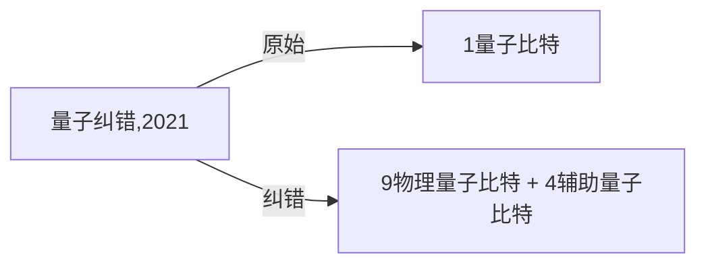

## Shor algorithm

Shor 纠错算法的本质是利用量子态的相长干涉特点将错误放大。

Bacon-Shor 算法是 Shor 算法的保护版本

2021年10月，门罗研究团队在实验室中实现了充分容错量子计算。

**是什么使量子信息处理成为可能？是什么分离了量子世界与经典世界？量子计算中正在利用哪些经典世界中无法获得的资源？**

## subsystem code papers outline

> **Bacon-Shor code:** A Bacon-Shor code is a subsystem quantum error-correcting code on an $L \times L$ lattice where the $2(L-1)$ weight-2L stabilizers are usually inferred from the measurements of $(L-1)^2$ weight-2 gauge operators.

### Operator quantum error-correcting subsystems for self-correcting quantum memories(2006)

编码量子信息重点：如何将信息编码至量子系统的子空间

### Subsystem Fault Tolerance with the Bacon-Shor Code(2007)

**摘要**：估计子系统在 Bacon-Shor 编码中的有效应用。FTEC 不需要纠缠附属态，实现最近两比特测量，找到对抗随机噪声下更低的量子准确极限 $1.94\times 10^{-4}$ 。

### Optimal Bacon-shor codes(2012)

经典错误概率如何影响比特翻转概率 $p_{X}$、相位翻转概率 $p_{Z}$。

## Chapter 1

### $1.1$

经典最好情形 $\mathbf{2}$ 次。当且仅当测量两次结果相同时无法确定平衡函数和常函数，其容错概率
$$
p=\frac{\left(\begin{array}{l}2^{n-1} \\ 2\end{array}\right)\cdot 2}{\left(\begin{array}{l}2^{n} \\ 2\end{array}\right)}=\dfrac{2^{n-1}-1}{2^n-1}<\dfrac{1}{2}
$$

而量子算法仅需 $\mathbf{1}$ 次完全确定结果（$\epsilon=0$），说明量子计算在该问题上的优越性。

### $1.2$

若状态可区分，发送的状态可以确定，设计合适的哈密顿设计器，在相同的状态下建立第二个系统；相反，准备量子态的多个副本，计算可观测值的平均值加以区分量子态。

## Chapter 2

### $2.1$

$$
\left[\begin{array}{c}1 \\ -1\end{array}\right]+\left[\begin{array}{l}1 \\ 2\end{array}\right]-\left[\begin{array}{l}2 \\ 1\end{array}\right]=\left[\begin{array}{l}0 \\ 0\end{array}\right]
$$

### $2.2$

$$
A=\left[\begin{array}{ll}0 & 1 \\ 1 & 0\end{array}\right],input: \{|0\rangle,|1\rangle\}, output: \{|1\rangle,|0\rangle\},A=\left[\begin{array}{ll}1 & 0 \\ 0 & 1\end{array}\right]
$$

### $2.3$

$$
B A\left|v_{i}\right\rangle =B\left(\sum_{j} A_{j i}\left|w_{j}\right\rangle\right) =\sum_{j} A_{j i} B\left|w_{j}\right\rangle =\sum_{j, k} A_{j i} B_{k j}\left|x_{k}\right\rangle \\ =\sum_{k}\left(\sum_{j} B_{k j} A_{j i}\right)\left|x_{k}\right\rangle =\sum_{k}(B A)_{k i}\left|x_{k}\right\rangle
$$

### $2.4$

$$
I_{ij}=\delta _{ij}
$$

### $2.5$

$$
\begin{aligned}
&(1)\left(\left(y_{1}, \cdots, y_{n}\right), \sum_{i} \lambda_{i}\left(z_{i 1}, \cdots, z_{i n}\right)\right)=\sum_{i, j} y_{i}^{*} \lambda_{j} z_{j i} 
=\sum_{j} \lambda_{j}\left(\sum_{i} y_{i}^{*} z_{j i}\right) 
\\
&\quad \ =\sum_{j} \lambda_{j}\left(\left(y_{1}, \cdots, y_{n}\right),\left(z_{j 1}, \cdots, z_{j n}\right)\right) =\sum_{i} \lambda_{i}\left(\left(y_{1}, \cdots, y_{n}\right),\left(z_{i 1}, \cdots, z_{i n}\right)\right)\\
&(2)\ \left(\left(y_{1}, \cdots, y_{n}\right),\left(z_{1}, \cdots, z_{n}\right)\right)^{*}=\left(\sum_{i} z_{i}^{*} y_{i}\right)=\left(\left(z_{1}, \cdots, z_{n}\right),\left(y_{1}, \cdots, y_{n}\right)\right)\\
&(3)\left(\left(y_{1}, \cdots, y_{n}\right),\left(y_{1}, \cdots, y_{n}\right)\right) =\sum_{i} y_{i}^{*} y_{i} =\sum_{i}\left|y_{i}\right|^{2}\geq 0\\
&\quad \ \left(\left(y_{1}, \cdots, y_{n}\right),\left(y_{1}, \cdots, y_{n}\right)\right)=0 \Longleftrightarrow  \left(y_{1}, \cdots, y_{n}\right)=0
\end{aligned}
$$

### $2.6$

$$
\begin{aligned}\left(\sum_{i} \lambda_{i}\left|w_{i}\right\rangle,|v\rangle\right) &=\left(|v\rangle, \sum_{i} \lambda_{i}\left|w_{i}\right\rangle\right)^{*} =\left(\sum_{i} \lambda_{i}\left(|v\rangle,\left|w_{i}\right\rangle\right)\right)^{*}  =\sum_{i} \lambda_{i}^{*}\left(\left|w_{i}\right\rangle,|v\rangle\right) \end{aligned}
$$

### $2.7$

$$
\begin{aligned}
&\langle w \mid v\rangle=\left[\begin{array}{ll} 1 & 1
\end{array}\right]\left[\begin{array}{c} 1 \\ -1
\end{array}\right]=0 
,\frac{|w\rangle}{\||w\rangle \|}=\frac{|w\rangle}{\sqrt{\langle w | w\rangle}}=\frac{1}{\sqrt{2}}\left[\begin{array}{l} 1 \\ 1
\end{array}\right],
\frac{|v\rangle}{\||v\rangle \|}=\frac{1}{\sqrt{2}}\left[\begin{array}{c}
1 \\
-1
\end{array}\right]
\end{aligned}
$$

### $2.8$

数学归纳法， $k=1$ 时 $\begin{aligned}
\left\langle v_{1} | v_{2}\right\rangle &=\left\langle v_{1}\right|\left(\frac{\left|w_{2}\right\rangle-\left\langle v_{1} | w_{2}\right\rangle\left|v_{1}\right\rangle}{\|\left|w_{2}\right\rangle-\left\langle v_{1} | w_{2}\right\rangle\left|v_{1}\right\rangle \|}\right)
=0
\end{aligned}$

$n=k$ 成立，对于 $n=k+1$ 有，$\forall \ 1\leq j\leq n$
$$
\begin{aligned}

\left\langle v_{j} | v_{n+1}\right\rangle &=\left\langle v_{j}\right|\left(\frac{\left|w_{n+1}\right\rangle-\displaystyle \sum_{i=1}^{n}\left\langle v_{i} | w_{n+1}\right\rangle\left|v_{i}\right\rangle}{\|\left|w_{n+1}\right\rangle-\displaystyle \sum_{i=1}^{n}\left\langle v_{i} | w_{n+1}\right\rangle\left|v_{i}\right\rangle \|}\right)\\&=
\frac{\left\langle v_{j} | w_{n+1}\right\rangle-\displaystyle \sum_{i=1}^{n}\left\langle v_{i} | w_{n+1}\right\rangle\left\langle v_{j} | v_{i}\right\rangle}{\|\left|w_{n+1}\right\rangle-\displaystyle \sum_{i=1}^{n}\left\langle v_{i} | w_{n+1}\right\rangle\left|v_{i}\right\rangle \|}=0
\end{aligned}
$$

### $2.9$

根据完备性关系，$A=I_{W}AI_{V}=\displaystyle \sum_{i,j}|\omega_j\rangle\langle\omega_j|A|v_i\rangle\langle v_i|=\sum_{i,j}\langle\omega_j|A|v_i\rangle|\omega_j\rangle\langle v_i|$
$$
\begin{aligned}
X=|0\rangle\langle 1|+| 1\rangle\langle 0|,Y=-i|0\rangle\langle 1|+i| 1\rangle\langle 0|,Z=|0\rangle\langle 0|-| 1\rangle\langle 1|
\end{aligned}
$$

### $2.10$

$$
\left(\left|v_{j}\right\rangle\left\langle v_{k}\right|\right)_{p q}=\delta_{p j} \delta_{k q}
$$

### $2.11$

$$
\lambda_{X,Y,Z}=\pm1,\begin{cases}X:|\lambda=1\rangle=\dfrac{1}{\sqrt{2}}\left[\begin{array}{c} 1 \\1\end{array}\right],|\lambda=-1\rangle=\dfrac{1}{\sqrt{2}}\left[\begin{array}{c} -1 \\1\end{array}\right]\\
Y:|\lambda=1\rangle=\dfrac{1}{\sqrt{2}}\left[\begin{array}{c} 1 \\i\end{array}\right],|\lambda=-1\rangle=\dfrac{1}{\sqrt{2}}\left[\begin{array}{c} i \\1\end{array}\right]
\\Z:|\lambda=1\rangle=\left[\begin{array}{c} 1 \\0\end{array}\right],|\lambda=-1\rangle=\left[\begin{array}{c} 0 \\1\end{array}\right]
\end{cases}
$$

对角表示为 $\begin{cases}X=\begin{pmatrix}0 & 1\\1 & 0\end{pmatrix}=\dfrac{1}{2}\left(\begin{array}{l}1 \\ 1
\end{array}\right)\left(\begin{array}{ll} 1 & 1 \end{array}\right)-\dfrac{1}{2}\left(\begin{array}{l} 1 \\ -1 \end{array}\right)\left(\begin{array}{ll} 1 & -1 \end{array}\right)\\   Y=\begin{pmatrix}0 & -i\\i & 0\end{pmatrix}=\dfrac{1}{2}\left(\begin{array}{l}1 \\ i
\end{array}\right)\left(\begin{array}{ll} 1 & -i \end{array}\right)-\dfrac{1}{2}\left(\begin{array}{l} i \\ 1 \end{array}\right)\left(\begin{array}{ll} -i & 1 \end{array}\right)\\   Z=\begin{pmatrix}1 & 0\\0 & -1\end{pmatrix}=\left(\begin{array}{l}1 \\ 0
\end{array}\right)\left(\begin{array}{ll} 1 & 0 \end{array}\right)-\left(\begin{array}{l} 0 \\ 1 \end{array}\right)\left(\begin{array}{ll} 0 & 1 \end{array}\right)\end{cases}$

### $2.12$

$$
\lambda =1,|\lambda=1\rangle=\begin{bmatrix}0\\1\end{bmatrix},A\neq a\begin{bmatrix}0&0\\0&1\end{bmatrix}
$$

### $2.13$

> 伴随算子的抽象定义：$\forall \ |v\rangle ,|\omega\rangle,(|v\rangle,A|\omega\rangle)=(A^{\dagger}|v\rangle,|\omega\rangle)$
$$
\forall \ |x\rangle,|y\rangle,\langle x|(|\omega\rangle \langle v|)^{\dagger}|y\rangle =\left(|x\rangle,(|\omega\rangle \langle v|)^{\dagger}|y\rangle\right)=\left((|\omega\rangle \langle v|)^{\dagger}|y\rangle,|x\rangle\right)^{*}\\
=(|y\rangle,|\omega\rangle\langle v|x\rangle)^{*}=(\langle y|\omega\rangle\langle v|x\rangle)^{*}=\langle v|x\rangle ^{*}\langle y |\omega \rangle^{*}=\langle x|v\rangle\langle \omega|y\rangle
$$

$$
\langle x|(|\omega\rangle \langle v|)^{\dagger}|y\rangle=\langle x|v\rangle\langle \omega|y\rangle\Longrightarrow (|w\rangle\langle v|)^{\dagger}=|v\rangle\langle w|
$$

### $2.14$

$$
\left(a_{i} A_{i}\right)^{\dagger}=(a_iIA_i)^{\dagger}=A_{i}^{\dagger}(a_i I)^{\dagger}=a_i^{*}A^{\dagger}
$$

### $2.15$

$$
\begin{aligned}
\left(\left(A^{\dagger}\right)^{\dagger}|\psi\rangle,|\phi\rangle\right) &=\left(|\psi\rangle, A^{\dagger}|\phi\rangle\right) =\left(A^{\dagger}|\phi\rangle,|\psi\rangle\right)^{*} =(|\phi\rangle, A|\psi\rangle)^{*} =(A|\psi\rangle,|\phi\rangle)
\end{aligned}
$$

### $2.16$

$$
P=\sum_{i=1}^{k}|i\rangle\langle i|,P^2=\left(\sum_{i=1}^{k}|i\rangle\langle i|\right)^2=\sum_{i=1}^{k}|i\rangle\langle i|i\rangle|i\rangle+2\sum_{i<j}|i\rangle\langle i|j\rangle|j\rangle=\sum_{i=1}^{k}|i\rangle\langle i|=P
$$

### $2.17$

$$
\Longrightarrow:A|\lambda\rangle=\lambda|\lambda\rangle,\langle \lambda|A|\lambda\rangle=\lambda \langle \lambda|\lambda\rangle=\langle\lambda|A^{\dagger}|\lambda\rangle=(A|\lambda\rangle)^{\dagger}|\lambda\rangle=\lambda^* \langle \lambda|\lambda\rangle,\lambda=\lambda^*\\
\Longleftarrow:AA^{\dagger}=A^{\dagger}A,A=\displaystyle \sum_{i}\lambda_i|\lambda_i\rangle\langle\lambda_i|,A^{\dagger}=\sum_{i}\lambda_i^*|\lambda_i\rangle\langle\lambda_i|=A^{\dagger}
$$

### $2.18$

设 $\lambda$ 为 $U$ 特征值， $|\lambda\rangle$ 为 $U$ 在 $\lambda$ 本征空间的特征向量， $U|\lambda\rangle=\lambda|\lambda\rangle,\langle\lambda|U^{\dagger}=\langle\lambda|\lambda^*$

相乘得 $\langle\lambda|U^{\dagger}U|\lambda\rangle=\lambda\lambda^*\langle\lambda|\lambda\rangle=\|\lambda\|^2\langle\lambda|\lambda\rangle=\langle\lambda|\lambda\rangle\Longrightarrow \|\lambda\|=1$

### $2.19$

$$
X=X^{\dagger},Y=Y^{\dagger},Z=Z^{\dagger},XX^{\dagger}=X^2=I,YY^{\dagger}=Y^2=I,ZZ^{\dagger}=Z^2=I,
$$

### $2.20$

$$
\left\langle v_{i}|A| v_{j}\right\rangle=\sum_{k l}\left\langle v_{i} \mid w_{k}\right\rangle\left\langle w_{k}|A| w_{l}\right\rangle\left\langle w_{l} \mid v_{j}\right\rangle
$$

### $2.21$

厄米算子 $A$ 的对角化：与正规算子相似，其中 $QMQ$ 的正规性易得
$$
\begin{aligned}
A &=I A I 
=(P+Q) A(P+Q) 
=P A P+Q A P+P A Q+Q A Q=\lambda P+QAQ
\end{aligned}
$$

$$
\begin{aligned}
Q A Q(Q A Q)^{\dagger} &=Q A Q Q A^{\dagger} Q =Q A^{\dagger} Q Q A Q =\left(Q AQ\right)^{\dagger} Q A Q
\end{aligned}
$$

将 $A$ 的对角化化解为 $P$ 和 $Q$ 的，从而由归纳法，任何厄米算子在标准正交基下可对角化

### $2.22$

$$
A|\lambda_1\rangle=\lambda_1|\lambda_1\rangle,A|\lambda_2\rangle=\lambda_2|\lambda_2\rangle,\langle\lambda_2|A^{\dagger}=\langle\lambda_2|\lambda_2^*\Longrightarrow\langle\lambda_2|A=\langle\lambda_2|\lambda_2\\
\langle\lambda_2|A|\lambda_1\rangle=\lambda_2\langle\lambda_2|\lambda_1\rangle=\lambda_1\langle\lambda_2|\lambda_1\rangle,\lambda_1\neq\lambda_2\Longrightarrow\langle\lambda_2|\lambda_1\rangle=0
$$

### $2.23$

$$
P|\lambda\rangle=\lambda|\lambda\rangle=P^2|\lambda\rangle=P\lambda|\lambda\rangle=\lambda^2|\lambda\rangle,|\lambda\rangle\neq0,\lambda^2=\lambda,\lambda=0,1
$$

### $2.24$

仿造实矩阵可分解为实对称矩阵和实反对称矩阵，将 $A$ 拆解为
$$
A=\frac{A+A^{\dagger}}{2}+i \frac{A-A^{\dagger}}{2 i}=B+iC
$$
其中 $B$ 和 $C$ 都为厄米矩阵，则 $\langle v|A|v\rangle=\langle v|B|v\rangle+i\langle v|C|v\rangle\geq 0$

而由厄米矩阵可以谱分解为 $\displaystyle \sum_{i}\lambda_i|i\rangle\langle i|$，其中 $|i\rangle$ 为标准正交基，且 $\lambda_i$ 为实数

故 $i\langle v|C|v\rangle$ 为虚数，从而 $\langle v|C|v\rangle=0\Longrightarrow C=O$，故 $A=B=\dfrac{A+A^{\dagger}}{2}$ 为厄米算子

> 引理：$\forall \ |v\rangle,\langle v|C|v\rangle=0\Longleftrightarrow C=O$。
>
>  $\forall \ |u\rangle,|v\rangle$，可以构造出下列等式使得 $\langle u|C|v\rangle=0$：
> $$
> \begin{array}{r}
> (|u\rangle, C |v\rangle)=\dfrac{1}{4}\left[(|u+v\rangle, C|u+v\rangle)-(|u-v\rangle, C|u-v\rangle)+\dfrac{1}{i}(|u+i v\rangle, C|u+i v\rangle)\right. \\
> \left.-\dfrac{1}{i}(|u-i v\rangle, C|u-i v\rangle)\right]
> \end{array}
> $$
> > 上式右侧化简 $\dfrac{2(|v\rangle,C|u\rangle)+2(|u\rangle,C|v\rangle)}{4}+\dfrac{2(|iv\rangle,C|u\rangle)+2(|u\rangle,iC|v\rangle)}{4i}$
> >
> > 由复空间内积定义 $(|iv\rangle,C|u\rangle)=\overline{i}\langle v|C|u\rangle=-i\langle v|C|u\rangle,(|u\rangle,iC|u\rangle)=i\langle u|C|v\rangle$
> >
> > $RHS=\dfrac{(|v\rangle,C|u\rangle)+(|u\rangle,C|v\rangle)}{2}+\dfrac{-i(|v\rangle,C|u\rangle)+i(|u\rangle,C|v\rangle)}{2i}=(|u\rangle, C |v\rangle)$
> >
>
> 故 $\forall \ |v\rangle,\langle v|C|v\rangle=0\Longleftrightarrow \forall \ |u\rangle,|v\rangle,\langle u|C|v\rangle=0$，而取 $|u\rangle=C|v\rangle$ ，由内积正定性
>
> $(C|v\rangle,C|v\rangle)=0\Longrightarrow C|v\rangle=0, \forall \ |v\rangle\Longrightarrow C=O$

### $2.25$

$$
\forall \ |v\rangle,\langle v|A^{\dagger}A|v\rangle=(A|v\rangle,A|v\rangle)\geq 0
$$

### $2.26$

$$
\begin{aligned}|\psi\rangle^{\otimes 2} &=\frac{1}{\sqrt{2}}(|0\rangle+|1\rangle) \otimes \frac{1}{\sqrt{2}}(|0\rangle+|1\rangle)=\frac{1}{2}(|00\rangle+|01\rangle+|10\rangle+|11\rangle)\\
|\psi\rangle^{\otimes 3} &=\frac{1}{\sqrt{2}}(|0\rangle+|1\rangle) \otimes \frac{1}{\sqrt{2}}(|0\rangle+|1\rangle) \otimes \frac{1}{\sqrt{2}}(|0\rangle+|1\rangle)\\ &=\frac{1}{2 \sqrt{2}}(|000\rangle+|001\rangle+|010\rangle+|011\rangle+|100\rangle+|101\rangle+|110\rangle+|111\rangle)
\end{aligned}
$$

### $2.27$

$$
\begin{aligned} X \otimes Z &=\left[\begin{array}{ll}0 & 1 \\ 1 & 0\end{array}\right] \otimes\left[\begin{array}{cc}1 & 0 \\ 0 & -1\end{array}\right]=\left[\begin{array}{cccc}0 & 0 & 1 & 0 \\ 0 & 0 & 0 & -1 \\ 1 & 0 & 0 & 0 \\ 0 & -1 & 0 & 0\end{array}\right] \\ 
I \otimes X &=\left[\begin{array}{ll}1 & 0 \\ 0 & 1\end{array}\right] \otimes\left[\begin{array}{ll}0 & 1 \\ 1 & 0\end{array}\right] =\left[\begin{array}{llll}0 & 1 & 0 & 0 \\ 1 & 0 & 0 & 0 \\ 0 & 0 & 0 & 1 \\ 0 & 0 & 1 & 0\end{array}\right] \\
X \otimes I &=\left[\begin{array}{lll}0 & 1 \\ 1 & 0\end{array}\right] \otimes\left[\begin{array}{ll}1 & 0 \\ 0 & 1\end{array}\right] =\left[\begin{array}{llll}0 & 0 & 1 & 0 \\ 0 & 0 & 0 & 1 \\ 1 & 0 & 0 & 0 \\ 0 & 1 & 0 & 0\end{array}\right] \end{aligned}
$$

一般情形下，张量积不可交换。

### $2.28$

$$
\begin{aligned}(A \otimes B)^{*} &=\left[\begin{array}{ccc}A_{11} B & \cdots & A_{1 n} B \\ \vdots & \ddots & \vdots \\ A_{m 1} B & \cdots & A_{m n} B\end{array}\right]^{*} =\left[\begin{array}{ccc}A_{11}^{*} B^{*} & \cdots & A_{1 n}^{*} B^{*} \\ \vdots & \ddots & \vdots \\ A_{m 1}^{*} B^{*} & \cdots & A_{m n}^{*} B^{*}\end{array}\right] =A^{*} \otimes B^{*} \\
(A \otimes B)^{T}&=\left[\begin{array}{ccc}
A_{11} B & \cdots & A_{1 n} B \\
\vdots & \ddots & \vdots \\
A_{m 1} B & \cdots & A_{m n} B
\end{array}\right]^{T}=\left[\begin{array}{ccc}
A_{11} B^{T} & \cdots & A_{m 1} B^{T} \\
\vdots & \ddots & \vdots \\
A_{1 n} B^{T} & \cdots & A_{m n} B^{T}
\end{array}\right]=A^{T} \otimes B^{T}\\

(A \otimes B)^{\dagger} &=\left((A \otimes B)^{*}\right)^{T} =\left(A^{*} \otimes B^{*}\right)^{T} =\left(A^{*}\right)^{T} \otimes\left(B^{*}\right)^{T} =A^{\dagger} \otimes B^{\dagger}

\end{aligned}
$$

### $2.29$

$$
\begin{aligned}
\left(U_{1} \otimes U_{2}\right)\left(U_{1} \otimes U_{2}\right)^{\dagger} &=U_{1} U_{1}^{\dagger} \otimes U_{2} U_{2}^{\dagger} =I \otimes I=I
\end{aligned}
$$

### $2.30$

$$
(A \otimes B)^{\dagger}=A^{\dagger} \otimes B^{\dagger}=A \otimes B
$$

### $2.31$

$$
(\langle u|\otimes\langle v|)(A \otimes B)| (u\rangle \otimes| v\rangle)=\langle u|A| u\rangle\langle v|B| v\rangle\geq 0
$$

### $2.32$

$$
\begin{aligned}
\left(P_{1} \otimes P_{2}\right)^{2} &=P_{1}^{2} \otimes P_{2}^{2} =P_{1} \otimes P_{2}
\end{aligned}
$$

### $2.33$

$$
\begin{aligned}
H &=\frac{1}{\sqrt{2}}[|0\rangle\langle 0|+| 1\rangle\langle 0|+| 0\rangle\langle 1|-| 1\rangle\langle 1|] =\frac{1}{\sqrt{2}} \sum_{x, y}(-1)^{x \cdot y}|x\rangle\langle y|\\
H^{\otimes n} &=\frac{1}{\sqrt{2^{n}}} \sum_{x 1, y 1}(-1)^{x_{1} \cdot y_{1}}\left|x_{1}\right\rangle\langle y_{1}|\otimes \cdots\otimes \sum_{x_{n}, y_{n}}(-1)^{x_{n} \cdot y_{n}} |x_{n}\rangle\langle y_{n}| \\&=\frac{1}{\sqrt{2^{n}}} \sum_{\boldsymbol{x}, \boldsymbol{y}}(-1)^{\boldsymbol{x} \cdot \boldsymbol{y}}|\boldsymbol{x}\rangle\langle\boldsymbol{y}|\\

H^{\otimes 2}&=\frac{1}{\sqrt{2}}\left[\begin{array}{cc}
1 & 1 \\
1 & -1
\end{array}\right] \otimes \frac{1}{\sqrt{2}}\left[\begin{array}{cc}
1 & 1 \\
1 & -1
\end{array}\right]=\frac{1}{2}\left[\begin{array}{cccc}
1 & 1 & 1 & 1 \\
1 & -1 & 1 & -1 \\
1 & 1 & -1 & -1 \\
1 & -1 & -1 & 1
\end{array}\right]

\end{aligned}
$$

### $2.34$

> 正规算子 $A$ （正交）谱分解 $A=\displaystyle \sum_{i}a|a\rangle\langle a|$ ，定义算子函数 $f(A)=\displaystyle \sum_{i}f(a)|a\rangle\langle a|$

将 $A=\left[\begin{array}{ll}
4 & 3 \\
3 & 4
\end{array}\right]$ 谱分解 $A=1\cdot \dfrac{1}{2}\left[\begin{array}{c} 1 \\-1\end{array}\right] \left[\begin{array}{c} 1 &-1\end{array}\right]+7\cdot \dfrac{1}{2}\left[\begin{array}{c} 1 \\1\end{array}\right] \left[\begin{array}{c} 1 &1\end{array}\right]$，从而
$$
\sqrt{A}=1\cdot \dfrac{1}{2}\left[\begin{array}{c} 1 \\-1\end{array}\right] \left[\begin{array}{c} 1 &-1\end{array}\right]+\sqrt{7}\cdot \dfrac{1}{2}\left[\begin{array}{c} 1 \\1\end{array}\right] \left[\begin{array}{c} 1 &1\end{array}\right]=\frac{1}{2}\left[\begin{array}{cc}
1+\sqrt{7} & -1+\sqrt{7} \\
-1+\sqrt{7} & 1+\sqrt{7}
\end{array}\right]\\
\log(A)=0\cdot \dfrac{1}{2}\left[\begin{array}{c} 1 \\-1\end{array}\right] \left[\begin{array}{c} 1 &-1\end{array}\right]+\log 7\cdot \dfrac{1}{2}\left[\begin{array}{c} 1 \\1\end{array}\right] \left[\begin{array}{c} 1 &1\end{array}\right]=\frac{\log (7)}{2}\left[\begin{array}{ll}
1 & 1 \\
1 & 1
\end{array}\right]
$$

### $2.35$

$$
\begin{aligned}
\vec{v} \cdot \vec{\sigma} &=\sum_{i=1}^{3} v_{i} \sigma_{i} =v_{1}\left[\begin{array}{ll}
0 & 1 \\
1 & 0
\end{array}\right]+v_{2}\left[\begin{array}{cc}
0 & -i \\
i & 0
\end{array}\right]+v_{3}\left[\begin{array}{cc}
1 & 0 \\
0 & -1
\end{array}\right] =\left[\begin{array}{cc}
v_{3} & v_{1}-i v_{2} \\
v_{1}+i v_{2} & -v_{3}
\end{array}\right]
\end{aligned}
$$

计算特征值 $\begin{aligned}
\operatorname{det}(\vec{v} \cdot \vec{\sigma}-\lambda I) &=\left(v_{3}-\lambda\right)\left(-v_{3}-\lambda\right)-\left(v_{1}-i v_{2}\right)\left(v_{1}+i v_{2}\right) =\lambda^{2}-1 \quad
\end{aligned}$

由其为厄米矩阵，则可以（正交）谱分解 $\vec{v} \cdot \vec{\sigma}=\left|\lambda_{1}\right\rangle\left\langle\lambda_{1}|-| \lambda_{-1}\right\rangle\left\langle\lambda_{-1}\right|$

其中 $\left|\lambda_{1}\right\rangle\left\langle\lambda_{1}|+| \lambda_{-1}\right\rangle\left\langle\lambda_{-1}\right|=I$，而代入指数函数分别作用在 $\pm i\theta$ 上，展开得到
$$
\begin{aligned}
e ^{i \theta \vec{v} \cdot \vec{\sigma}} &=e^{i \theta}\left|\lambda_{1}\right\rangle\left\langle\lambda_{1}\left|+e^{-i \theta}\right| \lambda_{-1}\right\rangle\left\langle\lambda_{-1}\right| \\
&=(\cos \theta+i \sin \theta)\left|\lambda_{1}\right\rangle\left\langle\lambda_{1}|+(\cos \theta-i \sin \theta)| \lambda_{-1}\right\rangle\left\langle\lambda_{-1}\right| \\
&=\cos \theta\left(\left|\lambda_{1}\right\rangle\left\langle\lambda_{1}|+| \lambda_{-1}\right\rangle\left\langle\lambda_{-1}\right|\right)+i \sin \theta\left(\left|\lambda_{1}\right\rangle\left\langle\lambda_{1}|-| \lambda_{-1}\right\rangle\left\langle\lambda_{-1}\right|\right) \\
&=\cos (\theta) I+i \sin (\theta) \vec{v} \cdot \vec{\sigma}
\end{aligned}
$$

### $2.36$

$$
\begin{aligned}
&\operatorname{Tr}\left(\sigma_{1}\right)=0+0=\operatorname{Tr}\left(\sigma_{2}\right)=0+0=\operatorname{Tr}\left(\sigma_{3}\right)=1+(-1)=0 
\end{aligned}
$$

### $2.37$

$$
\begin{aligned}
\operatorname{Tr}(A B) &=\sum_{i}\langle i|A B| i\rangle 
=\sum_{i, j}\langle i|A| j\rangle\langle j|B| i\rangle =\sum_{i, j}\langle j|B| i\rangle\langle i|A| j\rangle \\
&=\sum_{j}\langle j|B A| j\rangle =\operatorname{Tr}(B A)
\end{aligned}
$$

### $2.38$

$$
\begin{aligned}
\operatorname{Tr}(A+B) &=\sum_{i}\langle i|A+B| i\rangle =\sum_{i}(\langle i|A| i\rangle+\langle i|B| i\rangle)=\operatorname{Tr}(A)+\operatorname{Tr}(B) \\

\operatorname{Tr}(z A) &=\sum_{i}\langle i|z A| i\rangle 
=z \sum_{i}\langle i|A| i\rangle=z \operatorname{Tr}(A)

\end{aligned}
$$

### $2.39$

