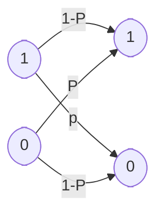
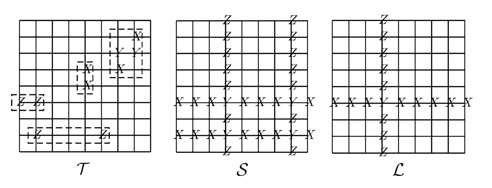

# 量子纠错编码

黄书鸿 鲁睿 赵晨阳  
   

  
清华大学  

<b>摘要: </b>
 

从噪声以及经典量子纠错出发，回顾了量子纠错理论，并详细推导了量子纠错领域中应用广泛的 CSS 编码以及稳定子理论。在现代量子纠错相关研究中，基于稳定子编码框架，提出表面码编码以及子系统编码两种更好的编码方式，两者在量子纠错的物理构建以及理论下界均有相关进展，两者均能在量子计算机纠错性能方面有更好表现。
 

<b>关键词: </b>
 

量子纠错; CSS 编码; 稳定子理论; 表面码编码; 子系统编码; 

# Quantum Error-correction Coding

Shuhong Huang, Rui Lu, Chenyang Zhao

<i>Tsinghua University</i>

<b>Abstract: </b>
 

From the perspective of noise and classical quantum error correction, the quantum error correction theory is reviewed, and the CSS coding and stabilizers theory which are widely used in the field of quantum error correction are derived in detail.  In modern quantum error correction related research, based on the stabilization coding framework, two better coding methods are proposed, surface code coding and subsystem coding. Both of them have made relevant progress in the physical construction and theoretical lower bound of quantum error correction, and both of them can have better performance in the quantum computer error correction performance.

  

<b>Key Words: </b>
 

Quantum error correction;  CSS code;  Stable son theory;  Surface code code;  Subsystem code; 

[TOC]

量子纠错主要讨论在存在噪声的情况下，如何可靠地进行量子信息处理。论文第一节将首先讨论量子纠错码的基本理论——它如何能抵抗噪声以保护量子信息。随后，我们研究一个具体的稳定子码的案例：Surface code，它是现在最为主流的量子纠错码。最后，我们拓展稳定子码的定义，研究子系统码，这对我们设计新的量子纠错码具有很大的启发意义。

## 经典量子纠错码

### 噪声

噪声在日常系统中无处不在，为了能够让系统正常工作，我们往往采用冗余编码的方式来编码信息，这样即使受到噪声污染，也有办法从中恢复原来编码的信息。
下图展示了一个一个有噪声的信道。信道中噪声的影响是以概率 $p>0$ 将正在被传输的比特翻转，而以概率 $1-p$ 使比特无差错地传输。这种信道称为二元对称信道 (binary symmetric channel)。可做如下编码：
$$
\begin{aligned}
0 & \rightarrow 000 \\
1 & \rightarrow 111
\end{aligned}
$$
这个比特串 000 和 111 有时被叫做逻辑 0 和逻辑 1，因为它们分别扮演了 0 和 1 的角色。我们现在通过信道发送所有这三个比特。接收方采用多数表决很大概率可以恢复原有的信息，只要我们假设错误发生的概率不大。

### 量子噪声

在了解信号纠错的基本思想后，我们在此阐明量子噪声以及其特点。量子噪声产生的主要原因是实验室环境下的量子系统并不是一个完美的孤立系统，总是会与环境发生相互作用，在这个大系统中的演化，就表现为实验系统中的噪声。

我们可以假设初始状态下系统和环境之间是没有纠缠的，状态分别表示为 $\rho$ 和 $\rho_{env}$，且在系统和环境组成的大系统中经历演化 $U$，那么从实验室系统的角度来看，$\rho$ 经历如下的变化：
$$
\Epsilon (\rho) = tr_{env}[U (\rho \otimes \rho_{env})U^{\dagger}]
$$
由于我们总是可以引入一个额外的系统对 $\rho_{env}$ 进行纯化，并且假设它在纯化后表示状态 $|0\rangle$，我们总是可以假设环境的初始状态为 $|0\rangle$。所以以上的作用总是可以写作下面的 operator sum 的形式：
$$
E(\rho) = \sum_i E_i \rho E_i^\dagger
$$
它显然是线性的，并且若 $\rho$ 为正，$\Epsilon(\rho)$ 也为正，并且保持 trace 不变。集合 $E = \{E_i\}$ 就称之为错误，当然对于同一个如上的作用，可以有不同的 operator sum 的表达形式。

这里我们不加证明地声称，所有的有噪声的量子信道都可以用一个保持半正定性和 trace 的 operator sum 来表示。在量子纠错的理论中，我们最为关注的是一类称为 Pauli error 的错误，它们作用在单个 qubit 上，通常可以被表示为：
$$
\Epsilon(\rho) = (1 - p_X - p_Y - p_Z)\rho + p_X X\rho X + p_Y Y\rho Y + p_Z Z\rho Z
$$
可以验证上面的公式符合我们说的性质。这还可以解释为对于该 qubit，有 $p_\sigma$ 的概率发生 $\sigma$ 错误，事实上从这个观点出发并结合 density operator 的定义，我们也可以得到以上的形式。

### 三量子比特的比特翻转编码

为了抵消噪声的影响保护量子状态，我们将会基于类似的原理来引入量子纠错码。经典信息和量子信息之间存在着一些重要的区别，这就需要引人一种新的思想以使这样的量子纠错码成为可能。这种新的思想需要克服如下三个问题：

1. 不可克隆：有人可能试图通过将量子状态复制三次或多次，以量子力学方式来实现重复码。但据不可克隆 (no-cloning) 定理，这种作法是不允许的，即使复制是可能的，也不可能来度量和比较来自信道的三个量子状态输出。

2. 差错是连续的：连续的不同差错可能出现在单量子比特上。为确定哪个差错出现以便来纠正它，看来需要无穷高的精度，因此要求无穷多的计算资源。

3. 测量会破坏量子信息：在经典纠错中，我们会观测来自信道的输出，并决定采用什么样的解码步骤。量子力学中的观测一般会破坏所观测的量子状态并使恢复成为不可能。

假设通过一个信道发送量子比特，信道以概率 $1-p$ 保持量子比特不改变，以概率 $p$ 使量子比特翻转。也即以概率 $p$ 状态 $|\psi\rangle$ 被取为状态 $X|\psi\rangle$，其中 $X$ 为通常的 Pauli sigma $x$ 算子或比特翻转算子。这种信道被称为比特翻转信道 (bit flip channel)。我们现在来解释比特翻转码 (bit flip code)，这种编码可被用来处理来自这种信道的噪声的影响，进而保护量子比特。
设我们将单量子比特状态 $a|0\rangle+b|1\rangle$ 用三个量子比特编码为 $a|000\rangle+$ $b|111\rangle$。一个方便的方法是把这个编码写为：
$$
\begin{aligned}
|0\rangle \rightarrow\left|0_{\mathrm{L}}\right\rangle & \equiv|000\rangle \\
|1\rangle \rightarrow\left|1_{\mathrm{L}}\right\rangle & \equiv|111\rangle
\end{aligned}
$$

其中，基状态的叠加被取为相应编码状态的叠加。符号 $\left|0_{\mathrm{L}}\right\rangle$ 和 $\left|1_{\mathrm{L}}\right\rangle$ 表示这些是逻辑 $|0\rangle$ 和逻辑 $|1\rangle$ 状态，而不是物理的 0 和 1 状态。

设初始状态 $a|0\rangle+b|1\rangle$ 已被完美地编码为 $a|000\rangle+b|111\rangle$。这三个量子比特中的每一个都通过一个比特翻转信道的独立备份。设一个或更少的量子比特出现了一个比特翻转。有一种简单的两阶段纠错方法，可用于恢复和纠正这种情况中的量子状态。

1. 阶段一：差错检测 (error-detection) 或症状诊断 (syndrome diagnosis)：我们执行一次测量，它会告诉我们什么差错 (如果存在的话) 出现在量子状态上。这个测量结果被称为差错症状 (error syndrome)。对于比特翻转信道，对应于四个投影算子，可有四种差错症状：

$$
\begin{array}{lll}P_{0} \equiv|000\rangle\langle 000|+| 111\rangle\langle 111| & \text { 没有差错 }  \\ P_{1} \equiv|100\rangle\langle 100|+| 011\rangle\langle 011| & \text { 第一量子比特上比特翻转 }  \\ P_{2} \equiv|010\rangle\langle 010|+| 101\rangle\langle 101| & \text { 第二量子比特上比特翻转 }  \\ P_{3} \equiv|001\rangle\langle 001|+| 110\rangle\langle 110| & \text { 第三量子比特上比特翻转 }\end{array}
$$

设举例来说比特翻转出现在第一个量子比特上，所以破坏后的状态为 $a|100\rangle+$ $b|011\rangle$。注意到在这种情况中 $\left\langle\psi\left|P_{1}\right| \psi\right\rangle=1$，所以测量结果 (差错症状) 的输出肯定为 1。进而差错症状测量不会引起状态的任何改变，在差错症状测量之前和之后的状态都为 $a|100\rangle+b|011\rangle$。注意，差错症状所包含的只是有关出现什么差错的信息，而不允许我们来推断有关 $a$ 或 $b$ 的值的任何事情，也即它不包含所被保护状态的信息。这是差错症状测量的一个普遍特征，因为为了得到有关量子状态身份的信息，一般有必要对该状态进行扰动。

2. 阶段二：恢复 (recovery)：我们采用差错症状的值来了解采用什么方法来恢复初始状态。举例来说，如果差错症状为 1，指示第一个量子比特上比特翻转，则我们只要再一次翻转那个量子比特，就以完全准确地恢复到原状态 $a|000\rangle+b|111\rangle$。这四种可能的差错状态和每种情况中的恢复方法为:

| 差错状态                  | 恢复方法               |
| ------------------------- | ---------------------- |
| 0 (没有差错)              | 什么也不用做           |
| 1(第一量子比特上比特翻转) | 再一次翻转第一量子比特 |
| 2(第二量子比 上比特翻转)  | 再一次翻转第二量子比特 |
| 3(第三量子比特上比特翻转) | 再一次翻转第三量子比特 |

对于差错症状的每个值，在给定相应所出现的差错后，容易看出原状态可得以完全准确的恢复。这种纠错方法，只要在三个量子比特出现不超过一个的比特翻转，就可完美地来工作。这种情况以概率 $(1-p)^{3}+3 p(1-p)^{2}=1-3 p^{2}+2 p^{3}$ 出现，剩下一个差错没有纠正的概率因而为 $3 p^{2}-2 p^{3}$，正好如经典重复码。同样，对 $p<1 / 2$，编码和解码会改善量子状态的存储可靠性。

### 改善差错分析

上述这种差错分析并不是完全足够的。因为并非所有的差错和量子力学中的状态都是同等地作用的：量子状态位于连续空间中, 所以有可能某些差错只会使状态造成轻微破坏，而其他差错则使状态完全弄乱。比特翻转差错 $X$ 是一个极端的例子，这个差错根本不影响状态 $(|0\rangle+|1\rangle) / \sqrt{2}$，但会翻转 $|0\rangle$ 状态而使其变为 $|1\rangle$。在前一种情况中我们无需担心比特翻转差错的出现，而在后一种情况中我们显然会非常担心。

为讨论这个问题，我们要用到引入于保真度概念：一个纯态和一个混合态之间的保真度为 $F(|\psi\rangle, \rho)=\sqrt{\langle\psi|\rho| \psi\rangle}$。量子纠错的目标是来提高保真度，使以相当接近于最大可能保真度 1 来存储 (或传送) 量子信息。让我们对利用三量子比特比特翻转码所能达到的最小保真度和当不执行纠错时的保真度来作一比较。设所感兴趣的量子状态为 $|\psi\rangle$，没有采用纠错码时，量子比特在经由信道发送后的状态为：
$$
\rho=(1-p)|\psi\rangle\langle\psi|+p X| \psi\rangle\langle\psi| X
$$
保真度为：
$$
F=\sqrt{\langle\psi|\rho| \psi\rangle}=\sqrt{(1-p)+p\langle\psi|X| \psi\rangle\langle\psi|X| \psi\rangle}
$$
平方根号中的第二项为非负且当 $|\psi\rangle=|0\rangle$ 时等于 0，所以我们看到最小保真度为 $F=\sqrt{(1-p)}$。设三量子比特纠错码被用来保护 $|\psi\rangle=a\left|0_{\text {L. }}\right\rangle+b\left|1_{\text {L. }}\right\rangle$，噪声和纠错两者作用后的量子状态为：
$$
\rho=\left[(1-p)^{3}+3 p(1-p)^{2}\right]|\psi\rangle\langle\psi|+\cdots
$$
省略号表示的项代表两个或三个量子比特上比特翻转的贡献。所有这些省略项都是半正定算子，所以我们所计算的保真度将是真正保真度的一个下界。而另一方面，$F=\sqrt{\langle\psi|\rho| \psi\rangle} \geqslant \sqrt{(1-p)^{3}+3 p(1-p)^{2}}$。也即保真度至少为 $\sqrt{1-3 p^{2}+2 p^{3}}$，所以存储量子状态的保真度在规定 $p<1 / 2$ 下会被改善，这与我们早先非常粗糙的分析得到的结论是相同的。

存在另一种理解差错症状测量的不同方法，它在推广三量子比特码中是会有用处的。假设代替测量四个投影算子 $P_{0}, P_{1}, P_{2}, P_{3}$，我们来执行两个测量，第一个是对可观测量 $Z_{1} Z_{2}$ (也即 $\left.Z \otimes Z \otimes I\right)$ 的，第二个是对可观测量 $Z_{2} Z_{3}$ 的。这些观测量中的每一个都具有特征值 1 ，所以每个测量都提供一个单量子比特信息，总共两个量子比特信息，即四个可能的差错症状，恰好等同于早先描述中的结果。第一个测量即对 $Z_{1} Z_{2}$ 的测量，可被想象为来比较第一个量子比特和第二个量子比特，看它们是否相同。具体而言，考虑到 $Z_{1} Z_{2}$ 具有谱分解：
$$
Z_{1} Z_{2}=(|00\rangle\langle 00|+| 11\rangle\langle 11|) \otimes I-(|01\rangle\langle 01|+| 10\rangle\langle 10|) \otimes I
$$
它对应于具有投影算子 $(|00\rangle\langle 00|+| 11\rangle\langle 11|) \otimes I$ 和 $(|01\rangle\langle 01|+| 10\rangle\langle 10|) \otimes I$ 的一个投影测量。因此，测量 $Z_{1} Z_{2}$ 可被想象为来比较第一个量子比特和第二个量 子比特的值，若它们相同给出 $+1$，若它们不同给出 $-1$。类似地，测量 $Z_{2} Z_{3}$ 被想象为比较第二个量子比特和第三个量子比特的值，若它们相同给出 $+1$，若它们不同给出 $-1$。组合这两个测量结果，我们就能确定是否有比特翻转出现在量子比特中的一个比特上，如果有那么还可来确定是哪一种：若两者测量结果都给出 $+1$，则以高概率没有比特翻转出现；若测量 $Z_{1} Z_{2}$ 给出 $+1$ 而测量 $Z_{2} Z_{3}$ 给出 $-1$，则以高概率只有第三个量子比特翻转；若测量 $Z_{1} Z_{2}$ 给出 $-1$ 而测量 $Z_{2} Z_{3}$ 给出 $+1$，则以高概率只有第一个量子比特翻转；最后，若两者测量结果都给出 $-1$，则以高概率只有第二个量子比特翻转。这些测量成功的关键是，两个测量都不会给出有关编码后量子状态的幅值 $a$ 和 $b$ 的任何信息，因而两个测量都不会破坏我们用此编码来保护的量子状态的叠加。

### 三量子比特的相位翻转码

对于 $Z$ 错误，我们完全可以采用和比特翻转码相同的思路，$X$ 会对调 $|0\rangle$ 和 $|1\rangle$，$Z$ 会对调 $|+\rangle$ 和 $|-\rangle$，那么我们可以做如下编码：
$$
|0_L\rangle \rightarrow |+++\rangle \\
|1_L\rangle \rightarrow |---\rangle
$$
类似的分析让我们知道它可以纠正单比特的 $Z$ 错误。

## Shor 码

有一种简单的量子码能针对单量子比特上任意差错的影响进行保护。这种码就是以其发明者命名的 Shor 码，它是量子比特相位翻转码和三量子比特比特翻转码的组合。我们首先用相位翻转码来编码量子比特: $|0\rangle \rightarrow|+++\rangle,|1\rangle \rightarrow$ $|---\rangle$。其次，我们用三个量子比特比特翻转码来编码这些量子比特中的每个：$|+\rangle$ 编码为 $(|000\rangle+|111\rangle) / \sqrt{2},|-\rangle$ 编码为 $(|000\rangle-|111\rangle) / \sqrt{2}$。这个结果为 9 量子比特，其码字为：
$$
\begin{array}{l}
|0\rangle \rightarrow\left|0_{\mathrm{L}}\right\rangle \equiv \frac{(|000\rangle+|111\rangle)(|000\rangle+|111\rangle)(|000\rangle+|111\rangle)}{2 \sqrt{2}} \\
|1\rangle \rightarrow\left|1_{\mathrm{L}}\right\rangle \equiv \frac{(|000\rangle-|111\rangle)(|000\rangle-|111\rangle)(|000\rangle-|111\rangle)}{2 \sqrt{2}}
\end{array}
$$

Shor 码能对任一量子比特上的相位翻转差错和比特翻转差错进行保护。为看清这点，设比特翻转出现在第一个量子比特上。就比特翻转码来说，我们执行对 $Z_{1} Z_{2}$ 的一次测量，并比较前两个量子比特，发现它们不同。基此我们得出结论，比特翻转差错出现在第一或第二量子比特。下一步，我们通过执行对 $Z_{2} Z_{3}$ 的一次测量来比较第二和第三量子比特。我们发现它们相同，所以第二量子比特不可能出现翻转。据此得到结论，第一量子比特必出现了翻转，只要再一次翻转第一量子比特就会从差错中恢复，回复到原来的状态。按类似的方法，我们就能从这个码中检测和恢复出 9 个量子比特的任意一个受比特翻转差错影响的比特。

我们现以类似的方式来处理量子比特上的相位翻转。设相位翻转出现在第一量子比特上。这个相位翻转使第一量子比特块中的符号翻转，变 $(|000\rangle+|111\rangle)$ 为 $(|000\rangle-|111\rangle)$，反之亦然。事实上，前三个量子比特中任意一个上的相位翻转都具有这种影响，我们所描述的纠错方法对这三种可能差错中的任意一种都能奏效。差错症状测量开始于比较第一个和第二个三量子比特块的符号，就像对相位翻转码的差错症状测量开始于比较第一和第二量子比特一样。举例来说，(| 000>一 $|111\rangle)(|000\rangle \cdots|111\rangle)$ 在两个量子比特块中具有相同符号 $(-)$，而 $(|000\rangle-$ $|111\rangle)(|000\rangle+|111\rangle)$ 具有不同符号。当相位翻转出现在前三个量子比特中任意一个上时，我们发现第一和第二量子比特块的符号为不同。差错症状测量的第二阶段和最后阶段是来比较第二和第三量子比特块的符号。我们发现这些符号为相同，并得到结论在第一个三量子比特块中必有翻转。通过翻转第一个三量子比特块中的符号，我们就会将其恢复到它的原来的值。以类似的方式，我们还可恢复 9 个量子比特中任意一个上的相位翻转。

设比特翻转和相位翻转差错两者同时出现在第一量子比特上，也即算子 $Z_{1} X_{1}$ 作用于那个量子比特上。那么，容易看出，检测比特翻转差错的方法将可来检测第一量子比特上的比特翻转并对其纠正，检测相位翻转差错的方法将可来检测第一个三量子比特块上的相位翻转并对其纠正。因此，Shor 码也能来纠正单量子比特上比特翻转和相位翻转的组合差错。

事实上，Shor 码对单量子比特上的保护要比比特翻转和相位翻转差错多得多一一我们现来证明，Shor 码可对完全任意的差错进行保护，只要规定它们仅影响一个单量子比特。
为简化分析，设一个任意类型的噪声只出现在第一量子比特上。我们用保迹量子运算 $\varepsilon$ 来描述噪声，分析纠错的最为方便的做法是将 $\varepsilon$ 展开为具有运算元 $\left\{E_{i}\right\}$ 的算子和表示。设噪声作用前编码后的量子比特状态为： $|\psi\rangle=\alpha\left|0_{\mathrm{L}}\right\rangle+\beta\left|1_{\mathrm{L}}\right\rangle$，则噪声作用以后这个状态为 $\varepsilon(|\psi\rangle\langle\psi|)=\sum_{i} E_{i}|\psi\rangle\langle\psi| E_{i}^{\dagger}$。为分析纠错的作用，最容易的做法是把纠错作用集中到这个和式的一个单项上，比如说 $E_{i}|\psi\rangle\langle\psi| E_{i}^{\dagger}$。作为第一量子比特上的一个单独的算子 $E_{i}$，可以被展开为单位阵 $I$ 、比特翻转 $X_{1}$ 、相位翻转 $Z_{1}$ 以及组合位与相位翻转 $X_{1} Z_{1}$ 的一个线性组合：
$$
E_{i}=e_{i 0} I+e_{i 1} X_{1}+e_{i 2} Z_{1}+e_{i 3} X_{1} Z_{1}
$$
(非归一化) 量子状态 $E_{i}|\psi\rangle$ 因而可写成 $|\psi\rangle, X_{1}|\psi\rangle, Z_{1}|\psi\rangle, X_{1} Z_{1}|\psi\rangle$ 四项的叠加。测量差错症状会将这个叠加结果坍塌为四个状态 $|\psi\rangle, X_{1}|\psi\rangle, Z_{1}|\psi\rangle, X_{1} Z_{1}|\psi\rangle$ 之一，恢复过程由随后通过作用适当的逆运算而执行，并获得最终状态 $|\psi\rangle$。这些对于所有其他运算元 $E_{i}$ 也是正确的。因此，纠错会使原来状态 $|\psi\rangle$ 恢复，尽管事实上第一量子比特上的差错是任意的。这是关于量子纠错的一个基本和深刻的事实，通过只纠正差错的一个离散集一一在这个例子中，为比特翻转、相位翻转以及组合比特与相位翻转一一量子纠错码就会自动地纠正要比这个离散集明显大得多的 (连续) 差错类。

当噪声不只影响第一个量子比特时会发生什么呢？处理这个问题有两个基本思想。首先，在很多情况中，一个很好的近似是假定噪声为独立地作用于量子比特。在规定噪声在一个量子比特上的影响为相当小后，我们就可把噪声的总影响展开为包括零量子比特上的差错、单量子比特上的差错、双量子比特上的差错等各项之 和，并以零量子比特上的差错项和单量子比特上的差错项控制高阶项。执行纠错会带来对零阶项和一阶项的合理纠正，剩下的只是小得多的二阶和高阶差错，这就实现了对差错的基本抑制。

## 量子纠错的理论

量子纠错理论的基本思想自然地推广了由 Shor 码引发的思想，量子状态通过酉运算被编码为量子纠错码，其形式定义为某个较大 Hilbert 空间中的一个子空 间 $C$。为方便起见，我们采用符号 $P$ 表示到码空间 $C$ 上的投影算子；且对三量子比特比特翻转码，$P=|000\rangle\langle 000|+| 111\rangle\langle 111|$。在编码以后，这个码会受到噪声的影响，紧接着执行差错症状测量以检测所出现的差错类型。一旦差错症状确定，恢复运算就会执行，以使量子系统回到这个码的原来状态。

不同的差错症状对应于整个 Hilbert 空间中保形的和正交的子空间，这些子空间必是正交的，否则它们就不能被差错症状测量可靠地区分。进而，由于到不同子空间的差错映射必将正交码字映射到正交状态，因此这些不同的子空间必为原来码空间的保形版本，这样就能使其从差错中恢复。这个直观的图像基本上就是下面所要讨论的量子纠错条件的要旨。

我们仅只作两个很宽泛的假定：噪声由量子运算 $\varepsilon$ 所描述，整个纠错方法由我们称之为纠错运算的一个保迹量子运算 $\mathscr{R}$ 承担。这个纠错运算把我们上面称为差错检测和恢复的两个步骤合并，为确保纠错是成功的，我们要求对任何状态 $\rho$，其支集位于码空间 $C$ 中，有

$$
(\mathscr{R} \circ \varepsilon)(\rho) \propto \rho
$$

量子纠错条件是一个简单方程组，它们可被检验以确定量子纠错码是否能对抗特殊类型的噪声 $\varepsilon$。我们将应用这些条件来构造大量的量子码，并将研究量子纠错码的一些普遍性质。

### 量子纠错条件

令 $C$ 为一个量子码，令 $P$ 为到 $C$ 的投影算子。设 $\varepsilon$ 为具有运算元 $\left\{E_{i}\right\}$ 的量子运算。则纠正 $C$ 上 $\varepsilon$ 的纠错运算 $R$ 存在的充分必要条件为，对某个复数 Hermite 矩阵 $\alpha$ 成立：
$$
P E_{i}^{\dagger} E_{j} P=\alpha_{i j} P
$$
我们称运算元 $\left\{E_{i}\right\}$ 为噪声 $\varepsilon$ 的差错，且如果这样一个 $\Re$ 存在，我们就说 $\left\{E_{i}\right\}$ 组成一个可纠正的差错集合。

### 差错离散化

 我们已经讨论了针对一种特定噪声过程的量子信息的保护。但是，一般来说，我们并不准确知道量子系统遭受的是什么噪声。如果特定码 $C$ 和纠错运算 $\mathscr{R}$ 能被用于针对全部类型噪声过程的保护，那么这将会非常有用。幸运的是，量子纠错条件很容易用于严格地提供这类保护。

定理：设 $C$ 为量子码，$\mathscr{R}$ 为符合量子纠错条件的纠错运算，用以从具有算子元 $\left\{E_{i}\right\}$ 的噪声过程中恢复。设 $\mathscr{F}$ 为具有运算元 $\left\{F_{j}\right\}$ 的量子运算，运算元 $\left\{F_{j}\right\}$ 为 $E_{i}$ 的线性组合，即对某个复数矩阵 $m_{j i}$ 有 $F_{j}=\sum_{i} m_{j i} E_{i}$。那么，纠错运算 $\mathscr{R}$ 也可对码 $C$ 上的噪声过程 $\mathscr{F}$ 的作用来进行纠正。

由此，一噪声过程 $\varepsilon$，其运算元由这些差错算子 $\left\{E_{i}\right\}$ 的线性组合而成，都将通过恢复运算 $\mathscr{R}$ 可被纠正。

按此观点，设 $\varepsilon$ 为作用于单量子比特上的量子运算。那么，其每个运算元 $\left\{E_{i}\right\}$ 都可以被写成为 Pauli 矩阵 $\sigma_{0}, \sigma_{1}, \sigma_{2}, \sigma_{3}$ 的线性组合。因此，为检验 Shor 码能对第一量子比特上的单量子比特差错进行纠错，只需验证满足方程：
$$
P \sigma_{i}^{1} \sigma_{j}^{1} P=\alpha_{i j} P
$$
其中 $\sigma_{i}^{1}$ 为作用于第一量子比特上的 Pauli 矩阵 $(I, X, Y$ 和 $Z)$。 一旦满足这点，就会保证第一量子比特上的任何差错过程都可以被纠正 。

概括起来，通过上例，我们已经认识到，有可能使量子差错离散化；为对抗单量子比特上可能的连续差错，只要贏得对有限差错集即四个 Pauli 矩阵的成功纠错即可。类似结果对于高维量子系统同样成立，这反映了与经典模拟系统的纠错理论的显著差异。这类系统中的纠错是非常不同的，因为原理上存在有无穷数目的不同差错症状，经典信息处理的数字纠错要成功得多，因为它只包含有限数目的差错症状。相比于与经典模拟纠错，量子纠错看起来与经典数字纠错类似得多。

### 独立差错模型

这一节中将利用不同量子比特上差错独立的假设以解释如何同时确保量子纠错理论和可靠量子信息处理。直观上，如果噪声过程独立地作用于码中的不同量子比特上，那么在规定噪声足够弱的情况下，与非编码状态相比，纠错应当更能改善编码状态的存储保真度。为说明这一点，我们以退极化信道的例子作为开始，它会为基本思想提供一个特别简单的实证，随后再扩展这种思想来包括其他 的重要信道。

退极化信道可以由一个单参数即概率 $p$ 来描述。单量子比特上退极化信道的作用可由方程 $\varepsilon(\rho)=(1-p) \rho+(p / 3)[X \rho X+Y \rho Y+Z \rho Z]$ 来定义，并可以被解释如下概念——量子比特什么都没有发生的概率为 $1-p$，算子 $X, Y$ 和 $Z$ 中的每一个作用于量子比特的概率为 $p / 3$。退极化信道特别易于在量子纠错的背景下进行分析，因为它具有根据四个基本差错 $I, X, Y$ 和 $Z$ 来表述的一个方便的解释，而这些基本差错已被最为广泛地应用于量子码的分析中。我们将会来解释这种分析是如何进行的，然后再回到如下问题：当我们考虑一个没有由 $I, X, Y$ 和 $Z$ 运算 简单解释的过程时，情况会怎样。简单的计算显示，对通过退极化信道发送的状态，最小保真度给出为 $F=\sqrt{1-2 p / 3}=1-p / 3+O\left(p^{2}\right)$。

设我们用能纠正任何单量子比特上差错的一个 $n$ 量子比特量子码来对一个单量子比特信息编码。设具有参数 $p$ 的退极化信道独立地作用于这个量子比特中的每一个，则在所有 $n$ 个量子比特上所引起的联合作用为：
$$
\varepsilon^{\otimes n}(\rho)=(1-p)^{n} \rho+\sum_{j=1}^{n} \sum_{k=1}^{3}(1-p)^{n-1} \frac{p}{3} \sigma_{k}^{j} \rho \sigma_{k}^{j}+\cdots
$$
其中$\cdots$表示均为正且在分析时将丢弃的高阶项。纠错执行以后，只要 $\rho$ 原来处于码中，出现在这个和式中的所有项将会被回复到状态 $\rho$ :
$$
\left(\mathscr{R} \otimes \varepsilon^{\otimes n}\right)(\rho)=\left[(1-p)^{n}+n(1-p)^{n-1} p\right] \rho+\cdots
$$
所以保真度满足：
$$
F \geqslant \sqrt{(1-p)^{n-1}(1-p+n p)}=1-\frac{\left(\begin{array}{l}
n \\
2
\end{array}\right)}{2} p^{2}+O\left(p^{3}\right)
$$
因此在规定差错的概率 $p$ 为充分小后，采用量子纠错码会改善被这个码所保护的量子状态保真度。

并非所有噪声污染的信道都可如此容易地解释为由无差错、比特翻转、相位翻转及其两两组合的一个随机组合。许多自然出现的量子信道都不具备这样的解释。

用 $E_{j, k}$ 表示 $E_{j}$ 在第 $j$ 个量子比特上的作用，则噪声在编码后量子比特上的影响可写为：
$$
\begin{aligned}
\varepsilon^{\otimes n}(\rho)=&\left(E_{0,1} \otimes E_{0.2} \otimes \cdots \otimes E_{0 . n}\right) \rho\left(E_{0.1}^{\dagger} \otimes E_{0,2}^{\dagger} \otimes \cdots \otimes E_{0 . n}^{\dagger}\right)+\\
& \sum_{j=1}^{n}\left[E_{1 . j} \otimes\left(\otimes_{k \neq j} E_{0, k}\right)\right] \rho\left[E_{1 . j}^{\dagger} \otimes\left(\otimes_{k \neq j}^{\dagger} E_{0 . k}^{\dagger}\right)\right]+O\left(\gamma^{2}\right)
\end{aligned}
$$
设 $E_{0}=(1-\gamma / 4) I+\gamma Z / 4+O\left(\gamma^{2}\right)$ 和 $E_{1}=\sqrt{\gamma}(X+\mathrm{i} Y) / 2$，将这些表达式带入上式就给出：
$$
\begin{aligned}
\varepsilon^{\otimes n}(\rho)=&\left(1-\frac{\gamma}{4}\right)^{2 n} \rho+\frac{\gamma}{4}\left(1-\frac{\gamma}{4}\right)^{2 n-1} \sum_{j=1}^{n}\left(Z_{j} \rho+\rho Z_{j}\right)+\\
& \frac{\gamma}{4}\left(1-\frac{\gamma}{4}\right)^{2 n-2} \sum_{j=1}^{n}\left(X_{j}+\mathrm{i} Y_{j}\right) \rho\left(X_{j}-\mathrm{i} Y_{j}\right)+O\left(\gamma^{2}\right)
\end{aligned}
$$
设 $\rho$ 为这个码的状态。显然，$\rho$ 上的纠错作用是保持其不变。容易通过考虑在 $Z_{j}|\psi\rangle\langle\psi|$ 上的作用而来理解像在 $Z_{j} \rho$ 和 $\rho Z_{j}$ 项上的纠错作用，其中 $|\psi\rangle$ 为这个码的状态。我们设这个码使差错 $Z_{j}$ 把 $|\psi\rangle$ 变到正交于码的一个子空间，以便当执行差错症状测量时像 $Z_{j}|\psi\rangle\langle\psi|$ 那样项就不出现 (注意，即使不引入这个正交性假定，通过研究将这个码变到正交子空间上的差错算子，类似的分析仍然可以进行)。 因此，像 $Z_{j} \rho$ 那样的项在纠错以后会消失，像 $Z_{j} \rho, X_{j} \rho Y_{j}$ 和 $Y_{j} \rho X_{j}$ 那样的项也是如此。进而，纠错会将 $X_{j} \rho Y_{j}$ 和 $Y_{j} \rho X_{j}$ 变回到 $\rho$，因为这个码能纠正一个量子比特上的差错。因而，在纠错以后系统的状态为：
$$
\left(1-\frac{\gamma}{4}\right)^{2 n} \rho+2 n \frac{\gamma}{4}\left(1-\frac{\gamma}{4}\right)^{2 n-2} \rho+O\left(\gamma^{2}\right)=\rho+O\left(\gamma^{2}\right)
$$
因此，准确到阶 $\gamma^{2}$，纠错会使量子系统返回到它的原始状态 $\rho$，而对弱噪声 (小 $\left.\gamma\right)$，如同退极化信道那样，纠错会对差错产生净抑制。此处分析是针对幅值阻尼噪声模型的，但不难推广这个讨论到其他噪声模型并得到类似的结论。

### 量子 Hamming 界

在应用中，我们会愿意采用可能的“最好”量子码。但在给定的情形中，“最好”的意思是依赖于应用的。由于这个原因，我们希望有判据来判断一种具有特定特性的码是否存在。在本节中，我们来介绍量子 Hamming 界，这个简单界提供了关于量子码一般特性的一些灵感。不幸的是，Hamming 界适用于非简并编码，但它告诉我们更一般的界可能的样子。设想以能纠正 $t$ 或更少数目的量子比特上差错的方式， 一个非简并编码将 $k$ 量子比特编码为 $n$ 量子比特。设出现 $j$ 个差错，其中 $j \leqslant t$。总共有 $\left(\begin{array}{l}n \\ j\end{array}\right)$ 组差错的可能出现位置。对应每组这样的位置，会有三个可能的差错——三个 Pauli矩阵 $X, Y, Z$——它们可能出现在每个量子比特中，总共有 $3^{j}$ 个可能的差错。在 $t$ 或更少量子比特上出现差错的总个数因而为：
$$
\sum_{j=0}^{t}\left(\begin{array}{l}
n \\
j
\end{array}\right) 3^{j}
$$
注意，$j=0$ 对应于“差错” $I$，即任何量子比特上没有差错的情况。为了以非简并编码方式来编码 $k$ 个量子比特，这些差错中的每个都必须对应于一个正交的 $2^{k}$ 维子空间。所有这些子空间必须置于对 $n$ 个量子比特可利用的整个 $2^{n}$ 维空间中，从而导致不等式：
$$
\sum_{j=0}^{t}\left(\begin{array}{l}
n \\
j
\end{array}\right) 3^{j} 2^{k} \leqslant 2^{n}
$$
这就是量子 Hamming 界。举例来说，考虑这样一种情形，其中我们希望以一个量子比特上差错可被容忍的方式，用 $n$ 个量子比特来编码一个量子比特。在这种情况中，量子 Hamming 界为：
$$
2(1+3 n) \leqslant 2^{n}
$$
变换后表明，这个不等式对 $n \leqslant 4$ 不满足，而对 $n \geqslant 5$ 的值满足。因此，不存在用少于 5 个量子比特对一个量子比特编码的一种非简并编码，这种编码方式能够对抗单量子比特上所有可能差错。当然，并非所有量子码都是非简并的。所以，量子 Hamming 界主要作为一种经验来使用，而不是作为量子码存在性的确实的和快速的界。

## 量子码的构建

接下里的讨论将对经典线性码理论所作简短回顾，随后利用经典线性码的思想来构造并深入讨论一大类称为 Calderbank-Shor-Steane (CSS) 码的量子码。最后还会讨论稳定子码 (stabilizer code) 来结束本章内容，这是一类比 CSS 码更为一般的码，它为构造各种不同类型的量子码提供强有力的手段。

### 经典线性码

接下来简要介绍经典线性码，这对于 CSS 码的构建至关重要。

编码 $k$ 个量子比特信息到 $n$ 个比特码空间的一个线性码 $C$，可由一个 $n \times k$ 生成矩阵 $G$ 来指定，$G$ 的所有元属于 $\boldsymbol{Z}_{2}$ 即 0 和 1。矩阵 $G$ 将信息映射到其编好的码。因此，$k$ 个比特消息 $x$ 被编码为 $G x$，其中消息 $x$ 被显式地当成为一个列向量。算术运算都是模 2 的。

例如：用每个比特的三次重复来编码两个比特一个 $[6,2]$ 码。这个例子具有生成矩阵：
$$
G=\left[\begin{array}{ll}
1 & 0 \\
1 & 0 \\
1 & 0 \\
0 & 1 \\
0 & 1 \\
0 & 1
\end{array}\right]
$$
线性码的生成矩阵定义的有吸引力的特性之一是在我们想要编码的消息和它们如何被编码之间有一种明显的关系。按线性码的另一种替代 (但等价) 的奇偶检验矩阵形式，线性码的纠错最容易理解。在这个定义中， 一个 $[n, k]$ 码定义为由 $\boldsymbol{Z}_{2}$ 上使 $H x=0$ 成立的所有 $n$ 元向量 $x$ 来组成，其中 $H$ 称为奇偶检验矩阵 (parity check matrix) 的一个 $(n-k) \times n$ 矩阵，其元均为 0 和 1。等价而更为简洁地，这个码可被定义为 $H$ 的核。一个编码 $k$ 比特的码具有 $2^{k}$ 个可能的码字，所以 $H$ 的核必是 $k$ 维的，因此我们要求 $H$ 为行线性无关。

为了将线性码的奇偶检验描述与生成矩阵描述联系起来，我们需要来研究一种方法，以使我们能在奇偶检验矩阵 $H$ 和生成矩阵 $G$ 之间进行双向转换。为从奇偶检验矩阵转换到生成矩阵，挑选 $k$ 个线性无关的向量 $y_{1}, \cdots, y_{k}$ 来张成 $H$ 的核， 并使 $G$ 具有列 $y_{1}$ 直到 $y_{k}$，为从生成矩阵去到奇偶检验矩阵，挑选 $n-k$ 个正交于 $G$ 各列的线性无关的向量 $y_{1}, \cdots, y_{n-k}$，并使 $H$ 的行为 $y_{1}^{\mathrm{T}}, \cdots, y_{n-k}^{\mathrm{T}}$ (这里正交指模 2 内积必须为 0$)$。作为一个例子，考虑由生成矩阵式$G=\left[\begin{array}{l}
1 \\
1 \\
1
\end{array}\right]$定义的 $[3,1]$ 重复码。为构造 $H$,我们挑选 3-1=2 个正交于 $G$ 各列的线性无关向量，比如说 $(1,1,0)$ 和 $(0,1,1)$。并定义奇偶检验矩阵为：
$$
H \equiv\left[\begin{array}{lll}
1 & 1 & 0 \\
0 & 1 & 1
\end{array}\right]
$$
容易检验，$H x=0$ 仅对码字 $x=(0,0,0)$ 和 $x=(1,1,1)$ 成立。

奇偶检验矩阵使差错检测和恢复变得十分明显。设我们编码消息 $x$ 为 $y=$ $G x$，但由噪声引起的一个差错 $e$ 使 $y$ 受到污染，并给出污染后的码字 $y^{\prime}=y+e$ (注意，“+”号在这里表示比特方式的模 2 加)。因为对所有码字 $H y=0$，由此导出 $H y^{\prime}=H e$。我们称 $H y^{\prime}$ 为差错症状，它扮演类似于量子纠错中差错症状所扮演的角色；它是污染后状态 $y^{\prime}$ 的函数 $H_{y^{\prime}}$ 如同量子差错症状是通过测量污染后量子状态所决定的。由于关系 $H y^{\prime}=H e$，差错症状包含有关出现的差错的信息，将能像所希望那样来恢复到原来的码字 $y$。为看清这如何会是可能的，设没有差错或仅有一个差错出现。那么，差错症状 $H y^{\prime}$ 在没有差错的情况中等于 0，而当一个差错出现在第 $j$ 个比特上时等于 $H e_{j}$，其中 $e_{j}$ 是第 $j$ 个元为 1 的单位向量。如果我们假定差错最多出现在一个比特上，那么有可能通过计算差错症状 $H y^{\prime}$ 并将其与不同的 $H e_{j}$ 值比较，以确定哪个比特需要被纠正，而来执行纠错。

更为一般地，要深人了解纠错是如何利用线性码可被执行的，这可以通过距离的概念而获知。设 $x$ 和 $y$ 各为 $n$ 比特的字。$x$ 和 $y$ 之间的 (Hamming) 距离 $d(x, y$ ) 定义为 $x$ 和 $y$ 有差异的位置的数目。举例来说，$d((1,1,0,0),(0,1,0,1))=2$。字 $x$ 的(Hamming)权重定义为全零字串到其的距离 $\mathrm{wt}(x) \equiv d(x, 0)$，也即 $x$ 中非零位置的数目。注意，$d(x, y)=\mathrm{wt}(x+y)$。为理解与纠错的联系，设我们采用一种线性纠错码，对 $x$ 编码为 $y=G x$。经噪声污染后输出 $y^{\prime}=y+e$。设一个量子比特翻转的概率小于 $1 / 2$，已编码的最可能码字为 $y$，这个码字 $y$ 得到 $y^{\prime}$ 所需要的比特翻转数目最少，即使 $\operatorname{wt}(e)=d\left(y, y^{\prime}\right)$ 取极小。原则上，应用线性码的纠错，可通过简单地以这样一个 $y$ 替换 $y^{\prime}$ 来实现。我们定义，一个码的距离为其任意两个码字之间的最小距离：
$$
d(C) \equiv \min _{x, y \in C, x \neq y} d(x, y)
$$
但是，$d(x, y)=\mathrm{wt}(x+y)$。由于码是线性的，若 $x$ 和 $y$ 为码字则 $x+y$ 也是码字，所以我们看到：
$$
d(C)=\min _{x \in C, x \neq 0} \mathrm{wt}(x)
$$
令 $d \equiv d(C)$，则 $C$ 为一个 $[n, k, d]$ 码。距离的重要性在于，对某个整数 $t$，简单地通过解码受污染的编码消息 $y^{\prime}$ 为满足 $d\left(y, y^{\prime}\right) \leqslant t$ 的惟一码字 $y$，具有距离至少为 $2 t+1$ 的一个码就能来纠正最多 $t$ 个比特上的差错。

现在通过对一些码的重要构造即对偶构造的解释，来结束对经典纠错码的概述。设 $C$ 为一个 $[n, k]$ 码，其具有生成矩阵 $G$ 和奇偶检验矩阵 $H$。那么，可定义另一个码，$C$ 的对偶码并记为 $C^{\perp}$，其具有生成矩阵 $G^{\mathrm{T}}$ 和奇偶检验矩阵 $H^{\top}$。等价地，$C$ 的对偶码由正交于 $C$ 中所有码字的全部码字 $y$ 组成。称一个码为弱自对偶 (weakly self-dual)，如果 $C \subseteq C^{\perp}$；称一个码为严格自对偶 (strictly self-dual)，如果 $C=C^{\perp}$。相当引人注目的是，对经典线性码的对偶构造会自然地出现于量子纠错的研究中，而且是构造 CSS 码的一类重要量子码的关键。

### Calderbank-Shor-Steane 码

量子纠错码大类中的第一个例子是 Calderbank-Shor-Steane 码，通常更多地被称为 CSS 码，这是以码发明者姓名的首字母所命名的。CSS 码是更为一般类稳定子码的一个重要子类。

设 $C_{1}$ 和 $C_{2}$ 为 $\left[n, k_{1}\right]$ 和 $\left[n, k_{2}\right]$ 经典线性码，使有 $C_{2} \subset C_{1}$且 $C_{1}$ 和 $C_{2}^{\perp}$。两者可纠正 $t$ 个差错。通过下面的构造，我们将要定义能纠正 $t$ 个量子比特上差错的一个 $\left[n, k_{1}-k_{2}\right]$ 量子码  $\operatorname{CSS}\left(C_{1},C_{2}\right)$。即 $C_{2}$ 上 $C_{1}$ 的 $\operatorname{CSS}$ 码。设 $x \in C_{1}$ 为 $C_{1}$ 中的任一码字，那么，我们就定义量子状态 $\left|x+C_{2}\right\rangle$ 为：
$$
\left|x+C_{2}\right\rangle \equiv \frac{1}{\sqrt{\left|C_{2}\right|}} \sum_{y \in C_{2}}|x+y\rangle
$$
其中，“ +” 为按比特的模 2 方式加。设 $x^{\prime}$ 为 $C_{1}$ 的一个元，使有 $x-x^{\prime} \in C_{2}$。那么，容易看到 $\left|x+C_{2}\right\rangle=\left|x^{\prime}+C_{2}\right\rangle$，因此状态 $\left|x+C_{2}\right\rangle$ 只依赖于 $x$ 所在的陪集 $C_{1} / C_{2}$，这同时解释了我们已用于 $\left|x+C_{2}\right\rangle$ 的陪集符号。进而，如果 $x$ 和 $x^{\prime}$ 属于 $C_{2}$ 的不同陪集，那么不存在 $y, y^{\prime} \in C_{2}$，使得 $x+y=x^{\prime}+y^{\prime}$，因而 $\left|x+C_{2}\right\rangle$ 和 $\left|x^{\prime}+C_{2}\right\rangle$ 为正交状态。量子码  $\operatorname{CSS}\left(C_{1}, C_{2}\right)$ 就定义为由所有 $x \in C_{1}$ 的状态 $\left|x+C_{2}\right\rangle$ 所张成的向量空间。$C_{1}$ 中 $C_{2}$ 的陪集的数目为 $\left|C_{1}\right| /\left|C_{2}\right|$，所以 $\operatorname{CSS}\left(C_{1}, C_{2}\right)$ 的维数为 $\left|C_{1}\right| /\left|C_{2}\right|=$ $2^{k_{1}-k_{2}}$，因此 $\operatorname{cSS}\left(C_{1}, C_{2}\right)$ 是一个 $\left[n, k_{1}-k_{2}\right]$ 量子码。

可以利用 $C_{1}$ 和 $C_{2}^{\perp}$ 的经典纠错性质来检测和纠正量子差错。事实上，通过分别利用 $C_{1}$ 和 $C_{2}^{\perp}$ 的纠错性质，有可能对 $\operatorname{CSS}\left(C_{1}, C_{2}\right)$ 上最多 $t$ 个比特翻转差错和相位翻转差错进行纠错。设比特翻转差错由 $n$ 比特向量 $e_{1}$ 来描述，且在比特翻转出现的比特上为 1，在其他比特上为 0。相位翻转差错由 $n$ 比特向量 $e_{2}$ 来描述，且在相位翻转出现的比特上为 1，在其他位上为 0。如果 $\left|x+C_{2}\right\rangle$ 为原始状态，那么受污染后的状态为：
$$
\frac{1}{\sqrt{\mid C_{2} T}} \sum_{y \in C_{2}}(-1)^{(x+y) e_{2}}\left|x+y+e_{1}\right\rangle
$$
为检测比特翻转出现在什么地方，方便的做法是引人一个辅助码。包含足够多量子比特来存储码 $C_{1}$ 的差错症状，且初始处于全 0 状态 $|0\rangle$。我们采用可逆计算，即对码 $C_{1}$ 应用奇偶矩阵 $H_{1}$, 把 $\left|x+y+e_{1}\right\rangle|0\rangle$ 变到 $\left|x+y+e_{1}\right\rangle\left|H_{1}\left(x+y+e_{1}\right)\right\rangle=\mid x+$ $\left.y+e_{1}\right\rangle\left|H_{1} e_{1}\right\rangle$，因为通过奇偶检验矩阵 $x+y \in C_{1}$ 可消去。这个运算的作用是来产生状态：
$$
\frac{1}{\sqrt{\left|C_{2}\right|}} \sum_{y \in C_{2}}(-1)^{(x+y) e_{2}}\left|x+y+e_{1}\right\rangle\left|H_{1} e_{1}\right\rangle
$$
对比特翻转差错的差错检测是通过测量辅助码得到结果 $H_{1} e_{1}$ 并消去辅助码而完成的，并给出状态为：
$$
\frac{1}{\sqrt{\left|C_{2}\right|}} \sum_{y \in C_{2}}(-1)^{(x+y) e_{2}}\left|x+y+e_{1}\right\rangle
$$
得到差错症状 $H_{1} e_{1}$ 后，就可以推断差错 $e_{1}$，因为 $C_{1}$ 能纠正最多 $t$ 个差错，这就完成了差错检测。恢复可简单地通过对差错 $e_{1}$ 中出现比特翻转的位置上应用非门而执行，消去所有比特翻转差错后给出状态：
$$
\frac{1}{\sqrt{\left|C_{2}\right|}} \sum_{y \in C_{2}}(-1)^{(x+y) e_{2}}|x+y\rangle
$$
为检测相位翻转差错，我们对每个量子比特应用 Hadamard 门，把状态变为：
$$
\frac{1}{\sqrt{\left|C_{2}\right| 2^{n}}} \sum_{z} \sum_{y \in C_{2}}(-1)^{(x+y)\left(e_{2}+z\right)}|z\rangle
$$

其中，求和取遍 $n$ 个量子比特 $z$ 的所有可能值。令 $z^{\prime} \equiv z+e_{2}$，则这个状态可重写为：
$$
\frac{1}{\sqrt{\left|C_{2}\right| 2^{n}}} \sum_{z^{\prime}} \sum_{y \in C_{2}}(-1)^{(x+y) z^{\prime}}\left|z^{\prime}+e_{2}\right\rangle
$$
设 $z^{\prime} \in C_{2}^{\perp}$，则容易看到 $\sum_{y \in C_{2}}(-1)^{y \cdot z^{\prime}}=\left|C_{2}\right|$，而若 $z^{\prime} \notin C_{2}^{\perp}$ 则 $\sum_{y \in C_{2}}(-1)^{y k^{\prime}}=0$。因此，状态可重写为：
$$
\frac{1}{\sqrt{2^{n} /\left|C_{2}\right|}} \sum_{z^{\prime} \in C_{2}^{\perp}}(-1)^{x^{\prime}}\left|z^{\prime}+e_{2}\right\rangle
$$
这个关系式看上去正好就是由向量 $e_{2}$ 描述的比特翻转差错。至于比特翻转的差错检测，我们引入一个辅助码并对 $C_{2}^{\perp}$ 逆向地应用奇偶检验矩阵 $H_{2}$ 以得到 $H_{2} e_{2}$，并纠正比特翻转差错 $e_{2}$，得到状态为：
$$
\frac{1}{\sqrt{2^{n} /\left|C_{2}\right|}} \sum_{z^{\prime} \in C_{2}^{\frac{1}{2}}}(\quad 1)^{x z^{\prime}}\left|z^{\prime}\right\rangle
$$
纠错可通过再一次对每个量子比特应用 Hadamard 门而来完成；我们可以或者直接计算这些门的结果，或者注意到 $e_{2}=0$ 时式 $\frac{1}{\sqrt{2^{n}|| C_{2} \mid}} \sum_{z^{\prime} \in C_{2}^{\perp}}(-1)^{x z^{\prime}}\left|z^{\prime}+e_{2}\right\rangle$ 中的状态应用 Hadamard 门的作用；由于 Hadamard门是自可逆的，这就回到了 $e_{2}=0$ 时式 $\frac{1}{\sqrt{\left|C_{2}\right|}} \sum_{y \in C_{2}}(-1)^{(x+y) e_{2}}|x+y\rangle$ 中的状态：
$$
\frac{1}{\sqrt{\left|C_{2}\right|}} \sum_{y \in C_{2}}|x+y\rangle
$$
这就是初始的编码后的状态。

CSS 码的一个重要应用是证明 Gilbert-Varshamov 界的量子版本，这个 Gilbert-Varshamov 界可保证好量子码的存在。这可陈述为，当 $n$ 变大达到极限时，对某个 $k$ 存在防止最多 $t$ 个量子比特上差错的 $[n, k]$ 量子码，使有：
$$
\frac{k}{n} \geqslant 1-2 H\left(\frac{2 t}{n}\right)
$$
因此，假设人们并不试图填塞太多的量子比特 $k$ 到 $n$ 个量子比特码中，那么好的纠错量子码是存在的。CSS 码的 Gilbert-Varshamov 界的证明要比经典 GilbertVarshamov 界的证明更为复杂，原因是经典码 $C_{1}$ 和 $C_{2}$ 中引人的一些限制。

概括起来，设 $C_{1}$ 和 $C_{2}$ 分别为 $\left[n, k_{1}\right]$ 和 $\left[n, k_{2}\right]$ 经典线性码并使 $C_{2} \subset C_{1}, C_{1}$ 和 $C_{2}^{\perp}$ 两者可纠正最多 $t$ 个比特上的差错。则 $\operatorname{CSS}\left(C_{1}, C_{2}\right)$ 是一个 $\left[n, k_{1}-k_{2}\right]$ 量子纠错码，它能来纠正最多 $t$ 个比特上的任意差错。进而，差错检测和纠正步骤仅要求应用 Hadamard 门和受控非门，在每种情况中门的数目线性于码的大小。编码和解码也可应用一些线性于码大小的门，但这里不进行讨论。

## 稳定子码

稳定子码，有时也被称为加性量子码，是一类重要的量子码。为了理解它，我们将首先介绍稳定子体系，以及它是如何体现酉门和测量的。最后我们给出构造稳定子码的方法。

### 稳定子体系
稳定子体系的中心思路可通过一个例子容易地来说明，考虑双量子比特的 $\mathrm{EPR}$ 态：
$$
|\psi\rangle=\frac{|00\rangle+|11\rangle}{\sqrt{2}}
$$

容易验证，这个状态满足恒等式 $X_{1} X_{2}|\psi\rangle=|\psi\rangle$ 和 $Z_{1} Z_{2}|\psi\rangle=|\psi\rangle$；我们认为，这个状态被算子 $X_{1} X_{2}$ 和 $Z_{1} Z_{2}$ 稳定。有点不太显然的是，状态 $|\psi\rangle$ 是用这些算子 $X_{1} X_{2}$ 和 $Z_{1} Z_{2}$ 稳定的惟一量子状态 (除了一个全局相位)。稳定子体系的基本思想是：比之显式地研究状态自身，许多量子状态可通过稳定它们的算子更容易地来描述。比之用状态向量描述，许多量子码 (包括 CSS 码和 Shor 码) 可用稳定子得到更为简洁的描述。甚至更为重要的是，量子比特上的差错、各种运算如 Hadamard 门、相位门和甚至受控非门，以及计算基中的测量，所有这一切都可以用稳定子形式来容易地描述。

使稳定子体系强有力的关键在于群论的灵活运用，最主要的群是 $n$ 个量子比特上的 Pauli 群 $G_{n}$。对于单量子比特，Pauli 群定义为由所有 Pauli 矩阵与$\pm 1, \pm i$ 相乘所组成：
$$
G_{1} \equiv\{\pm I, \pm \mathrm{i} I, \pm X, \pm \mathrm{i} X, \pm Y, \pm \mathrm{i} Y, \pm Z, \pm \mathrm{i} Z\}
$$
这个矩阵集合构成矩阵乘运算下的一个群。

现在我们就能更为精确地来定义稳定子。设 $S$ 为 $G_{n}$ 的一个子群，定义 $V_{S}$ 为 由 $S$ 的每个元所固定的 $n$ 量子比特状态的集合。$V_{S}$ 为由 $S$ 所稳定的向量空间，$S$ 被称为空间 $V_{S}$ 的稳定子，因为 $V_{S}$ 的每个元为在 $S$ 中元的作用下是稳定的。

如果 $G$ 的每个元都可被写为序列 $g_{1}, \cdots, g_{l}$ 的元的一个乘积，群 $G$ 中的一组元 $g_{1}, \cdots, g_{l}$ 被说成为来生成这个群 $G$，写为 $G=$ $\left\langle g_{1}, \cdots, g_{l}\right\rangle$。在例子中，由于 $Z_{1} Z_{3}=\left(Z_{1} Z_{2}\right)\left(Z_{2} Z_{3}\right)$ 和 $I=\left(Z_{1} Z_{2}\right)^{2}$，所以 $S=\left\langle Z_{1} Z_{2},Z_{2} Z_{3}\right\rangle$。事实上，大小为 $|G|$ 的一个 群 $G$ 具有最多 $\log (|G|)$ 个的一组生成元。进而，为看清一个特定的向量可用群 $S$ 来稳定，我们只需要检验向量可用生成元稳定。因为它自动就会由生成元的乘积稳定。

并非 Pauli 群的任一子群 $S$ 都可被用作非平凡向量空间的稳定子。举例来说，考虑由 $(\pm I, \pm X)$ 组成的 $G_{1}$ 的子群，显然 $(-I)|\psi\rangle=|\psi\rangle$ 只有解 $|\psi\rangle=0$。因而， $(\pm I, \pm X)$ 是平凡向量空间的稳定子。为使 $S$ 稳定一个非平凡向量空间 $V_{S}, S$ 必须满足 两个必要条件：
1. S 的元可对易；
2. $-I$ 不是 $S$ 的一个元。

为证明这两个条件是必要的，设 $V_{S}$ 为非平凡，所以它包含一个非零向量 $|\psi\rangle$。令 $M$ 和 $N$ 为 $S$ 的元，则 $M$ 和 $N$ 为 Pauli 矩阵的张量积，且可能具有一个总乘子。由于 Pauli 矩阵全部均与另一个为对易或反对易，基此导出，$M$ 和 $N$ 必或为对易或反对易。为建立条件 (1) 即它们为对易，我们反设 $M$ 和 $N$ 为反对易，并来证明这会导致矛盾。据假定 $-N M=M N$，所以我们有 $-|\psi\rangle=-N M|\psi\rangle=M N|\psi\rangle=|\psi\rangle$，其中第一个等式和最后一个等式由 $M$ 和 $N$ 可稳定 $|\psi\rangle$ 的事实所导出。于是，我们 有 $-|\psi\rangle=|\psi\rangle$，这意味着 $|\psi\rangle$ 为零向量，这就如预期的那样，导出了矛盾。为建立条件 (2) 即 $-I \notin S$，只需注意，如果 $-I$ 为 $S$ 的一个元，那么我们有 $-|\psi\rangle=|\psi\rangle$，这又 一次会导致矛盾。

一般来说，我们只需要找到一组独立的生成元，它在以下的意义中具有“最小性”：

$$
\left\langle g_{1}, \cdots, g_{i-1}, g_{i+1}, \cdots, g_{l}\right\rangle \neq\left\langle g_{1}, \cdots, g_{l}\right\rangle
$$

可以用检验矩阵来判断独立性。设 $S=\left\langle g_{1}, \cdots, g_{l}\right\rangle$。用检验矩阵来表示生成元 $g_{1}, \cdots, g_{l}$ 是一种非常有用的方法。检验矩阵是一个 $l \times 2 n$ 的矩阵，其行对应于生成元 $g_{1}$ 到 $g_{l}$； 矩阵左边的 1 表明哪些生成元包含 $X$，矩阵右边的 1 表明哪些生成元包含 $Z$；矩阵两边都出现 1 则表明生成元中有一个 Y。更确切地，第 $i$ 行可如下构造：如果 $g_{i}$ 在第 $j$ 个量子比特上包含一个 $I$，那么第 $j$ 列元和第 $n+j$ 列元均为 0 ；如果 $g_{i}$ 在第 $j$ 个量子比特上包含一个 $X$，那么第 $j$ 列元为 1 而第 $n+j$ 列元为 0；如果 $g_{i}$ 在第 $j$ 个量子比特上包含一个 $Z$，那么第 $j$ 列元为 0 而第 $n+j$ 列元为 1；如果 $g_{i}$ 在第 $j$ 个量子比特上包含一个 $Y$，那么第 $j$ 列元和第 $n+j$ 列两者均为 1。在 Steane 7 量子比特码情况中，我们可以得出检验矩阵为：

$$
\left[\begin{array}{lllllll|lllllll}
0 & 0 & 0 & 1 & 1 & 1 & 1 & 0 & 0 & 0 & 0 & 0 & 0 & 0 \\
0 & 1 & 1 & 0 & 0 & 1 & 1 & 0 & 0 & 0 & 0 & 0 & 0 & 0 \\
1 & 0 & 1 & 0 & 1 & 0 & 1 & 0 & 0 & 0 & 0 & 0 & 0 & 0 \\
0 & 0 & 0 & 0 & 0 & 0 & 0 & 0 & 0 & 0 & 1 & 1 & 1 & 1 \\
0 & 0 & 0 & 0 & 0 & 0 & 0 & 0 & 1 & 1 & 0 & 0 & 1 & 1 \\
0 & 0 & 0 & 0 & 0 & 0 & 0 & 1 & 0 & 1 & 0 & 1 & 0 & 1
\end{array}\right]
$$

检验矩阵并不包含有关生成元前面的乘子的任何信息，但它确实包含很多其他有用的信息，以至多到我们要用 $r(g)$ 来指示 Pauli 群一个元 $g$ 的 $2 n$ 维行向量表示。设我们定义一个 $2 n \times 2 n$ 矩阵 $\Lambda$ 为：
$$
\Lambda=\left[\begin{array}{ll}
0 & I \\
I & 0
\end{array}\right]
$$
其中，位于非对角线上的 $I$ 矩阵是 $n \times n$ 的。容易看出，当且仅当 $r(g) \Delta r\left(g^{\prime}\right)^{\mathrm{T}}=0$，Pauli 群的元 $g$ 和 $g^{\prime}$ 对易；公式 $x \Lambda y^{\mathrm{T}}$ 定义行矩阵 $x$ 和 $y$ 之间的一类扭曲的内积，表示对应于 $x$ 和 $y$ 的 Pauli 群的元是否为对易或不对易。

### 酉门和稳定子体系

设对由群 $S$ 稳定的一个向量空间 $V_{S}$ 作用一个酉运算 $U$，令 $|\psi\rangle$ 为 $V_{S}$ 的任一元，那么，对 $S$ 的任意一个元 $g$ 有：

$$
U|\psi\rangle=U g|\psi\rangle=U g U^{+} U|\psi\rangle
$$

因而状态 $U|\psi\rangle$ 可由 $U g U^{+}$所稳定，由此我们推断，向量空间 $U V_{S}$ 可由群 $\left\{U S U^{+} \equiv U g U^{+} \mid g \in S\right\}$ 所稳定。进而，若 $g_{1}, \cdots, g_{l}$ 生成 $S$，则 $U g_{1} U^{+}, \cdots, U g_{l} U^{+}$生成 $U S U^{+}$，所以要计算稳定子中的改变，只需计算它是如何来影响稳定子的生成元的。

用这种方法处理动力学过程的一大优点在于，对某个特殊的酉运算 $U$，生成元的这种变换具有特别吸引人的形式。举例来说，设我们将一个 Hadamard 门作用于单量子比特，注意到：

$$
H X H^{+}=Z, \quad H Y H^{+}=-Y, \quad H_{Z}^{*} H^{+}=X
$$

作为推论，我们可正确地推断，在 Hadamard 门作用于由 $Z(|0\rangle)$ 镇定的量子状态后，所得到的状态将可由 $X(|+\rangle)$ 所稳定。

你可能会认为，这并不令人印象深刻。但是设想，我们有 $n$ 个量子比特在一个状态中，其稳定子为 $\left\langle Z_{1}, Z_{2}, \cdots, Z_{n}\right\rangle$。容易看出，这就是状态 $|0\rangle^{\otimes n}$。将 Hadamard 门作用于 $n$ 个量子比特的每一个，随后的这个状态就具有稳定子 $\left\langle X_{1}, X_{2}, \cdots, X_{n}\right\rangle$；又容易看出，这只不过是个熟悉的状态，即所有计算基态的一个均匀叠加态。关于这个例子值得注意之处是，最后状态的通常 (状态向量) 描述需要确定 $2^{n}$ 个振幅，而由生成元 $\left\langle X_{1}, X_{2}, \cdots, X_{n}\right\rangle$ 所进行的描述与 $n$ 成线性。在稳定子体系之内，还有很多的可能性，包括受控非门的有效描述，它连同 Hadamard 门一起可能生成纠缠。考虑算子 $X_{1}, X_{2}, Z_{1}$ 和 $Z_{2}$ 在受控非门共轭作用下的行为。用 $U$ 表示以第 1 个量子比特作为控制和第 2 个量子比特作为目标的受控非门，有：

$$
U X_{1} U^{\dagger}=\left[\begin{array}{llll}
1 & 0 & 0 & 0 \\
0 & 1 & 0 & 0 \\
0 & 0 & 0 & 1 \\
0 & 0 & 1 & 0
\end{array}\right]\left[\begin{array}{llll}
0 & 0 & 1 & 0 \\
0 & 0 & 0 & 1 \\
1 & 0 & 0 & 0 \\
0 & 1 & 0 & 0
\end{array}\right]\left[\begin{array}{llll}
1 & 0 & 0 & 0 \\
0 & 1 & 0 & 0 \\
0 & 0 & 0 & 1 \\
0 & 0 & 1 & 0
\end{array}\right]
$$

$$
\begin{array}{l}
=\left[\begin{array}{llll}
0 & 0 & 0 & 1 \\
0 & 0 & 1 & 0 \\
0 & 1 & 0 & 0 \\
1 & 0 & 0 & 0
\end{array}\right] \\
=X_{1} X_{2}
\end{array}
$$

类似的计算显示，$U X_{2} U^{+}=X_{2}, U Z_{1} U^{\dagger}=Z_{1}$ 和 $U Z_{2} U^{\dagger}=Z_{1} Z_{2}$。为看清楚双量子比特 Pauli 群中 $U$ 如何共轭作用到其他算子的，我们只需对已知结果取乘积。举例来说，为计算 $U X_{1} X_{2} U^{\dagger}$，我们观察到 $U X_{1} X_{2} U^{+}=U X_{1} U^{\dagger} U X_{2} U^{+}=\left(X_{1} X_{2}\right) X_{2}=X_{1}$，$Y$ 型 Pauli 矩阵可类似地进行处理，比如 $U Y_{2} U^{+}=\mathrm{i} U X_{2} Z_{2} U^{+}=\mathrm{i} U X_{2} U^{+} U Z_{2} U^{+}=$ i $X_{1}\left(Z_{1} Z_{2}\right)=Z_{1} Y_{2}$。

在 Hadamard 门和受控非门以外，有什么样的门可以在稳定子体系内来描述呢？对这个集合最重要的补充是相位门即单量子比特门，其定义为：

$$
S=\left[\begin{array}{ll}
1 & 0 \\
0 & i
\end{array}\right]
$$

相位门在 Pauli 矩阵上共轭作用可容易地计算为：

$$
S X S^{\dagger}=Y, \quad S Z S^{\dagger}=Z
$$

事实上，共轭作用下的任何把 $G_{n}$ 的元变为 $G_{n}$ 的元的酉运算都可由 Hadamard 门、相位门和受控非门来组成。根据定义，使 $U G_{n} U^{\dagger}=G_{n}$ 成立的 $U$ 集合为 $G_{n}$ 的正规化子 (normalizer) 并表为 $N\left(G_{n}\right)$。因此，我们断言 $G_{n}$ 的正规化子由 Hadamard 门、相位门和受控非门来生成。有鉴于此，Hadamard 门、相位门和受控非门有时简称为正规化子门。

然而大多数量子门都不属于，两种有特殊意义而不属于正规化子的门是 $\pi / 8$ 门和 Toffoli 门。对于前者，简单计算可得：

$$
T Z T^{\dagger}=Z, \quad T X T^{\dagger}=\frac{X+Y}{\sqrt{2}}
$$

### 稳定子体系的测量

计算基中的测量在稳定子体系内也可容易地描述。为了解具体做法，设想我们做一次 $g \in G_{n}$ 的测量。为方便起见，不失一般性假定，$g$ 是前面没有乘子 $-1$ 或 $\pm \mathrm{i}$ 的 Pauli 矩阵的一个乘积，系统假定为处于具有稳定子 $\left\langle g_{1}, \cdots, g_{\iota}\right\rangle$ 的状态 $|\psi\rangle$，状态的稳定子在这个测量下如何来变换？这里有两种可能性：
- $g$ 与稳定子的所有生成元对易。
- $g$ 与稳定子的一个或多个生成元反对易。设稳定子具有生成元 $g_{1}, \cdots, g_{l}$，且 $g$ 与 $g_{1}$ 反对易。不失一般性我们可以假定 $g$ 与 $g_{2}, \cdots, g_{l}$ 对易，因为如果它与这些元中的一个（例如 $g_{2}$）不对易，那么容易验证 $g$ 确实与 $g_{1} g_{2}$ 对易，因而我们只需简单地在稳定子的生成元序列中用 $g_{1} g_{2}$ 替换 $g_{2}$。

第一种情形，据下面的论证，可以导出 $g$ 或者 $-g$ 为稳定子的一个元。因为对每个稳定子生成元 $g_{j} g|\psi\rangle=g g_{j}|\psi\rangle=g|\psi\rangle, g|\psi\rangle$ 位于 $V_{s}$ 中并因此是 $|\psi\rangle$ 的倍数。

由于 $g^{2}=I$，基此导出 $g|\psi\rangle=\pm|\psi\rangle$，由此 $g$ 或者 $-g$ 必位于稳定子中。我们假定 $g$ 位于稳定子中，对 $-g$ 的讨论可类似进行。这种情况下，$g|\psi\rangle=|\psi\rangle$ 并 $g$ 的测量以概率 1 得到 $+1$，且这个测量不会扰动系统的状态并因此保持稳定子不变。

当 $g$ 或 $-g g_{1}$ 反对易而与稳定子的所有其他生成元对易时的第二种情形，结果会如何呢？注意，$g$ 具有特征值 $\pm 1$，所以测量结果 $\pm 1$ 的投影算子分别由 $(I \pm g) / 2$ 所给出，因此测量概率为：

$$
\begin{array}{l}
p(+1)=\operatorname{tr}\left(\frac{I+g}{2}|\psi\rangle\langle\psi|\right) \\
p(-1)=\operatorname{tr}\left(\frac{I-g}{2}|\psi\rangle\langle\psi|\right)
\end{array}
$$

利用事实 $g_{1}|\psi\rangle=|\psi\rangle$ 和 $g g_{1}=-g_{1} g$，给出：

$$
\begin{aligned}
p(+1) &=\operatorname{tr}\left(\frac{I+g_{2}}{2} g_{1}|\psi\rangle\langle\psi|\right) \\
&=\operatorname{tr}\left(g_{1} \frac{I-g}{2}|\psi\rangle\langle\psi|\right)
\end{aligned}
$$

应用迹的循环性质，将 $g_{1}$ 放到迹的右边末端，并利用  $g_{1}=g_{1}^{\dagger}$ 把它吸收到 $\langle\psi|$ 中，从而给出：

$$
p(+1)=\operatorname{tr}\left(\frac{I-g}{2}|\psi\rangle\langle\psi|\right)=p(-1)
$$

因为 $p(+1)+p(-1)=1$，我们推出 $p(+1)=p(-1)=1 / 2$。设出现结果 $+1$，在这种情况下，系统的新状态为 $\left|\psi^{\dagger}\right\rangle \equiv(I+g)|\psi\rangle \mid \sqrt{2}$，它具有稳定子 $\left\langle g, g_{2}, \cdots, g_{n}\right\rangle$。类似地，如果出现结果 $-1$，以后的状态可由 $\left\langle-g, g_{2}, \cdots, g_{n}\right\rangle$ 来稳定。

### 稳定子码构造

稳定子体系极其适合描述量子码。其基本思想非常简单：一个 $[n, k]$ 稳定子码被定义为由 $G_{n}$ 的子群 $S$ 可稳定的向量空间 $V_{S}$，使得 $一 I \notin S$ 且 $S$ 具有 $n-k$ 个独立的和对易的生成元，$S=\left\langle g_{1}, \cdots, g_{n-k}\right\rangle$，我们记该码为 $C(S)$。

码 $C(S)$ 的逻辑基状态是什么呢？原理上，给定稳定子 $S$ 的 $n-k$ 个生成元，我们可在码 $C(S)$ 中选取任意 $2^{k}$ 个正交归一向量以作为我们的逻辑计算基态。实际上，更有意义的是，用更为系统的方法来选取状态。一种方法如下：首先，我们选取算子 $\bar{Z}_{1}, \cdots, \bar{Z}_{k} \in G_{n}$，使得 $g_{1}, \cdots, g_{n-k}, \bar{Z}_{1}, \cdots, \bar{Z}_{k}$ 形成一个独立的和对易的集合。算子 $\bar{Z}_{j}$ 扮演逻辑量子比特数 $j$ 上的逻辑 Pauli sigma $z$ 算子的角色，所以逻辑计算基状态 $\left|x_{1}, \cdots, x_{k}\right\rangle_{\mathrm{L}}$。因此定义为具有如下稳定子的状态：

$$
\left\langle g_{1}, \cdots, g_{n k},(-1)^{x_{1}} \bar{Z}_{1}, \cdots,(-1)^{x_{k}} \bar{Z}_{k}\right\rangle
$$

类似地，定义 $\bar{X}_{j}$ 为 Pauli 矩阵乘积，它在共轭作用下将 $\bar{Z}_{j}$ 变到 $-\bar{Z}_{j}$，而其他的 $\bar{Z}_{i}$ 和 $g_{i}$ 保持不变。很清楚，$\bar{X}_{j}$ 对编码后的第 $j$ 个量子比特起到了量子非门的作用。算子 $\bar{X}_{j}$ 满足 $\bar{X}_{j} g_{k} \bar{X}_{j}^{\dagger}=g_{k}$，因而可与稳定子的所有生成元对易。也容易检验，$\bar{X}_{j}$ 与除 $\bar{Z}_{j}$ 以外的所有 $\bar{Z}_{i}$ 对易，与 $\bar{Z}_{j}$ 则为反对易。

稳定子码的纠错性质与其稳定子的生成元有何联系呢？设我们用具有稳定子 $S=\left\langle g_{1}, \cdots, g_{n-k}\right\rangle$ 的 $[n, k]$ 稳定子码 $C(S)$ 来编码一个状态，且一个差错 $E$ 出现而污染了数据。

设 $C(S)$ 为受差错 $E \in G_{n}$ 污染的一个稳定子码，当 $E$ 与稳定子的一个元为反对易时，在这个码空间会发生什么呢？在这种情况下，$E$ 把 $C(S)$ 变到一个正交子空间，且通过执行一个适当的投影测量，该差错可以在原理上检测 (以及也许在检测后纠正)。如果 $E \in S$，我们就不需要担心，因为差错 $E$ 根本就不会污染这个空间。真正的危险来自于当 $E$ 可与 $S$ 的所有元对易却不是真的位于 $S$ 中时，也即对所有 $g \in S$ 成立 $E g=g E$ 时，使对所有 $g \in S$ 成立 $E g=g E$ 的集合 $E \in G_{n}$ 称为 $G_{n}$ 中 $S$ 的中心化子 (centralizer) 并将其表为 $Z(S)$。事实上，对于我们所关心的稳定子群 $S$，中心化子等同于更为熟悉的群即 $S$ 的记作 $N$ (S) 的正规化子，正规化子定义为由使对所有 $g \in S$ 成立 $E g E^{+} \in S$ 的 $G_{n}$ 的所有元 $S$ 所组成。

稳定子码的纠错条件定理——令 $S$ 为一个稳定子码 $C(S)$ 的稳定子，设 $\left\{E_{j}\right\}$ 为 $G_{n}$ 中使对所有 $j$ 和 $k$ 成立 $E_{j}^{\dagger} E_{k} \notin N(S)-S$ 的算子的一个集合。那么，$\left\{E_{j}\right\}$ 为对码 $C(S)$ 的一个可纠正差错的集合。

不失一般性，我们只考虑 $G_{n}$ 中 $E_{j}^{\dagger}=E_{j}$ 成立的差错 $E_{j}$，这就把对稳定子码的纠错条件简化为对所有 $j$ 和 $k$ 具有 $E_{j}^{\dagger} E_{k} \notin N(S)-S$。

证令 $P$ 为到码空间 $C(S)$ 的投影算子，当给定 $j$ 和 $k$ 时有两种可能性：或者 $E_{j}^{\dagger} E_{k}$ 位于 $S$ 中，或者 $E_{j}^{\dagger} E_{k}$ 位于 $G_{n}-N(S)$ 中。考虑第一种情况，由于 $P$ 与 $S$ 的元相乘 $P$ 不变，所以有 $P E_{j}^{\dagger} E_{k} P=P$。设 $E_{j}^{\dagger} E_{k} \in G_{n}-N(S)$，使得 $E_{j}^{\dagger} E_{k}$ 与 $S$ 的某个元 $g_{1}$ 必为反对易。

令 $g_{1}, \cdots, g_{n-k}$ 为 $S$ 的一组生成元，使得：

$$
P=\frac{\prod_{l=1}^{n-k}\left(I+g_{l}\right)}{2^{n-k}}
$$

应用反对易性，给出：

$$
E_{j}^{\dagger} E_{k} P=\left(I-g_{1}\right) E_{j}^{\dagger} E_{k} \frac{\prod_{l=2}^{n-k}\left(I+g_{l}\right)}{2^{n-k}}
$$

但是，由于 $\left(I+g_{1}\right)\left(I-g_{1}\right)=0$ 而有 $P\left(I-g_{1}\right)=0$，因此每当 $E_{j}^{\dagger} E_{k} \in G_{n}-N(S)$ 就有 $P E_{j}^{\dagger} E_{k} P=0$。这就导出，差错的集合 $\left\{E_{j}\right\}$ 满足量子纠错条件，因而构成一个可纠正的差错集合。

接下来介绍如何纠错，设 $g_{1}, \cdots, g_{n-k}$ 为一个 $[n, k]$ 稳定子码的稳定子的一组生成元，$\left\{E_{j}\right\}$ 为对这个码的一个可纠正差错的集合。差错检测可以通过依次测量稳定子的生成元 $g_{1}$ 到 $g_{n-k}$ 来进行。得到的差错症状由测量的结果 $\beta_{1}$ 到 $\beta_{n-k}$ 所组成。如果差错 $E_{j}$ 出现，那么差错症状由 $\beta_{l}$ 来 给出且使得 $E_{j} g_{l} E_{j}^{\dagger}=\beta_{l} g_{l}$。如果 $E_{j}$ 为具有这个差错症状的惟一差错算子，恢复可简单地应用 $E_{j}^{\dagger}$ 来实现。如果有两个不相同的差错 $E_{j}$ 和 $E_{j^{\prime}}$ 导致同一个差错症状，就会有 $E_{j} P E_{j}^{\dagger}=E_{j^{\prime}} P E_{j^{\prime}}^{\dagger}$，其中 $P$ 为到码空间的投影算子。所以，只要 $E_{j}^{\dagger} E_{j^{\prime}} \in S$ 成立，就有 $E_{j}^{\dagger} E_{j^{\prime}} P E_{j^{\prime}}^{\dagger} E_{j}=P$，因此在差错 $E_{j^{\prime}}$ 发生后应用 $E_{j}^{\dagger}$ 会使得恢复成功。因而，对每个可能的差错症状，我们只是选择一个与该差错症状相一致的单差错 $E_{j}$, 在 当该差错症状被观测到时,应用 $E_{j}^{\dagger}$ 以实现恢复。

我们定义一个差错 $E \in G_{n}$ 的权重为在张量积中不等于单位阵的项数目。举例来说，$X_{1} Z_{4} Y_{8}$ 的权重为 3。一个稳定子码 $C(S)$ 的距离定义为 $N(S)-S$ 的元的最小权重。如果 $C(S)$ 是具有距离 $d$ 的一个 $[n, k]$ 码，那么我们说 $C(S)$ 是一个 $[n, k, d]$ 稳定子码。根据定理内容，如同在经典码中那样，一个具有距离至少为 $2 t+1$ 的码必能来纠正任意 $t$ 量子比特上的任意差错。

## Surface code

Surface code 是一种量子纠错码，属于 stabilizer code 的一种，它可以定义在任何一种表面的格点上，比如说： $g$-torus、平面，具有很好的局部性，尤其对于 Pauli error （由每个 physical qubit 上的 $X$, $Z$ 错误生成）具有简单直观的纠错策略。接下来我们将主要介绍平面码和圆环码，在这些编码上的 $X_L$、$Z_L$、$CNOT$ 算子的构造，以及测量和初始化的方法。

### Surface code

Surface code 的构造如下图所示，其中白色圆点表示 data qubit，黑色圆点表示 measure qubit，measure qubit 又分为两种，用 $X$ 和 $Z$ 表示，它们与周围的 4 个 data qubit 连接（在边界处的是 3 个）

可以看到这两种连接分别表示在 $Z_a Z_b Z_c Z_d$ 和 $X_a X_b X_c X_d$ 这两个 observable 上进行测量，这些 observable 正是 surface code 所对应的稳定子群 $S$ 的生成元，我们可以验证按照上图的排布，这些 observable 都是可交换的。

仅考虑 data qubit 的状态，令 $k$ 是上述 measure qubit 的数量，我们把在上述测量作用中保持不变的状态称之为静止态，对于 $2^k$ 个可能的不同测量结果，即 $\{-1, 1\}^k$，静止态可能生活在其中任何一个测量结果所定义的子空间中。具体来说，假设在某个 measure qubit 上进行测量，等价于在周围的 data qubit 上做测量 $Z_a Z_b Z_c Z_d$ ，得到测量结果 $Z_{abcd}$，也就是说 data qubit 的状态恰好是算子 $Z_a Z_b Z_c Z_d$ 的对应于特征值 $Z_{abcd}$ 的特征向量，则显然有 $Z_{abcd}\cdot Z_a Z_b Z_c Z_d\in S$。用该方法得到稳定子群 $S$ 后，就得到对应的 $V_S$，所谓静止态就生活在 $V_S$ 中，显然这样的 $V_S$ 有 $2^k$ 个。一般来说，我们不会事先选定一个特定的 $V_S$ 作为我们的编码空间，而是在经过多轮测量得到一个静止态后将它所生活的空间当做我们的编码空间，进而得到对应的 stabilizer code。

### 单比特错误

首先，我们可以考虑在一个data qubit 上面的 $X$ 错误，一旦发生，则和其相邻的 $Z$ measure qubit 的测量结果都会发生改变，因此我们可以定位这样的错误，对于 $Y$ 错误，也是类似的。

当然，在测量过程中发生的错误也需要考虑，但是这种错误往往只会改变一个测量结果。每一轮测量时的 measure qubit 都要初始化，所以可以视每轮测量的错误是独立的，若假设发生错误的概率很低，我们可以进行多轮测量，则很大概率测量结果就会回归正常，因此对于测量错误我们也可以检测。

### $X_L$ 与 $Z_L$ operator

$X_L$ 和 $Z_L$ 算子可以按照下图定义，其中 $X_L$ 是对蓝色线上的 data qubit 作用 $X$ 算子，蓝色线连接平面的由 $X$ measure qubit 组成的边界，称为**粗糙边界**；而 $Z_L$ 则是对红色线上的 data qubit 作用 $Z$ 算子，连接 $Z$ measure qubit 边界，称为**光滑边界**。可以验证，对于以下图方式编码的logic qubit，这样定义的逻辑算子确实满足$X_L$ 和 $Z_L$ 的要求，即：1）自身共轭对称；2）互相反交换；3）是 $S$ 的中心化子。

**唯一性** 可以注意到，还有其他定义方式，比如说：可以将蓝色线换成紫色线，但是这样得到的 $X_L' = (X_2 X_{10}X_{11}X_{12})\cdot X_L$ ，只相差一个 $S$ 中的元素（不考虑符号），这意味着在stabilizer code 的子空间中，这两个算子只相差一个 global phase ，即测量结果 $X_{2, 10, 11, 12}$。事实上，所有的合法的逻辑算子在这种意义下都是等价的。

一种观点是，我们可以把 $H$ 分解为 $Q\otimes L$ ，每一个静止态都可以表示为 $|Q\rangle |q_L\rangle$ ，$S$ 中的元素只作用在空间 $Q$ 上，且保持 $|Q\rangle$ 不变，而我们刚刚定义的逻辑算子则作用在 $|q_L\rangle$ 上。

### 其他 logical qubit 的表示方式

按照上面的表示方式，如果我们使用 $N\times N$ 的 data qubit 晶格表示一个 qubit，则每个逻辑算子均要同时作用在 $N$ 个physical qubits 上，十分麻烦。因此有如下的构造方式，我们可以通过关闭某些 measure qubit 来在平面上形成“洞”，通过这些“洞”我们可以在局部实现逻辑算子，不过这样也就意味着对应的surface code 的距离 $d$ 的减小。

这里我们关闭了一个 $Z$ measure qubit，称为 $Z$-cut qubit。可以验证，图中蓝色线和红色线对应的 $X$-chain 和 $Z$-chain 恰好定义了 $X_L, Z_L$。当然我们可以注意到，如果晶格的边界都是同一种类型，即使关闭一个measure qubit 也不能创造出新的自由度，这是因为此刻 measure qubit 的数量和 data qubit 的数量一样，没有多余的自由度。

一种变体是，开两个“洞”，称之为 double $Z$-cut qubit，带来了额外的 4 个自由度，不过我们只对在其中的两个自由度上的作用感兴趣（可以将其他两个自由度并入 $|Q\rangle$ 中），按照下图的线来定义逻辑算子。一般选择其中一个红圈来定义 $Z_L$，用连接两个红圈的蓝线来定义 $X_L$。

这种构造对于我们后续通过 topological braid transformation 实现 $CNOT$ 十分重要。

### $X_L$ 和 $Z_L$ 的软件实现

考虑到实际的量子电路中，一般只含有 $H, X, Z, CNOT$ 这些门，最后在每个 qubit 处进行测量。注意到 $X, Z$ 算子和这些算子具有良好的交换性或者反交换性，所以我们可以不必真的对 qubit 实施 $X_L$ 或者 $Z_L$，而是可以通过软件记录这些操作，然后通过交换性将这些影响一直沿着电路传递到测量前，然后我们根据这些影响来矫正测量的结果。

### 初始化与测量

#### 初始化

对于$X$-cut qubit，初始化又分为“难”和“易”，容易的是准备 $|+_L\rangle$ 和 $|-_L\rangle$ 状态，困难的是准备 $|g_L\rangle$ 和 $|e_L\rangle$ 状态。前者只需要把每个data qubit置为$|+\rangle$ 或者 $|-\rangle$ 即可，或者采用下图的方式，先开启所有的 measure qubit，进行数轮测量，然后关闭两个 $X$ measure qubit ，则$X_L$ 所围绕的 measure qubit 的上一次测量结果正是此时logical qubit的状态，$+1$ 对应 $|+_L\rangle$ ，$-1$ 对应 $|-_L\rangle$。我们可以适当应用 $Z_L$ 得到想要的状态。

后者的准备可以通过一个 Hadamard gate 实现，但是logical Hadamard gate 本身实现就比较复杂，下面我们介绍另一种方法。首先关闭部分的 measure qubit 如 (b) 所示，注意到 “洞”的边界上的 $Z$ measure qubit 也只连接 3 个 data qubit，然后对这几个被孤立的 data qubit 进行 $M_Z$ 测量，与其他活跃的 measure qubit 的测量一起进行，这主要是为了在初始化阶段保持纠错能力。然后将 3 个 data qubit 都设置为 $|g_L\rangle$，恢复部分的 measure qubit 如 (d) 所以，进行几轮测量后，则可以得到对应于 $Z_L$ 特征值 $+1$ 的静止态。

对于这个过程，可以有这样的解释：设置孤立的 data qubit 后，系统状态为 $|\phi\rangle = |ggg\rangle |\phi'\rangle$，是$Z_L$ 对应于特征值 $+1$ 的特征向量，但是却并非静止态。考虑到$Z_L$ 和所有的 $X$ measure operator 都是可交换的，所以它们的特征空间有一组共同的基，这样的话 $|\phi\rangle$ 可以看作是一些静止态的叠加态，且这些静止态都对应于 $Z_L$ 的$+1$ 特征值，进行一轮测量后会把系统状态投影到其中的一个静止态上。

#### 测量

测量过程几乎就是初始化过程的“逆过程”，对应于测量的基也分为“难”和“易”。以 $X$-cut qubit 为例，容易的测量只需要开启 $X_L$ 所围绕的 $X$ measure qubit，然后报告该处的测量结果即可，而困难的测量则需要再次如(b)一样孤立出 data qubit，然后分别进行 $M_Z$，最后恢复原状，进行测量，测量的结果就是 $Z_{1,2,3} = Z_1 Z_2 Z_3$。

### 更大的距离

通过制造更大的洞，我们可以增大距离$d$，从而提高 surface code 的抗干扰能力，而它的逻辑算子、初始化、测量，都可以仿照上面所说的进行。以下图为例，它将 $d$ 从 4 增加到了 8。而在 $Z_L$ 上的测量则可以通过对中间 4 个孤立qubit进行 $M_Z$ 测量并且将结果相乘。

### 移动 qubit

我们可以将移动 qubit 的过程分为两部分，一部分是物理上的操作，一部分是logical operator的变化。首先物理上，第一步首先进行一次测量，在下一次测量前关闭部分测量，如(b)所示，然后进行一轮测量，包括测量$X_6$，然后开启一部分测量，如(c)所示，再进行一轮测量即可。

注意到在这个过程中的logical operator的变化，从(a)到(b)的过程中，有如下变化：
$$
\begin{aligned}
Z_L:=Z_3 Z_4 Z_5 Z_6 &\rightarrow Z_L^e:=Z_3 Z_5 Z_9 Z_8 Z_7 Z_4 \\
X_L:= X_1 X_2 X_3 &\rightarrow X_L':= X_1 X_2 X_3 X_4
\end{aligned}
$$
在(b)到(c)的过程中，有如下变化：
$$
Z_L^e \rightarrow Z_L':=Z_6 Z_7 Z_8 Z_9
$$
最后得到的 $X_L'$ 和 $Z_L'$ 就是新的系统上的逻辑算子。

但是注意到，如果 $X_6$ 和变化中涉及到的两个 $Z$ measure 结果的乘积不为 $+1$，则新得到的算子和原来的算子在符号上会有不同。这里我们可以采用 Heisenberg 的观点：对于变换 $|\phi\rangle \rightarrow U|\phi\rangle$，我们可以视为状态保持不变，但是所有之后作用在上面的算子 $A$ 有变换 $A\rightarrow U^\dagger A U$。但是反过来看，如果所有的operator都被一个 $U$ 共轭作用了，则可以认为算子不变，但是状态受到一个$U$ 作用。这样的话，由于 $-X = Z^\dagger X Z, -Z = X^\dagger Z X$，我们可以看作是状态被如下作用：
$$
|\psi\rangle \rightarrow X_L'^{P_Z}Z_L'^{P_X}|\psi'\rangle
$$
其中 $|\psi'\rangle$ 是我们想要得到的状态，也即和原来的状态 $|\psi\rangle$ 相比在新的$X_L$定义下有相同的状态。

上面介绍了如何移动单个qubit，移动多个qubit和这个类似，逻辑算子也可以仿照上面进行改变，同时也要注意算子的符号变化和测量结果的关系：

### Topological braid transformation

#### 单个qubit

有了上面定义的移动多个 qubit 的方法后，我们可以通过移动两次，来让一个 qubit 绕一个圈：

我们发现经过两步移动后，新的$X_L$ 和 $Z_L$ 和原来相比几乎没有改变，只是符号可能由于测量结果的不同而有所改变，我们需要把它表示成 logical qubit 的改变。

#### 两个 qubit

如果第一个logical qubit 是$Z$-cut，第二个是 $X$-cut，则我们令第一个logical qubit 按照下图的方式绕着第二个qubit一圈，我们将看到这样的操作，在不考虑逻辑算子的符号改变的情况下（我们可以通过对状态进行变换来修正这一点）与$CNOT$ 是等价的。实际上，我们只需要检查该变换在 $I_{L, 1}\otimes X_{L, 2}, I_{L, 1}\otimes Z_{L, 2}, X_{L, 1}\otimes I_{L, 2}, Z_{L, 1}\otimes I_{L, 2}$ 上的作用即可，这并不困难，按图索骥即可：

上面的操作虽然构成了$CNOT$，但是却要求作用在不同类型的logical qubit上，使用以下电路可以纠正这个问题：

### Hadamard gate

通过 surface code 实现 Hadamard gate 十分复杂，因此只是简述过程：首先通过关闭部分 measure qubit 隔离出要作用的 logical qubit，然后通过乘上 $S$ 中的元素来改变$Z_L$ 的表示（此处需要记录或者处理符号改变）；

然后将黑色虚线框外的measure qubit也关闭，但是对于环中的data qubit还是需要进行$M_Z$来保证纠错功能；

对框中的所有data qubit作用一个 Hadamard gate，这会导致 $X_i$ 和 $Z_i$ 交换，形成如(e)不能对齐的情况，但是可以通过和左上相邻的qubit进行swap操作来再次对齐；

然后就是逐步恢复刚刚被关闭的measure qubit，然后通过符号调整使得逻辑算子和作用前一样。

此外，如果可以制备一些特定的量子态，我们可以利用上面已经实现的算子来实现 $S_L$ 和 $T_L$，这样就得到了一个 universal set，而量子态的制备则可以使用称为 state distillation 的技术，可以参考：*Surface codes: Towards practical large-scale quantum computation*。

###  一些变体

#### planar code

我们刚刚定义大部分操作都是基于带缺陷（$X$-cut 或者 $Y$-cut）的 surface code，但实际上我们不需要缺陷也可以定义 $CNOT$ gate，只需要引入新的操作 merge 和 split。这里的记号与刚刚稍有不同，这里大个的格点表示data qubit，小个的格点表示measure qubit，其中位于节点处的是 $Z$ measure qubit，位于面心的是 $X$ measure qubit。

**Lattice merging**

对于两个分离的logical qubit，我们可以按照如下的方式将其粗糙边界融合起来，形成一个新的logical qubit。为了方便起见，我们可以事先假设这两个 logical qubit 的 $X_L$ 定义在即将融合的边界上，$Z_L$ 也在同一个水平线上。

首先，将缝合处的新的 data qubit 设置为 $|g\rangle$，然后以下图的方式进行连接，得到一个新的logical qubit，然后经过一轮的测量。由于我们实现设定新的 data qubit 为 $|g\rangle$，所以所有的 $Z$ measure 的结果并不会改变，与此同时我们记录缝合处的 $X$ measure 的结果的乘积，可以看出，这样的操作等效于对 $X_{L,1}\otimes X_{L, 2}$ 这个 observable 的测量。根据测量结果$M$，若融合的两个状态分别是$|\psi\rangle$ 和 $|\phi\rangle$，则测量后的结果是：
$$
\frac{1}{\sqrt{2}}(|\psi\rangle|\phi\rangle + (-1)^M |\bar{\psi}\rangle|\bar{\phi}\rangle)
$$
其中，$|\bar{A}\rangle = X_L |A\rangle$。

再考虑如何将融合后的状态映射回到融合前的，我们观察到新的 $Z_L'$ 恰好是原来的 $Z_{L,1}, Z_{L,2}$ 的乘积，因而对应于融合后的 $|g_L\rangle$ ，必然对应融合前的 $|gg_L\rangle, |ee_L\rangle$ 的线性组合，同时考虑到新的 $X_L'$ 定义为其中一个 logical qubit 原来的 $X_L$ ，这这样的映射与测量结果 $M$ 有关，具体来说是：
$$
\begin{aligned}
|g_L\rangle &\rightarrow \frac{1}{\sqrt{2}}(|gg_L\rangle + (-1)^M |ee_L\rangle) \\
|e_L\rangle &\rightarrow \frac{1}{\sqrt{2}}(|ge_L\rangle + (-1)^M |eg_L\rangle) 
\end{aligned}
$$
所以融合之后的效果等效于，令 $|\psi\rangle = \alpha |g_L\rangle + \beta |e_L\rangle$：
$$
|\psi\rangle merge |\phi\rangle \rightarrow \alpha |\phi\rangle + (-1)^M \beta |\bar{\phi}\rangle
$$
类似的，在光滑边界的融合效果为也可以写成同样形式，只不过在 $|+_L\rangle, |-_L\rangle$ 下分解。

**Lattice spliting**

这次我们考虑在光滑边界上做分割，这操作十分简单，我们先将两个平面分开，然后在连接处的data qubit执行 $M_X$，使得剩下的状态和这3个离开的data qubit 解除纠缠。若是考虑到分开前后 $X_L$ 和 $Z_L$ 的作用，我们有如下的映射：
$$
\alpha |g_L\rangle + \beta |e_L\rangle \rightarrow \alpha |gg_L\rangle + \beta |ee_L\rangle
$$
**$CNOT$**

假设 $|C\rangle$ 是控制 qubit，$|T\rangle$ 是目标 qubit，$|INT\rangle$ 是辅助 qubit，初始化为 $|+_L\rangle$。首先让$|T\rangle$ 和  $|INT\rangle$ 做一个光滑的融合，得到：

$$
\begin{aligned}
|C\rangle merge |INT\rangle &\rightarrow \bar{\alpha}|+_L\rangle + (-1)^M \bar{\beta} |+_L\rangle \\
&= \frac{1}{\sqrt{2}}(\bar{\alpha} + (-1)^M \bar{\beta})|g_L\rangle + \frac{1}{\sqrt{2}}(\bar{\alpha} - (-1)^M \bar{\beta})|e_L\rangle
\end{aligned}
$$
根据测量结果 $M$ 适当地做 qubit flip，可以得到 $|C\rangle merge |INT\rangle \rightarrow\alpha |g_L\rangle + \beta |e_L\rangle$。

接下来将二者分开，则有：
$$
|C' INT\rangle = \alpha |gg_L\rangle + \beta |ee_L\rangle
$$
然后让 $|INT\rangle$ 和 $|T\rangle$ 做一个粗糙融合，得到：
$$
|C'INT'\rangle merge |T\rangle \rightarrow \alpha |g_L\rangle |T\rangle + (-1)^{M'} |e_L\rangle |XT\rangle
$$
这里的 $(-1)^{M'}$ 系数可以使用一个 $Z_{L, 1}$ 来进行纠正。

于是，我们通过一个辅助的qubit，使用融合与分裂操作，实现了 $CNOT$ gate。

**状态注入**

若能将一个 physical qubit 初始化为任意状态，就可以将 planar code 编码的 logical qubit 编码为任何一种状态，这种技术被称为“状态注入”。如下图所示，(a)中先将中间的 data qubit 初始化为 $\alpha |g\rangle + \beta |e\rangle$，其余初始化为 $|g\rangle$；(b)中使用$CNOT$ gate 和上下相邻的 data qubit形成纠缠态 $\alpha|ggg\rangle + \beta |eee\rangle$；注意到此时的状态在$Z_L$特征空间下的分解，利用和之前的困难初始化类似的分析，我们知道在(c)中开启所有 measure qubit 进行一轮测量，最后得到某一个静止态，并且对应于该测量结果下的 $\alpha|g_L\rangle + \beta |e_L\rangle$；如果需要扩大，只需要像(d)(e)那样把额外的measure qubit和data qubit连接上来，全部初始化为 $|g\rangle$，然后进行一轮测量。

**Hadamard gate**

单纯对所有的data qubit采用一个Hadamard 变换将会让我们得到正确的结果，但是由于$X$ 和 $Z$ 的对换，我们发现 planar code 旋转了 $90\degree$ ，如果物理实现上这些晶格可以移动，那么只需要再旋转回来。

否则的话，采用下图的方法：先将一些data qubit和其拼接形成一个更大的planar code，把多余部分通过 $M_Z$ 去掉，最后用 $SWAP$ 把新得到的方向正确的planar code平移回原来的位置。

planar code 和基于缺陷的 surface code 之间可以相互转化，我们前文中 surface code 的Hadamard gate 实现中正是利用了这一点，先将后者转化为前者，实现 Hadamard gate，然后转化回后者。

**简化**

下图展示了一个 $d=5$ 的planar code，可以对其简化来得到一个包含更少 data qubit 但 $d$ 不变的planar code。裁剪掉红色边框外的所有 data qubit 和 measure qubit，除了那些和边框上的 data qubit 有连接的 measure qubit。可以明显看出，新的planar code的距离没有改变。

#### color code

接下来，我们要换一种方式来叙述 surface code，这能帮我们更好地看出它与 color code 的联系。我们可以认为surface code可以由四价格点在某个闭合曲面（$g$-torus code）上的可以二着色的排布，因此我们可以将着色之后的面分为亮面和暗面，分别记做$P_L$和$P_D$，如下图所示：

有如下记号：
$$
B_p^{\sigma}:=\otimes _i \sigma^{s_p(i)}_i, \sigma = X, Z
$$
其中 $s_p(i)$ 是面 $p$ 的边界点的指示函数。则 surface code 的对应的 $S$ 的生成元集合为：
$$
\{B_p^X| p \in P_D\}\cup\{B_p^Z| p\in P_L\}
$$
一条 $Z$-string 由一连串的格点表示，它在每个这些格点上都作用上 $Z$；$X$-string 也可以类似定义。任何的operator都可以表示为一条 $Z$-string 和一条 $X$-string 的乘积，不考虑相位。由相同类型的色块对应的生成元的乘积所产生的 $\sigma$-string 称为 **边界**，那些不是 **边界** 的 **闭合** 的 $\sigma$-string 构成了那些无法被发现的错误，即属于 $C(S)$，我们可以从中选取逻辑算子。

我们主要考虑不同编码的效率，考虑最早的 torus code，一个 $g$-torus 可以编码 $2g$ 个logical qubit，如下图所示，注意不同类型的 string 相交奇数次表示它们反交换，偶数次表示它们交换：

color code 则是考虑由三价格点在某个表面上的可以三着色的排布，色块可以分为 $P_G, P_R, P_B$，它的生成元集合为：
$$
\{B_p^\sigma| \sigma = X, Z, p \in P\}
$$
这里的 string 定义除了类型（$X, Z$），还需要考虑颜色，比如说蓝色的 string 只能连接蓝色的色块，意味着它可以在蓝色色块中间穿过，而只能沿着其余两种颜色的色块的边沿。此外，关于 **边界** 、**闭合** 之类的讨论和之前类似。当然也可以直接考虑算符对于每个生成元的测量结果来直接推出logical qubit 的逻辑算子。

若是采用 color code，一个 $g$-torus 可以编码 $4g$ 个 logical qubit：

下面是一个实际的例子，展示了$d = 4$ 的情况下，普通的surface code 和 color code 在一个圆环上的排布，可以看到在前两个正规排布下 surface code 的 $C := \frac{n}{d^2}$ （纠错率）要大于 color code，但是编码的 logical qubit 数量却不如；(c)(d)分别展示了优化后的情形，此时 $d$ 不变，二者具有差不多的纠错率。

我们刚刚讨论的都是闭合曲面，如果要得到 planar code，那么只需要不断地移除色块直到曲面可以被展开到平面即可，这样的定义就和之前相同了，为了使 string 的定义相容，可以假设产生的边界也表示一个色块。在 planar code 情况下，两种编码的逻辑算子如下图所示：

## 子系统编码理论

### 简介

基于上述提到的**稳定子编码**，可以扩展到一种更一般的形式——**子系统编码**，形式化地来说，将量子系统的希尔伯特空间加以分解
$$
\mathcal{H}=C\oplus C^{\perp}=A \otimes B \oplus C^{\perp}
$$
其中将信息存储在 $A$ 上，而 $B$ 上的错误则可以忽略，而 $C$ 的数学描述则与上述提到的稳定子描述完全相同，对应稳定子群 $\mathcal{S}$ 所有特征值为 $1$ 的特征向量集合，**稳定子编码的新颖性**在于 $A$ 和 $B$ 的分离能将信息存储和错误纠正**部分分解**，拓宽了量子纠错的研究。

子系统编码也可以用编码空间上的两种群导出，称为**逻辑群和测量群**，逻辑群由**稳定子形式**生成，分别由 $\mathcal{L}_b$ 以及 $\mathcal{G}$ 表示，且要求两者的算子组合是可交换的。在代数结构层面上，能够将张量结构加以分解。逻辑群和测量群中的算子分别只在 $A$ 和 $B$ 上具有非平凡作用，起到了**分割希尔伯特空间**的作用。

### 一般构造

定义作用在 $n$ 比特空间上的泡利算子集合为 $\mathcal{P}_n$ ，恰当地选择其中 $2n$ 个元素 $X_i,Z_i, i\in \underline{n}$，使其满足
$$
\left[X_{i}, Z_{j}\right]=2 X_{i} Z_{j} \delta_{i, j}
$$
接着构建稳定子群，选择 $r<n$，定义 $\mathcal{S}:=\{Z_1^{\prime},\cdots Z_r^{\prime}\}$，要求该群为阿贝尔群且不包含 $-I$，由稳定子编码理论，我们能定义一个 $k:=n-r$ 比特的编码空间，将其中角标小于等于 $r$ 的 $Z_{i}$ 用 $S_{i}$ 来代替，进而以 $\mathcal{S}$ 的元素生成 $\mathcal{C}$
$$
C(S)=\left\langle i I, S_{1}, \ldots, S_{r}, X_{r+1}^{\prime}, \ldots, X_{n}^{\prime}, Z_{r+1}, \ldots, Z_{n}\right\rangle
$$
再次选择 $q<n-r$ 将 $\mathcal{C}$ 加以分离，分别得到**逻辑群和测量群**
$$
\mathcal{L}_{b}:=\left\langle X_{r+q+1}^{\prime}, \ldots, X_{n}^{\prime}, Z_{r+q+1}^{\prime}, \ldots, Z_{n}^{\prime}\right\rangle\longrightarrow A
$$

$$
\mathcal{G}:=\left\langle i I, \mathcal{S}, X_{r+1}^{\prime}, \ldots, X_{r+q}^{\prime}, Z_{r+1}^{\prime}, \ldots, Z_{r+q}^{\prime}\right\rangle\longrightarrow B
$$

由构造前泡利算符的正交性条件，有 $\left[\mathcal{G}, \mathcal{L}_{b}\right]=0$，由此我们成功把 $C$ 分割成具有 $2^{k}$ 维数的空间 $A$ 以及具有 $2^{q}$ 维数的空间 $B$，且该分割完全由 $\mathcal{G}$ 决定。

### 纠错条件

由于不需要关心 $B$ 空间的错误，量子纠错条件需要加以修正，令 $|i\rangle \otimes|k\rangle$ 为 $A\otimes B$ 的基，其与经典量子纠错对比如下：

| 经典量子纠错                                                 | 子系统量子纠错                                               |
| ------------------------------------------------------------ | ------------------------------------------------------------ |
| $\langle i |E_{a}^{\dagger} E_{b}| j \rangle=\delta_{i, j} c_{a, b}$ | $\langle i|\otimes\langle k|) E_{a}^{\dagger} E_{b}(|j\rangle \otimes|l\rangle)=\delta_{i, j} m_{a, b, k, l}$ |

所有 $n$ 比特泡利错误 $E_a^{\dagger}E_b\in \mathcal{P}_n$ 可以分为以下三类：

+ $E_a^{\dagger}E_b\in \mathcal{P}_n/\mathcal{C}(\mathcal{S})$ 反交换，至少一个稳定子
+ $E_a^{\dagger}E_b\in \mathcal{C}(\mathcal{S})/\mathcal{G}$ 可交换，且对 $A$ 有影响 
+ $E_a^{\dagger}E_b\in \mathcal{G})$ 仅作用在测量转换

## 子系统编码实例

以上从抽象的数学层面，基于稳定子编码的理论成果，对子系统编码的思想以及具体构造和纠错条件加以阐释。以下将从若干子系统量子纠错编码实例（均针对编码一个量子比特），体现更加具体的构造以及纠错能力。

### (伪)双比特子系统编码

>  该例子**只是为了更形象地说明**子系统量子纠错编码的思想，并没有成功达到纠错的目的（事实上，量子汉明界表明对于单比特量子至少需要 $5$ 个量子比特进行编码，而物理实验中一般使用 $7$ 个量子比特）

对于将单量子比特编码到双量子比特的情形，将希尔伯特空间 $\mathcal{H}$ 分解如下
$$
\begin{gathered}
H_{\text {int }}=\sum_{\alpha}\left[\left(I_{d} \oplus D_{\alpha}\right) \oplus E_{\alpha}\right] \oplus B_{\alpha}
\\\quad\quad\quad\quad\quad\quad\ \begin{array}{llll}\Large\downarrow & \Large\downarrow & \quad\Large\downarrow\quad& \Large\downarrow \\\mathcal{C} \quad& \mathcal{D} & \quad\mathcal{E} & \mathcal{H}_{E}\end{array}
\end{gathered}
$$
对于子空间编码而言，其编码方式作用在 $\alpha |0\rangle+\beta |1\rangle$ 上，本质上也是一种线性变换，形如 
$$
\alpha|0\rangle+\beta |1\rangle\longrightarrow \alpha\dfrac{|01\rangle-|10\rangle}{\sqrt{2}}+\beta|11\rangle
$$
而对于子系统编码而言，其增加了一个维度，且不关心该维度上的量子比特状态，形如
$$
\alpha|0\rangle+\beta |1\rangle\longrightarrow \forall \ |\psi\rangle,|\psi\rangle\otimes (\alpha|0\rangle+\beta |1\rangle)
$$

### shor 子系统纠错编码

重新回顾 Shor 纠错编码，该 $[9,1]$ 编码奇偶校验可表示如下
$$
\begin{gathered}
Z \otimes Z \otimes I \otimes I \otimes I \otimes I \otimes I \otimes I \otimes I \\
I \otimes Z \otimes Z \otimes I \otimes I \otimes I \otimes I \otimes I \otimes I \\
I \otimes I \otimes I \otimes Z \otimes Z \otimes I \otimes I \otimes I \otimes I \\
I \otimes I \otimes I \otimes I \otimes Z \otimes Z \otimes I \otimes I \otimes I \\
I \otimes I \otimes I \otimes I \otimes I \otimes I \otimes Z \otimes Z \otimes I \\
I \otimes I \otimes I \otimes I \otimes I \otimes I \otimes I \otimes Z \otimes Z \\
X \otimes X \otimes X \otimes X \otimes X \otimes X \otimes I \otimes I \otimes I \\
I \otimes I \otimes I \otimes X \otimes X \otimes X \otimes X \otimes X \otimes X
\end{gathered}
$$
该纠错编码中的**前 $6$ 个生成子可以调整为 $2$ 个**，由此总共简化为 $4$ 个稳定子，前两个生成子用于检验奇偶性，后两个生成子用于检验各三块之间的相位翻转性
$$
\begin{gathered}
&Z \otimes Z \otimes I \otimes Z \otimes Z \otimes I \otimes Z \otimes Z \otimes I \\
&I \otimes Z \otimes Z \otimes I \otimes Z \otimes Z \otimes I \otimes Z \otimes Z \\
&X \otimes X \otimes X \otimes X \otimes X \otimes X \otimes I \otimes I \otimes I \\
&I \otimes I \otimes I \otimes X \otimes X \otimes X \otimes X \otimes X \otimes X
\end{gathered}
$$
这样便可以同时检查六个物理比特的奇偶性，这样做之后我们的稳定子编码空间会更大，之前为 $2$ 维希尔伯特空间中的 $1$ 量子比特，减少 $4$ 个稳定子之后，稳定子编码空间为包含 $5$ 个虚拟比特的 $2^5$ 维空间。

随之而来的是，某些错误无法被探测到（例如同时在两份拷贝中发生比特翻转错误），但我们可以找到 **$4$ 对反对称算子**，这些算子能够生成当前无法被探测到的错误，这些算子只在**测量群**上工作，这 $4$ 对反对称算子的构造如下
$$
\begin{aligned}
&I \otimes Z \otimes Z \otimes I \otimes I \otimes I \otimes I \otimes I \otimes I \\
&I \otimes I \otimes X \otimes I \otimes I \otimes I \otimes I \otimes I \otimes X \\\\
&I \otimes I \otimes I \otimes I \otimes Z \otimes Z \otimes I \otimes I \otimes I \\
&I \otimes I \otimes I \otimes I \otimes I \otimes X \otimes I \otimes I \otimes X \\\\
&Z \otimes Z \otimes I \otimes I \otimes I \otimes I \otimes I \otimes I \otimes I \\
&X \otimes I \otimes I \otimes I \otimes I \otimes I \otimes X \otimes I \otimes I \\\\
&I \otimes I \otimes I \otimes Z \otimes Z \otimes I \otimes I \otimes I \otimes I \\
&I \otimes I \otimes I \otimes X \otimes I \otimes I \otimes X \otimes I \otimes I
\end{aligned}
$$
而刚好剩下一个比特作为稳定子形式，这 $4$ 个比特的错误不需要考虑，因为设计时信息仅存储在剩下的那一个比特中，进而**达到 $[[9,1,4,3]]$ 的纠错能力**，其中共有 $9$ 个量子比特参与纠错 $1$ 个比特，有 $4$ 个比特用于测量，其本身的错误不用考虑，汉明距离为 $3$。

相较于稳定子形式，子系统编码有更大的优势，**测量群与逻辑群的分离**充分利用可交换性的特性，不需要修复其他空间的错误，保证纠错的正常进行。

### 晶格子系统纠错编码

#### 二维晶格 ( Bacon-Shor 编码)

在该实例中，考虑一个更具有物理含义的模型——**二维晶格算子量子纠错**。使用一个二维的晶格来存储以及纠错一个量子比特的信息。

先将二维坐标一一映射到泡利算符，代表所有发生**二维泡利错误**的情况
$$
P(a, b)=\prod_{i, j=1}^{n} X_{i, j}^{a_{i, j}} Z_{i, j}^{b_{i, j}}=\prod_{i, j=1}^{n} \begin{cases}X_{i, j} & \text { if } a_{i, j}=1 \text { and } b_{i, j}=0 \\ Z_{i, j} & \text { if } a_{i, j}=0 \text { and } b_{i, j}=1 \\ -i Y_{i, j} & \text { if } a_{i, j}=1 \text { and } b_{i, j}=1\end{cases}
$$

其中运用泡利算符恒等式 $XZ=\begin{pmatrix}0&1\\1&0\end{pmatrix}\begin{pmatrix}1&0\\0&-1\end{pmatrix}=\begin{pmatrix}0&-1\\1&0\end{pmatrix}=-iY$，在二维晶格上构建算子集合 $\mathcal{T},\mathcal{S},\mathcal{L}$，对应三种群，其数学形式如下：
$$
\begin{cases}
\mathcal{T}=\left\{(-1)^{\phi} P(a, b) \mid \phi \in \mathbb{Z}_{2}, \displaystyle \scriptsize \bigoplus_{i=1}^{n}\normalsize  a_{i, j}=0,\displaystyle \scriptsize \bigoplus_{j=1}^{n} \normalsize b_{i, j}=0\right\},\left\langle X_{i, j} X_{i+1, j}, Z_{j, i} Z_{j, i+1}\right\rangle\\
\mathcal{S}=\left\{P(a,b)|\displaystyle \scriptsize \bigoplus_{i=1}^{n}\normalsize \left(\displaystyle \scriptsize \bigwedge_{j=1}^{n}\normalsize a_{i,j}\right)=0,\displaystyle \scriptsize \bigoplus_{i=1}^{n}\normalsize \left(\displaystyle \scriptsize \bigwedge_{j=1}^{n}\normalsize b_{i,j}\right)=0\right\},
\displaystyle \left\langle\prod_{i=1}^{n} X_{j, i} X_{j+1, i}, \prod_{i=1}^{n} Z_{i, j} Z_{i, j+1}\right\rangle\\
\mathcal{L}=\left\{(-1)^{\phi} P(a, b) \mid \phi \in \mathbb{Z}_{2}, \displaystyle \scriptsize \bigoplus_{i=1}^{n}\normalsize \left(\displaystyle \scriptsize \bigwedge_{j=1}^{n}\normalsize a_{i,j}\right)=1, \displaystyle \scriptsize \bigoplus_{i=1}^{n}\normalsize \left(\displaystyle \scriptsize \bigwedge_{j=1}^{n}\normalsize b_{i,j}\right)=1\right\}
\end{cases}
$$

该数学形式比较抽象，可以形象地描述如下：

1. $\mathcal{T}$ 上的算子满足每一行的 $X$ 算符个数为偶数个，每一列的 $Z$ 算符个数也为偶数个， 其中 $X$ 和 $Z$ 可以交叉，交叉点写作 $Y$，体现在图 $\mathcal{T}$ 右上角区域中；
2. $\mathcal{S}$ 上的算子满足所有全包括 $X$ 的行个数为偶数个，所有全包括 $Z$ 的列个数也为偶数个，交叉点同理，可参考图 $\mathcal{S}$；
3. $\mathcal{L}$ 上的算子满足所有全包括 $X$ 的行个数为奇数个，所有全包括 $Z$ 的列个数也为奇数个，交叉点同理，可参考图 $\mathcal{L}$；

由于 **$\mathcal{S}$ 可交换**，可分解 $(\mathbb{C}^2)^{2^{n}}$ 希尔伯特空间为：
$$
\mathcal{H}=\underset{s^{X}, s^{Z}}{\oplus} \mathcal{H}_{s^{X}, s^{Z}}
$$
又由于 $[\mathcal{T},\mathcal{L}]=0$，对每个 $\mathcal{H}_{s^{X}, s^{Z}}$ 可作如下分解，最终分解为
$$
H=\underset{s^{X}, s^{Z}}{\oplus} \mathcal{H}_{s^{X}, s^{Z}}^{\mathcal{T}} \otimes \mathcal{H}_{s^{X}, s^{Z}}^{\mathcal{L}}
$$
将信息编码在 $ \mathcal{H}_{s^{X}, s^{Z}}^{\mathcal{L}}$ 空间上， 作为子系统，定义纠错序列（**正交异或列**）
$$
e_{j}(a)=\oplus_{i=1}^{n} a_{i, j},\ f_{i}(b)=\oplus_{j=1}^{n} b_{i, j}
$$
**无噪声子系统**：满足 $e_j=f_i=0$ 的泡利错误 $P(a,b)\in \mathcal{H}_{s^{X}, s^{Z}}^{\mathcal{T}}$，此时对 $ \mathcal{H}_{s^{X}, s^{Z}}^{\mathcal{L}}$ 无影响，而编码并没有该空间上进行，相当于无噪声模型。

**有噪声子系统**：对更加一般的泡利错误 $P(a,b)$ ，选取一个泡利算子并与其作用，使其成为无噪声子系统中的错误，即 
$$
P^{\prime}(a,b)=Q(c,d)P(a,b)\in \mathcal{H}_{s^{X}, s^{Z}}^{\mathcal{T}}
$$
  $\mathcal{S}$ 用于错误纠正，其有 $2(n-1)$ 个生成元，分别作用在 $e_{j}(a)$ 和 $f_{i}(b)$ 上，同时得到生成结果，从 $\mathcal{S}$ 的生成元可知，问题**转化为两个一维重复编码**。
$$
\mathcal{S}=\left\langle\prod_{i=1}^{n} X_{j, i} X_{j+1, i}, \prod_{i=1}^{n} Z_{i, j} Z_{i, j+1}\right\rangle
$$
而对于一堆重复编码，其奇偶校验矩阵形式为 $\left[\begin{array}{llllll}
1 & 1 & & & & \\
& 1 & 1 & & & \\
& & \ \ \ddots & \ddots & & \\
& & & \ \ \ \ 1 & 1 & \\
& & & & 1 & 1
\end{array}\right]$

该矩阵任意 $n-1$ 列线性无关，存在 $n$ 列线性相关 （高斯消元），由经典线性码知识可知，其汉明距离为 $n$。

从而在该二维晶格中，有噪声子系统模型下，为 **$[n^2,1,n]$ 编码**，能纠正 $\lfloor\dfrac{n-1}{2}\rfloor$ 个错误，这这也说明 $n\geq 3$，否则无纠错效果。

该二维晶格子系统编码，本质上就是**把一维的重复编码扩展成二维**，能将 $2^{n^2}$ 维的**大希尔伯特空间分解成两个子系统**，将量子信息编码到其中一个子系统中，将信息和错误**部分分离**，达到更好的纠错效果。

#### 三维晶格

**三维晶格算子量子纠错**，与二维类似，在三维层面上加以修改，先定义**“三维”泡利错误**：
$$
\begin{aligned}
P(a, b) &=\prod_{i, j, k=1}^{n} X_{i, j, k}^{a_{i, j} k} Z_{i, j,, k}^{b_{i, j, k}} \\
&=\prod_{i, j, k=1}^{n} \begin{cases}X_{i, j, k} & \text { if } a_{i, j, k}=1 \text { and } b_{i, j, k}=0 \\
Z_{i, j, k} & \text { if } a_{i, j, k}=0 \text { and } b_{i, j, k}=1 \\
-i Y_{i, j, k} & \text { if } a_{i, j, k}=1 \text { and } b_{i, j, k}=1\end{cases}
\end{aligned}
$$
使用相同的手段构造出相应的算子群 $\mathcal{T}_3,\mathcal{S}_3,\mathcal{L}_3$ ，仅需要在求和时考虑多维度，同样也可以将 $\mathcal{H}$ 分解，利用相同的方式可以将错误都转换到整个大希尔伯特空间上的一个子集中，部分错误对其没有影响，剩余的错误则可以同时在每个维度上进行量子测量并加以修正。这样也可以**将三维问题转化为三个重复编码的问题**，最终得到 **$[n^3, 1, n]$ 编码**。

值得一提的是，由于现实世界是三维的，该三维晶格纠错可以从分析力学上找到相应的哈密顿量，例如在一个立方体晶格上定义哈密顿量
$$
H=-\lambda \sum_{i, j=1}^{n} \sum_{k=1}^{n-1}\left(X_{k, i, j} X_{k+1, i, j}+X_{i, k, j} X_{i, k+1, j}\right.
\left.+Z_{i, k, j} Z_{i, k+1, j}+Z_{i, j, k} Z_{i, j, k+1}\right)
$$
这与理论物理中的**伊辛耦合**相似，相应的，该哈密顿量也可以拆解为
$$
H=\underset{s^{X}, s^{Z}}{\oplus} H_{s^{X}, s^{\prime}} \otimes I_{2}
$$
于是可以利用量子信息的方法，将信息编码在 $I_2$ 中，达到纠错的效果。

### 抗噪性能

子系统纠错编码作为稳定子编码的扩充版本，这种**拆解**的思想，能让量子计算机的抵抗噪声性能有所提高，在前文经典量子纠错能力的基础上，该纠错编码方法能有效提高抵抗噪声性能。

#### 随机噪声

将上述二维晶格子系统纠错编码应用于实验室量子态，相应的纠缠附属态可以不需要，实现**最近两比特测量**，找到**对抗随机噪声**下**更低的量子准确极限 $1.94\times 10^{-4}$** ，相比之前下界提高一个数量级。

以下是应用**子系统编码**下，对于不同的编码，列出其需要的通用门 $\mbox{CNOT}$ 个数，使用子系统编码的理论计算得到的理论下界，在实验上，利用蒙特卡洛数值计算，其结果吻合度高：
$$
\begin{equation}
\begin{array}{llrcr}
\hline \hline {\text { Code }}  & \text { locs. } & \varepsilon_{0}\left(\times 10^{-4}\right) & \varepsilon_{0}^{\mathrm{MC}}\left(\times 10^{-4}\right) \\
\hline \text { Steane }[[7,1,3]]  & 575 & 0.27 & \\
\mathcal{C}_{\mathrm{BS}}^{(3)}[[9,1,3]]  & 297 & 1.21 & 1.21 \pm 0.06 \\
 & 297 & 1.26 & 1.26 \pm 0.05 \\
\mathcal{C}_{\mathrm{BS}}^{(5)}[[25,1,5]] & 1185 & 1.94 & 1.92 \pm 0.02 \\
 & 1185 & & 2.07 \pm 0.03 \\
\text { Golay }[[23,1,7]] & 7551 & & \approx 1 \\
\mathcal{C}_{\mathrm{BS}}^{(7)}[[49,1,7]]  & 2681 & & 1.74 \pm 0.01 \\
 & 2681 & & 1.91 \pm 0.01 \\
\hline \hline
\end{array}
\end{equation}
$$

可以看出，从真实的实验结果出发，子系统编码有比较更加的表现。

#### 非随机噪声

在 Bacon-shor 二维晶格子系统纠错编码中，考虑某些特殊情形，噪声的分布不再是完全随机的，而是具有一定的偏向，设**比特翻转概率 $p_{X}$、相位翻转概率 $p_{Z}$**，按照**非随机噪声**是否有偏向，推导对应失败概率。

假设 $p_X=p_Z$，理论得到相应失败概率为
$$
p_{\text{fail}}=\left(\frac{2}{\pi \ln 2}\right)^{1 / 2} \exp \left(\frac{\ln ^{2} 2}{8}\right) p^{1 / 2} \exp \left(-\frac{\ln ^{2} 2}{8 p}+O(p)\right)
$$
相关数值计算表明，当失败概率小于 $0.01$ 时，需要 $p_X=p_Z<0.022$，这并不能带来更好的效果，但如果考虑有**偏向噪声**的情况，如 $p_X\ll p_Z$ ，此时通过 Bacon-Shor 编码的理论分析计算得到
$$
\ln (p_{\text{fail}})=-A(b) / p_{Z}-(0.5) \ln \left(1 / p_{Z}\right)+C(b)+O\left(p_{Z}\right.\  polylog \left.(b)\right)
\\
A(b)=\frac{1}{8}(W(\sqrt{b}))^{2}+O\left(b^{-1 / 2} \ln b\right)
$$
其中
$$
W(\sqrt{b})=\ln \sqrt{b}-\ln \ln \sqrt{b}+\frac{\ln \ln \sqrt{b}}{\ln \sqrt{b}}+O\left(\frac{\ln \ln \sqrt{b}}{\ln ^{2} \sqrt{b}}\right)
$$
这与现代计算机容错率 $10^{-17}$ 对比，仅需要保证 $p_{Z}/p_{X}\approx 0.02$ 的条件，说明在噪声有偏向的特殊情形下，子系统编码具有一定的优越性。

## **参考文献**

[1] Nielsen, M.A and Chuang, I. L. *Quantum Computation and Quantum Information: 10th Anniversary Edition*, Cambridge University Press, (2010)

[2] A. G. Fowler, et al., *Surface codes: Towards practical large-scale quantum computation*, Phys. Rev. A 86, 032324 (2012)

[3] C. Horsman, et al., *Surface code quantum computing by lattice surgery*, New J. Phys. 14123011 (2012)

[4] H. Bombin and M. A. Martin-Delgado, *Optimal resources for topological two-dimensional stabilizer codes: Comparative study*, Phys. Rev. A 76, 012305 (2007)

[5] Y. Tomita and K. M. Svore, *Low-distance surface codes under realistic quantum noise*, Phys. Rev. A 90, 062320 (2014)

[6] D. Bacon, *Operator quantum error-correcting subsystems for self-correcting quantum memories*, Phys. Rev. A 73, 012340 (2006)

[7] P. Aliferis and A. W. Cross, *Subsystem Fault Tolerance with the BaconShor Code*, Phys. Rev. Lett. 98, 220502 (2007)

[8] J. Napp and J. Preskill, *Optimal Bacon-Shor codes*, Quantum Info. Comput. 13, 490 (2013)